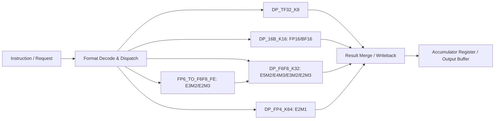
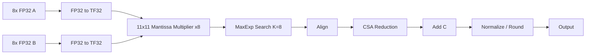
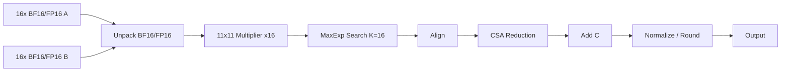
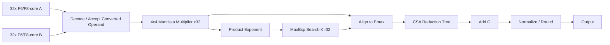
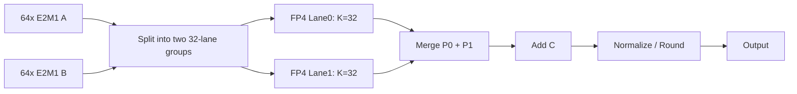

# 混合精度 Tensor Core 点积单元 Spec

## 1. 总体架构概述

本文档定义一种支持多种混合精度格式的 Tensor Core 风格点积单元。

### 1.1 设计目标

支持输入格式包括：

| 格式 | 总位宽 | 字段结构 | 有效尾数位宽 | 点积宽度 K |
|---|---:|---|---:|---:|
| TF32 | 19 bit | 1 sign + 8 exp + 10 frac | 11 | 8 |
| BF16 | 16 bit | 1 sign + 8 exp + 7 frac | 8 | 16 |
| FP16 | 16 bit | 1 sign + 5 exp + 10 frac | 11 | 16 |
| E5M2 | 8 bit | 1 sign + 5 exp + 2 frac | 3 | 32 |
| E4M3 | 8 bit | 1 sign + 4 exp + 3 frac | 4 | 32 |
| E3M2 | 6 bit | 1 sign + 3 exp + 2 frac | 3 | 32 |
| E2M3 | 6 bit | 1 sign + 2 exp + 3 frac | 4 | 32 |
| E2M1 | 4 bit | 1 sign + 2 exp + 1 frac | 2 | 64 |

点积计算形式为：

$$
D = C + \sum_{i=0}^{K-1} A_i \times B_i
$$

设计目标：

1. 支持 TF32、BF16、FP16、E5M2、E4M3、E3M2、E2M3、E2M1 多种输入格式。
2. 每种格式必须满足对应点积宽度。
3. 避免所有格式融合进一条过宽数据通路。
4. FP6 不单独实现完整点积计算核心，而是通过格式转换前端复用 FP8 点积核心。
5. E2M1 通过更高 lane density 实现 64 元素点积，相当于相对 FP8 / FP6 的 2× 元素吞吐。
6. 保持统一的上层调度接口和统一的输出写回接口。
7. 所有的舍入模式固定为 `RZ`, 除 `FP4` 均支持IEEE 754 特殊值规范。

---

### 1.2 总体分堆方案

采用**按点积宽度和计算通路分堆**。

整体划分如下：

| 子模块                            | 支持格式        | 点积宽度 K |      输入 payload | 计算核心        | 说明                     |
| ------------------------------ | ----------- | -----: | --------------: | ----------- | ---------------------- |
| `DP_TF32_K8`                   | TF32        |      8 |  8 × 32b = 256b | TF32 core   | FP32 输入，内部转 TF32       |
| `DP_16B_K16`                   | BF16 / FP16 |     16 | 16 × 16b = 256b | 16-bit core | BF16 / FP16 共用         |
| `DP_F6F8_K32`                   | E5M2 / E4M3 |     32 |  32 × 8b = 256b | F6/F8 core    | 原生 FP8                 |
| `FP6_TO_F6F8_FE` + `DP_F6F8_K32` | E3M2 / E2M3 |     32 |  32 × 6b = 192b | F6/F8 core    | FP6 前端转换后复用 FP8        |
| `DP_FP4_K64`                   | E2M1        |     64 |  64 × 4b = 256b | FP4 core    | 两个 32-lane half-dot 合并 |

核心观察：

```text
TF32:  8  × 32b = 256b
FP16:  16 × 16b = 256b
BF16:  16 × 16b = 256b
FP8:   32 × 8b  = 256b
FP6:   32 × 6b  = 192b，转换后扩展为 32 × 8b = 256b
FP4:   64 × 4b  = 256b
```

因此，从 operand fetch / register file / crossbar / input buffer 的角度看，大多数格式都可以规整到 **每个 operand 向量 256 bit** 的粒度。FP6 原始输入只有 192 bit，但进入 F6/F8 core 前会扩展成 256 bit 内部操作数。

---

### 1.3 顶层结构



---

## 2. 顶层接口定义

### 2.1 顶层模块

| 接口名称 | 位宽 | 说明 |
| --- | --- | --- |
| `clk` | 1 | 模块时钟输入 |
| `rst_n` | 1 | 低有效复位输入 |
| `req_valid` | 1 | 请求通道 valid |
| `req_ready` | 1 | 请求通道 ready |
| `req_fmt` | 4 | 输入格式编码，选择 TF32/BF16/FP16/FP8/FP6/FP4 模式 |
| `req_a_packed` | `VEC_BITS` | A 操作数 packed 输入向量 |
| `req_b_packed` | `VEC_BITS` | B 操作数 packed 输入向量 |
| `req_c` | `ACC_W` | 累加输入 C |
| `req_round_mode` | 3 | 舍入模式配置 |
| `req_acc_mode` | 3 | 累加模式配置 |
| `req_tag` | `TAG_W` | 请求标签，用于响应对应 |
| `resp_valid` | 1 | 响应通道 valid |
| `resp_ready` | 1 | 响应通道 ready |
| `resp_d` | `ACC_W` | 点积结果输出 D |
| `resp_flags` | 8 | 异常/状态标志输出 |
| `resp_tag` | `TAG_W` | 响应标签，回传请求 tag |

### 2.2 格式编码

```systemverilog
typedef enum logic [3:0] {
    FMT_TF32 = 4'd0,
    FMT_BF16 = 4'd1,
    FMT_FP16 = 4'd2,
    FMT_E5M2 = 4'd3,
    FMT_E4M3 = 4'd4,
    FMT_E3M2 = 4'd5,
    FMT_E2M3 = 4'd6,
    FMT_E2M1 = 4'd7
} fp_fmt_e;
```

### 2.3 点积宽度查询

```systemverilog
function automatic logic [7:0] dot_k_by_fmt(input fp_fmt_e fmt);
    case (fmt)
        FMT_TF32: dot_k_by_fmt = 8;
        FMT_BF16: dot_k_by_fmt = 16;
        FMT_FP16: dot_k_by_fmt = 16;
        FMT_E5M2: dot_k_by_fmt = 32;
        FMT_E4M3: dot_k_by_fmt = 32;
        FMT_E3M2: dot_k_by_fmt = 32;
        FMT_E2M3: dot_k_by_fmt = 32;
        FMT_E2M1: dot_k_by_fmt = 64;
        default:  dot_k_by_fmt = 0;
    endcase
endfunction
```

### 2.4 输入向量布局

统一使用 256-bit packed operand 输入。

| 格式   | 有效 payload | packed 布局                              |
| ---- | ---------: | -------------------------------------- |
| TF32 |       256b | `req_a_packed[32*i +: 32]`             |
| BF16 |       256b | `req_a_packed[16*i +: 16]`             |
| FP16 |       256b | `req_a_packed[16*i +: 16]`             |
| E5M2 |       256b | `req_a_packed[8*i +: 8]`               |
| E4M3 |       256b | `req_a_packed[8*i +: 8]`               |
| E3M2 |       192b | `req_a_packed[6*i +: 6]`，高 64b ignored |
| E2M3 |       192b | `req_a_packed[6*i +: 6]`，高 64b ignored |
| E2M1 |       256b | `req_a_packed[4*i +: 4]`               |

同理适用于 `req_b_packed`。

---

# 4. 子模块一：`DP_TF32_K8`

## 4.1 功能

`DP_TF32_K8` 负责处理 TF32 点积：

```text
K = 8
external input = FP32
internal compute = TF32
```

计算：

$$
D = C + \sum_{i=0}^{7} A_i^{TF32} \times B_i^{TF32}
$$

## 4.2 接口定义

| 接口名称 | 位宽 | 说明 |
| --- | --- | --- |
| `clk` | 1 | 模块时钟输入 |
| `rst_n` | 1 | 低有效复位输入 |
| `in_valid` | 1 | 输入请求 valid |
| `in_ready` | 1 | 输入请求 ready |
| `a_fp32_packed` | 256 | 8 路 FP32 A 输入，内部按 TF32 路径处理 |
| `b_fp32_packed` | 256 | 8 路 FP32 B 输入，内部按 TF32 路径处理 |
| `c_in` | `ACC_W` | 累加输入 C |
| `round_mode` | 3 | 舍入模式配置 |
| `tag_in` | `TAG_W` | 输入事务标签 |
| `out_valid` | 1 | 输出结果 valid |
| `out_ready` | 1 | 输出结果 ready |
| `d_out` | `ACC_W` | 点积结果输出 D |
| `flags_out` | 8 | 异常/状态标志输出 |
| `tag_out` | `TAG_W` | 输出事务标签 |

## 4.3 微架构



关键参数：

```text
K = 8
mantissa multiplier = 11 × 11
exponent path = 8-bit exponent
input payload = 8 × 32b = 256b
```

---

# 5. 子模块二：`DP_16B_K16`

## 5.1 功能

`DP_16B_K16` 支持 BF16 和 FP16：

```text
BF16 K = 16
FP16 K = 16
```

计算：

$$
D = C + \sum_{i=0}^{15} A_i \times B_i
$$

## 5.2 接口定义

| 接口名称 | 位宽 | 说明 |
| --- | --- | --- |
| `clk` | 1 | 模块时钟输入 |
| `rst_n` | 1 | 低有效复位输入 |
| `in_valid` | 1 | 输入请求 valid |
| `in_ready` | 1 | 输入请求 ready |
| `fmt_is_bf16` | 1 | 1 表示 BF16，0 表示 FP16 |
| `a_packed` | 256 | 16 路 BF16/FP16 A 输入 |
| `b_packed` | 256 | 16 路 BF16/FP16 B 输入 |
| `c_in` | `ACC_W` | 累加输入 C |
| `round_mode` | 3 | 舍入模式配置 |
| `tag_in` | `TAG_W` | 输入事务标签 |
| `out_valid` | 1 | 输出结果 valid |
| `out_ready` | 1 | 输出结果 ready |
| `d_out` | `ACC_W` | 点积结果输出 D |
| `flags_out` | 8 | 异常/状态标志输出 |
| `tag_out` | `TAG_W` | 输出事务标签 |

## 5.3 微架构



硬件配置：

```text
K = 16
FP16 effective mantissa = 11 bits
BF16 effective mantissa = 8 bits
mantissa multiplier = 11 × 11
BF16 mode gates unused high partial products
exponent path = max 8-bit exponent
input payload = 16 × 16b = 256b
```

---

# 6. 子模块三：`DP_F6F8_K32`

## 6.1 功能

`DP_F6F8_K32` 是本设计中的低精度主计算核心，支持：

```text
原生 FP8:
    E5M2
    E4M3

转换后 FP6:
    E3M2 -> F6/F8-core internal operand
    E2M3 -> F6/F8-core internal operand
```

点积宽度：

```text
K = 32
```

计算：

$$
D = C + \sum_{i=0}^{31} A_i \times B_i
$$

## 6.2 接口定义

`src_fmt` 编码如下：

| 接口名称 | 位宽 | 说明 |
| --- | --- | --- |
| `F6F8_SRC_E5M2` | 3 | 原生 E5M2 输入 |
| `F6F8_SRC_E4M3` | 3 | 原生 E4M3 输入 |
| `F6F8_SRC_E3M2_CONV` | 3 | 由 E3M2 转换得到的 F6/F8-core 输入 |
| `F6F8_SRC_E2M3_CONV` | 3 | 由 E2M3 转换得到的 F6/F8-core 输入 |

模块接口如下：

| 接口名称 | 位宽 | 说明 |
| --- | --- | --- |
| `clk` | 1 | 模块时钟输入 |
| `rst_n` | 1 | 低有效复位输入 |
| `in_valid` | 1 | 输入请求 valid |
| `in_ready` | 1 | 输入请求 ready |
| `src_fmt` | 3 | 选择原生 FP8 或 FP6 转换后的内部源格式 |
| `a_f6f8core_packed` | 256 | 32 路 8-bit F6/F8-core A 输入 |
| `b_f6f8core_packed` | 256 | 32 路 8-bit F6/F8-core B 输入 |
| `c_in` | `ACC_W` | 累加输入 C |
| `round_mode` | 3 | 舍入模式配置 |
| `tag_in` | `TAG_W` | 输入事务标签 |
| `out_valid` | 1 | 输出结果 valid |
| `out_ready` | 1 | 输出结果 ready |
| `d_out` | `ACC_W` | 点积结果输出 D |
| `flags_out` | 8 | 异常/状态标志输出 |
| `tag_out` | `TAG_W` | 输出事务标签 |

## 6.3 内部 operand 说明

`DP_F6F8_K32` 的输入并不一定是外部真实 FP8 编码。对于 FP6，前端会把 E3M2 / E2M3 转换为 F6/F8 core 可接受的内部格式。

推荐内部格式：

```systemverilog
typedef struct packed {
    logic        sign;
    logic signed [5:0] exp_unbiased;
    logic [3:0] mant;        // hidden bit + fraction, padded to 4 bits
    logic        is_zero;
    logic        is_subnormal;
    logic        is_inf;
    logic        is_nan;
} fp8core_operand_t;
```

如果为了节省接口宽度，也可以将其压缩成 8-bit pseudo-FP8 encoding，但更推荐在模块边界内使用结构化 decoded operand，避免不必要的二次编码 / 二次解码。

## 6.4 微架构



关键参数：

```text
K = 32
mantissa multiplier = 4 × 4
E4M3 / E2M3 converted: full 4-bit mantissa path
E5M2 / E3M2 converted: 3-bit mantissa active, high partial products gated
MaxExp path = FP8-level path
Alignment shifter = FP8-level shifter
Reduction tree = K=32 CSA tree
```

## 6.5 重要说明：FP6 复用 FP8 的影响

由于 FP6 实际走 `DP_F6F8_K32`，所以：

```text
FP6 不再获得独立 3-bit exponent path 带来的时序优势
FP6 不再拥有更小 alignment shifter
FP6 不再拥有更小 MaxExp search
FP6 不再拥有独立 CSA tree
```

但它获得：

```text
删除独立 DP_FP6 compute core
减少面积
减少验证复杂度
复用 FP8 主计算路径
保持 K=32 点积宽度
```

因此，新设计下 FP6 的收益主要来自：

```text
输入存储/带宽更低：32 × 6b = 192b
前端格式转换较轻
无需增加新的计算 datapath
```

而不是来自独立 FP6 计算核心的时序和功耗缩减。

---

# 7. 子模块四：`FP6_TO_F6F8_FE`

## 7.1 功能

`FP6_TO_F6F8_FE` 负责将 E3M2 / E2M3 转换为 `DP_F6F8_K32` 可接受的内部 operand。

支持格式：

```text
E3M2: 1 sign + 3 exp + 2 frac
E2M3: 1 sign + 2 exp + 3 frac
```

点积宽度：

```text
K = 32
```

输入 payload：

```text
32 × 6b = 192b
```

输出 payload：

```text
32 × 8b = 256b
```

或者输出 32 个结构化 `fp8core_operand_t`。

## 7.2 接口定义

| 接口名称 | 位宽 | 说明 |
| --- | --- | --- |
| `clk` | 1 | 模块时钟输入 |
| `rst_n` | 1 | 低有效复位输入 |
| `in_valid` | 1 | 输入请求 valid |
| `in_ready` | 1 | 输入请求 ready |
| `fmt_is_e3m2` | 1 | 1 表示 E3M2，0 表示 E2M3 |
| `a_fp6_packed` | 192 | 32 路 6-bit FP6 A 输入 |
| `b_fp6_packed` | 192 | 32 路 6-bit FP6 B 输入 |
| `tag_in` | `TAG_W` | 输入事务标签 |
| `out_valid` | 1 | 输出结果 valid |
| `out_ready` | 1 | 输出结果 ready |
| `out_src_fmt` | 3 | 输出到 F6/F8 core 的源格式编码 |
| `a_f6f8core_packed` | 256 | 转换后的 32 路 8-bit F6/F8-core A 输出 |
| `b_f6f8core_packed` | 256 | 转换后的 32 路 8-bit F6/F8-core B 输出 |
| `tag_out` | `TAG_W` | 输出事务标签 |

## 7.3 E3M2 转换规则

E3M2 字段：

```text
sign = x[5]
exp  = x[4:2]
frac = x[1:0]
```

有效尾数：

```text
mant_e3m2 = {hidden, frac[1:0]}   // 3 bits
```

转换为 F6/F8-core mantissa：

```text
mant_core = {hidden, frac[1:0], 1'b0}   // pad to 4 bits
```

指数转换：

```text
exp_unbiased = exp_field - bias_e3m2
```

然后送入 F6/F8 core 的内部指数路径。

如果实现上希望转换成 pseudo-FP8 编码，可以把 E3M2 映射到类似 E5M2 的内部编码：

```text
E3M2 -> pseudo E5M2
sign 保持不变
fraction 保持 2 bits
exponent 重新 bias 到 F6/F8-core 指数域
```

但推荐不要依赖外部 FP8 编码语义，而是直接生成 decoded operand。

## 7.4 E2M3 转换规则

E2M3 字段：

```text
sign = x[5]
exp  = x[4:3]
frac = x[2:0]
```

有效尾数：

```text
mant_e2m3 = {hidden, frac[2:0]}   // 4 bits
```

转换为 F6/F8-core mantissa：

```text
mant_core = {hidden, frac[2:0]}   // already 4 bits
```

指数转换：

```text
exp_unbiased = exp_field - bias_e2m3
```

如果实现上希望转换成 pseudo-FP8 编码，可以把 E2M3 映射到类似 E4M3 的内部编码：

```text
E2M3 -> pseudo E4M3
sign 保持不变
fraction 保持 3 bits
exponent 重新 bias 到 F6/F8-core 指数域
```

## 7.5 转换原则

FP6 转换必须满足：

```text
不引入额外舍入
不改变符号
不改变数值
只做 exponent rebias / mantissa padding / class flag generation
```

也就是说，FP6 → F6/F8-core 是一种 **exact widening conversion**，不是数值量化。

---

# 8. 子模块五：`DP_FP4_K64`

## 8.1 功能

`DP_FP4_K64` 专门支持 E2M1。

点积宽度：

```text
K = 64
```

计算：

$$
D = C + \sum_{i=0}^{63} A_i^{E2M1} \times B_i^{E2M1}
$$

输入 payload：

```text
64 × 4b = 256b
```

## 8.2 接口定义

| 接口名称 | 位宽 | 说明 |
| --- | --- | --- |
| `clk` | 1 | 模块时钟输入 |
| `rst_n` | 1 | 低有效复位输入 |
| `in_valid` | 1 | 输入请求 valid |
| `in_ready` | 1 | 输入请求 ready |
| `a_packed` | 256 | 64 路 4-bit E2M1 A 输入 |
| `b_packed` | 256 | 64 路 4-bit E2M1 B 输入 |
| `c_in` | `ACC_W` | 累加输入 C |
| `round_mode` | 3 | 舍入模式配置 |
| `tag_in` | `TAG_W` | 输入事务标签 |
| `out_valid` | 1 | 输出结果 valid |
| `out_ready` | 1 | 输出结果 ready |
| `d_out` | `ACC_W` | 点积结果输出 D |
| `flags_out` | 8 | 异常/状态标志输出 |
| `tag_out` | `TAG_W` | 输出事务标签 |

## 8.3 微架构

`DP_FP4_K64` 内部建议拆成两个 32-lane half-dot：

```text
lane0: i = 0  ~ 31
lane1: i = 32 ~ 63
```

每个 half-dot 计算：

$$
P_0 = \sum_{i=0}^{31} A_i \times B_i
$$

$$
P_1 = \sum_{i=32}^{63} A_i \times B_i
$$

最终：

$$
D = C + P_0 + P_1
$$

结构：



关键参数：

```text
K = 64
physical half-dot lanes = 2
each half-dot K = 32
mantissa multiplier = 2 × 2
exponent path = 2-bit exponent
input payload = 64 × 4b = 256b
```

这样 E2M1 在同样 256-bit operand 输入粒度下实现了：

```text
FP8 / FP6: K = 32
FP4 / E2M1: K = 64
```

即元素吞吐为 FP8 / FP6 的 2×。

---

# 9. 顶层 Dispatch 规则

## 9.1 Dispatch 表

| `req_fmt`  | 目标路径                           |
| ---------- | ------------------------------ |
| `FMT_TF32` | `DP_TF32_K8`                   |
| `FMT_BF16` | `DP_16B_K16`                   |
| `FMT_FP16` | `DP_16B_K16`                   |
| `FMT_E5M2` | `DP_F6F8_K32`                   |
| `FMT_E4M3` | `DP_F6F8_K32`                   |
| `FMT_E3M2` | `FP6_TO_F6F8_FE` → `DP_F6F8_K32` |
| `FMT_E2M3` | `FP6_TO_F6F8_FE` → `DP_F6F8_K32` |
| `FMT_E2M1` | `DP_FP4_K64`                   |

## 9.2 Dispatch 伪代码

```systemverilog
always_comb begin
    tf32_valid = 1'b0;
    dp16_valid = 1'b0;
    f6f8_valid  = 1'b0;
    fp6fe_valid = 1'b0;
    fp4_valid  = 1'b0;

    unique case (req_fmt)
        FMT_TF32: begin
            tf32_valid = req_valid;
            req_ready  = tf32_ready;
        end

        FMT_BF16,
        FMT_FP16: begin
            dp16_valid = req_valid;
            req_ready  = dp16_ready;
        end

        FMT_E5M2,
        FMT_E4M3: begin
            f6f8_valid = req_valid;
            req_ready = f6f8_ready;
        end

        FMT_E3M2,
        FMT_E2M3: begin
            fp6fe_valid = req_valid;
            req_ready   = fp6fe_ready;
        end

        FMT_E2M1: begin
            fp4_valid = req_valid;
            req_ready = fp4_ready;
        end

        default: begin
            req_ready = 1'b0;
        end
    endcase
end
```

---

# 10. 修正后的 Pipeline 建议

## 10.1 顶层 pipeline

| Stage | 功能                                    |
| ----- | ------------------------------------- |
| S0    | request decode / format dispatch      |
| S1    | format-specific unpack / FP6 widening |
| S2    | significand multiply / exponent add   |
| S3    | product normalize                     |
| S4    | max exponent search                   |
| S5    | alignment shift / sticky generation   |
| S6    | CSA reduction                         |
| S7    | CPA / add C                           |
| S8    | normalize / round                     |
| S9    | pack / flags / writeback              |

## 10.2 FP6 路径 pipeline

FP6 路径为：

```text
S0: dispatch E3M2 / E2M3
S1: FP6 unpack + exact widening to F6/F8-core operand
S2~S9: reuse DP_F6F8_K32 pipeline
```

也就是说：

```text
FP6 latency = FP6_FE latency + FP8_CORE latency
```

可选优化：

```text
将 FP6_FE 与 DP_F6F8_K32 的 S1 合并
```

这样 FP6 不额外增加 latency，只是增加一部分前端 mux / decode 逻辑。

---

# 11. 修正后的资源复用策略

## 11.1 不再实现独立 FP6 计算核心

删除：

```text
DP_FP6_K32
FP6-specific multiplier array
FP6-specific max-exp tree
FP6-specific alignment shifter
FP6-specific CSA tree
```

保留：

```text
FP6 unpack
FP6 exact widening
FP6 class flag generation
FP6 source-format sideband
```

## 11.2 F6/F8 core 的职责扩大

`DP_F6F8_K32` 现在支持四类来源：

```text
E5M2 native
E4M3 native
E3M2 converted
E2M3 converted
```

因此 F6/F8 core 需要支持：

```text
mantissa active width = 3 or 4
exponent source range = E5 / E4 / E3 / E2
format-specific class flags
format-specific output flag behavior
```

但它不需要知道外部 FP6 的真实编码细节。外部格式差异由 `FP6_TO_F6F8_FE` 处理。

## 11.3 面积 / 功耗 / 时序影响

修正后的方案：

| 项目         | 原独立 FP6 core     | 新 FP6-to-FP8 方案 |
| ---------- | ---------------- | --------------- |
| FP6 乘法器    | 独立 4×4 ×32       | 复用 FP8          |
| FP6 MaxExp | 独立 3-bit tree    | 复用 FP8          |
| FP6 Align  | 独立 small shifter | 复用 FP8          |
| FP6 CSA    | 独立 K=32 tree     | 复用 FP8          |
| FP6 输入带宽   | 192b             | 192b            |
| FP6 内部带宽   | 192b / local     | 扩展到 256b        |
| FP6 面积     | 更高               | 更低              |
| FP6 时序     | 可更短              | 受 F6/F8 core 限制   |
| 验证复杂度      | 更高               | 更低              |

结论：

```text
新方案牺牲了 FP6 独立小指数/小对齐器带来的时序和动态功耗优势，
换取更少的面积、更低的设计复杂度、更少的验证工作量，以及更好的工程实现可行性。
```

---

# 12. 修正后的参数表

| 通路                             | 支持格式        |  K | 输入 payload | 内部 compute width |        乘法器 |              MaxExp | ACC |
| ------------------------------ | ----------- | -: | ---------: | ---------------: | ---------: | ------------------: | --: |
| `DP_TF32_K8`                   | TF32        |  8 |       256b |             TF32 |      11×11 |      K=8, 8-bit exp | 32b |
| `DP_16B_K16`                   | BF16 / FP16 | 16 |       256b |           16-bit |      11×11 | K=16, max 8-bit exp | 32b |
| `DP_F6F8_K32`                   | E5M2 / E4M3 | 32 |       256b |              FP8 |        4×4 | K=32, max 5-bit exp | 32b |
| `FP6_TO_F6F8_FE` + `DP_F6F8_K32` | E3M2 / E2M3 | 32 |       192b |         F6/F8-core | 4×4 reused |    K=32, FP8 reused | 32b |
| `DP_FP4_K64`                   | E2M1        | 64 |       256b |              FP4 |    2×2 ×64 |        K=64 / 2×K32 | 32b |

---

# 13. 特殊值处理策略

## 13.1 通用原则

特殊值处理分两层：

```text
前端:
    detect zero / subnormal / normal / inf / nan
    generate class flags

计算核心:
    主要处理 normal/subnormal 数值路径
    特殊值通过 sideband 传递

后端:
    根据原始格式 fmt 决定 NaN / Inf / saturate / flush 行为
```

## 13.2 FP6 特殊值

由于 FP6 通过前端转入 F6/F8 core，必须保留原始格式 sideband：

```systemverilog
typedef struct packed {
    logic is_e3m2;
    logic is_e2m3;
    logic is_zero;
    logic is_subnormal;
    logic is_inf;
    logic is_nan;
    logic overflow_policy_saturate;
    logic flush_subnormal;
} fp6_sideband_t;
```

F6/F8 core 不直接解释 FP6 的特殊值编码，只接收已经分类后的 operand 和 sideband。

---

# 14. 验证计划修正

## 14.1 Golden Model

仍然使用 MMA-Sim 作为金标准。

每种格式独立生成 reference：

```text
TF32 K=8
BF16 K=16
FP16 K=16
E5M2 K=32
E4M3 K=32
E3M2 K=32
E2M3 K=32
E2M1 K=64
```

## 14.2 FP6 重点验证

FP6 需要额外验证两层正确性：

### 第一层：转换正确性

```text
E3M2 -> F6/F8-core operand
E2M3 -> F6/F8-core operand
```

检查：

```text
sign 是否保持
unbiased exponent 是否一致
mantissa padding 是否正确
zero / subnormal / normal / inf / nan 分类是否正确
是否没有引入额外 rounding
```

### 第二层：复用 F6/F8 core 的点积正确性

验证：

```text
converted E3M2 dot product == MMA-Sim E3M2 reference
converted E2M3 dot product == MMA-Sim E2M3 reference
```

## 14.3 点积宽度覆盖

| 格式   | 必须覆盖的 K |
| ---- | ------: |
| TF32 |       8 |
| BF16 |      16 |
| FP16 |      16 |
| E5M2 |      32 |
| E4M3 |      32 |
| E3M2 |      32 |
| E2M3 |      32 |
| E2M1 |      64 |

## 14.4 关键 corner cases

| 类型       | 覆盖内容                                          |
| -------- | --------------------------------------------- |
| 指数差      | 大指数差、小指数差、全部相等指数                              |
| 尾数       | 最大尾数、最小 normal、subnormal                      |
| 符号       | 全正、全负、正负混合、抵消求和                               |
| 舍入       | RNE、RTZ                                       |
| 特殊值      | zero、subnormal、inf、nan、overflow、underflow     |
| FP6 转换   | E3M2 padding、E2M3 full mantissa、bias rebasing |
| FP4 K=64 | 两个 K=32 half-dot 合并正确性                        |

---
