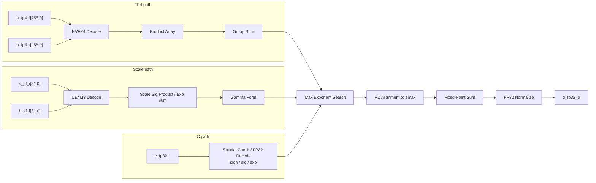

# 64-Element NVFP4 GDFS Dot Product Unit SPEC

## 1. 功能定义

该单元实现如下 64 元素 NVFP4 点积加 FP32 累加操作：

$$
d = c + \sum_{i=0}^{63}
\left(
a_i \cdot b_i \cdot aSF_{\lfloor i / 16 \rfloor} \cdot bSF_{\lfloor i / 16 \rfloor}
\right)
$$

其中：

* $a_i$、$b_i$ 为 NVFP4 数据；
* $aSF_g$、$bSF_g$ 为第 $g$ 组的 UE4M3 scale factor；
* 每组包含 16 个元素；
* 总共有 4 个 group dot product；
* $c$ 为 FP32 输入累加值；
* $d$ 为 FP32 输出结果。

将 64 个元素按 16 个一组划分：

$$
\sigma_g = \sum_{i=16g}^{16g+15} a_i b_i,\quad g=0,1,2,3
$$

然后每组乘以对应 scale：

$$
\gamma_g =
\sigma_g \cdot a^{SF}_g \cdot b^{SF}_g
$$

最终：

$$
d = c + \gamma_0 + \gamma_1 + \gamma_2 + \gamma_3
$$

---

## 2. 顶层接口定义

| 接口名称 | 位宽 | 说明 |
| --- | --: | --- |
| `clk` | 1 | 时钟信号 |
| `rst_n` | 1 | 低有效异步复位信号 |
| `in_vld_i` | 1 | 输入有效信号 |
| `in_rdy_o` | 1 | 单元可接收输入 |
| `a_fp4_i` | 256 | 64 个 NVFP4 A 操作数，每个 4 bit |
| `b_fp4_i` | 256 | 64 个 NVFP4 B 操作数，每个 4 bit |
| `a_sf_i` | 32 | 4 个 A 侧 UE4M3 scale，每个 8 bit |
| `b_sf_i` | 32 | 4 个 B 侧 UE4M3 scale，每个 8 bit |
| `c_fp32_i` | 32 | FP32 累加输入 |
| `out_vld_o` | 1 | 输出有效信号 |
| `out_rdy_i` | 1 | 下游可接收输出 |
| `d_fp32_o` | 32 | FP32 输出结果 |

握手语义：

```text
in_fire  = in_vld_i  & in_rdy_o
out_fire = out_vld_o & out_rdy_i
```

流水线采用标准 `vld/rdy` 反压机制：

* `out_rdy_i = 0` 时，S0-S4 的 valid 和数据保持；
* 反压向前传播，`in_rdy_o` 拉低；
* `rst_n = 0` 时，所有 stage valid 清零，`out_vld_o = 0`。

---

## 3. 数据格式定义

### 3.1 NVFP4 数据格式

NVFP4 元素宽度为 4 bit。该单元只负责按照 NVFP4 数值表将 4 bit 编码解码为内部定点值。

NVFP4 解码后的典型数值集合为：

$$
\pm \{0, 0.5, 1, 1.5, 2, 3, 4, 6\}
$$

因此两个 NVFP4 数相乘后：

$$
p_i = a_i b_i
$$

非零乘积绝对值范围为：

$$
0.25 \leq |p_i| \leq 36
$$

该乘积可以被定点数精确表示。

---

### 3.2 UE4M3 scale 格式

每个 scale factor 使用 8 bit 存储，但 Tensor Core 始终将最高位视为 0：

```text
scale_raw[7]   = ignored, forced to 0
scale_raw[6:3] = exponent
scale_raw[2:0] = mantissa
```

本规格固定采用如下解码规则：

```text
scale_eff[7]   = 1'b0
scale_eff[6:3] = exp_raw
scale_eff[2:0] = mant_raw
E4M3_BIAS      = 7
```

特殊值判定：

```text
scale_is_nan  = (scale_eff[6:0] == 7'b111_1111)
scale_is_zero = (exp_raw == 4'b0000) && (mant_raw == 3'b000)
scale_is_subn = (exp_raw == 4'b0000) && (mant_raw != 3'b000)
```

对有限值，统一写成：

$$
SF = s_{SF} \times 2^{e_{SF}}
$$

其中：

* 若 `scale_is_zero`，则 `s_SF = 0`，`e_SF = 0`；
* 若 `scale_is_subn`，则 `s_SF = {1'b0, mant_raw}`，`e_SF = -9`；
* 其他非 NaN 编码按 normal 处理，`s_SF = {1'b1, mant_raw}`，`e_SF = exp_raw - 10`。

说明：

* `s_SF` 为 4-bit 无符号整数 significand；
* `e_SF` 为已经扣除 3 个 mantissa fractional bits 的有符号指数；
* UE4M3 无 infinity；
* 本规格中仅 `7'b111_1111` 视为 NaN，其余编码均视为有限值。

---

### 3.3 FP32 `c` 和 `d`

FP32 格式为标准 IEEE-754 单精度格式：

```text
sign     : 1 bit
exponent : 8 bit
fraction : 23 bit
```

特殊值处理规则：

| 条件 | 输出 |
| --- | --- |
| 任意 scale factor 为 NaN | `d = NaN`，编码为 `0x7FFFFFFF` |
| `c` 为 NaN | `d = NaN`，编码为 `0x7FFFFFFF` |
| `c` 为 `+Inf` 或 `-Inf` | `d = c` |
| 无特殊值 | 进入正常 GDFS 计算路径 |

由于 NVFP4 数据本身不包含 NaN 和 Inf，因此不需要检查 `a_fp4_i` 和 `b_fp4_i` 的 NaN/Inf。

`c` 的正常数 / 非正规数解码规则固定为：

```text
c_sign     = c_fp32_i[31]
c_exp_raw  = c_fp32_i[30:23]
c_frac_raw = c_fp32_i[22:0]
FP32_BIAS  = 127
```

对有限值，统一写成：

$$
c = (-1)^{c_{sign}} \times c_{sig} \times 2^{c_{exp}}
$$

其中：

* 若 `c_exp_raw == 8'h00` 且 `c_frac_raw == 23'h0`，则 `c_sig = 0`，`c_exp = 0`；
* 若 `c_exp_raw == 8'h00` 且 `c_frac_raw != 23'h0`，则 `c_sig = {1'b0, c_frac_raw}`，`c_exp = -149`；
* 若 `8'h01 <= c_exp_raw <= 8'hFE`，则 `c_sig = {1'b1, c_frac_raw}`，`c_exp = c_exp_raw - 150`。

这里 `c_sig` 仅保留 24-bit significand，不在 C Decode 级扩展为更宽内部定点。

---

### 3.4 内部位宽约定

为避免后续各级位宽不一致，内部位宽统一采用下表：

| 名称 | 数值 | 说明 |
| --- | --: | --- |
| `FP4_PROD_W` | 9 | 单个 FP4 乘积，signed Q6.2 |
| `SIGMA_W` | 13 | 16 项局部和，signed Q10.2 |
| `SF_SIG_W` | 4 | 单个 UE4M3 significand |
| `SF_EXP_W` | 5 | 单个 UE4M3 指数，signed |
| `SF_SIG_PROD_W` | 8 | 两个 scale significand 乘积 |
| `SF_EXP_SUM_W` | 6 | 两个 scale 指数和，signed |
| `GAMMA_SIG_W` | 20 | `sigma_int × sf_sig_prod` 的结果 |
| `GAMMA_EXP_W` | 6 | `gamma` 的有符号指数 |
| `C_SIG_W` | 24 | FP32 `c` 的 24-bit significand |
| `C_EXP_W` | 9 | FP32 `c` 的有符号指数 |
| `EXP_DIFF_W` | 10 | 两个 9-bit signed exponent 相减得到的 shift 位宽 |
| `ALIGN_W` | 29 | 融合累加对齐时保留的 fractional bits |
| `ALIGN_MAG_W` | 30 | 归一化后单项 magnitude 位宽，Q1.29 |
| `ALIGN_TERM_W` | 31 | 对齐后的 signed fixed-point term 位宽，含符号和 Q1.29 magnitude |
| `ALIGN_SHIFT_W` | 5 | 对 `ALIGN_MAG_W` 宽度数据右移的 shift amount 位宽 |
| `SUM_W` | 34 | 5 路对齐后求和结果位宽 |
| `ALIGN_W_EXP` | 29 | `ALIGN_W` 转成 signed exponent 后用于计算 `base_exp` |

位宽来源说明：

* `SIGMA_W = 13`，因为 `16 × 36 = 576`，并保留 2 个 fractional bits；
* `SF_SIG_PROD_W = 8`，因为 `max(15 × 15) = 225`；
* `GAMMA_SIG_W = 20`，因为内部整数编码最大值为 `2304 × 225 = 518400`；
* `ALIGN_W = 29`，是当前 RTL 与本地 MMA-Sim 测试对齐后采用的 fractional bits；
* `ALIGN_MAG_W = ALIGN_W + 1 = 30`，表示归一化后的 Q1.29 magnitude；
* `ALIGN_TERM_W = ALIGN_MAG_W + 1 = 31`，表示带符号的对齐结果；
* `ALIGN_SHIFT_W = ceil(log2(ALIGN_MAG_W + 1)) = 5`，用于表达 `0..30` 的右移量；
* `SUM_W = ALIGN_TERM_W + ceil(log2(5)) = 31 + 3 = 34`，可覆盖 5 路同宽 signed 加法；
* `ALIGN_W_EXP = 29`，用于在 S3 中计算 `base_exp = emax - 29`。

---

# 4. 总体微架构

整体数据路径如下：



其中需要注意：

* NVFP4 数据路径与 scale 解码 / scale 乘法路径并行执行；
* `c_fp32_i` 只在前端解码为 `sign + significand + exponent`；
* 三条路径在指数搜索和对齐级汇合；
* 对齐使用真正的 `RZ` 规则，即先对 magnitude 右移，再恢复符号，不能直接对 signed 数做算术右移。

---

# 5. GDFS 计算流程

## Step 1：特殊值检查

检查对象：

* 4 个 `aSF`
* 4 个 `bSF`
* FP32 `c`

规则如下：

| 条件 | 处理方式 |
| --- | --- |
| 任意 scale factor 为 NaN | `d = 0x7FFFFFFF` |
| `c` 为 NaN | `d = 0x7FFFFFFF` |
| `c` 为 `+Inf` 或 `-Inf` | `d = c` |
| 无特殊值 | 进入 Step 2 |

NVFP4 数据无 NaN 和 Inf，因此不需要检查 FP4 输入。

---

## Step 2：NVFP4 乘积计算

对 64 对 NVFP4 元素并行计算：

$$
p_i = a_i b_i,\quad i=0,1,\dots,63
$$

每个乘积使用定点表示，且无精度损失。

由于：

$$
0.25 \leq |p_i| \leq 36
$$

可以使用如下定点格式存储乘积：

```text
signed Q6.2
```

即：

| 字段 | 位宽 | 说明 |
| --- | --: | --- |
| sign | 1 | 符号位 |
| integer | 6 | 整数部分，可覆盖到 36 |
| fraction | 2 | 小数部分，可精确表示 0.25 粒度 |

因此单个乘积建议位宽为：

$$
1 + 6 + 2 = 9\text{ bits}
$$

---

## Step 3：16-element group sum

64 个乘积按 16 个一组求和：

$$
\sigma_g = \sum_{i=16g}^{16g+15} p_i
$$

其中：

$$
g = 0,1,2,3
$$

每组最大绝对值为：

$$
|\sigma_g|_{\max} = 16 \times 36 = 576
$$

因此 group sum 可以使用：

```text
signed Q10.2
```

即：

| 字段 | 位宽 | 说明 |
| --- | --: | --- |
| sign | 1 | 符号位 |
| integer | 10 | 整数部分，可覆盖到 576 |
| fraction | 2 | 保留乘积的 0.25 粒度 |

group sum 建议位宽为：

$$
1 + 10 + 2 = 13\text{ bits}
$$

该步骤使用定点加法树实现，无精度损失。

---

## Step 4：group dot product 乘以 scale factor

对每个 group，计算：

$$
\gamma_g =
\sigma_g \cdot a^{SF}_g \cdot b^{SF}_g
$$

记内部整数编码的 `sigma_int_g` 为 Q10.2 的存储值，则：

$$
\sigma_g = \sigma^{int}_g \times 2^{-2}
$$

scale 合并：

$$
\text{sfSigProd}_g = s_{a,g} \times s_{b,g}
$$

$$
\text{sfExpSum}_g = e_{a,g} + e_{b,g}
$$

硬件统一输出：

$$
\gamma^{sig}_g = \sigma^{int}_g \times \text{sfSigProd}_g
$$

$$
\gamma^{exp}_g = \text{sfExpSum}_g - 2
$$

因此：

$$
\gamma_g = \gamma^{sig}_g \times 2^{\gamma^{exp}_g}
$$

说明：

* `-2` 来自 `sigma_int_g` 的 2 个 fractional bits；
* `gamma_sig_g` 为有符号整数；
* `gamma_exp_g` 为有符号指数；
* 该步骤不发生精度损失。

---

## Step 5：指数最大值搜索与对齐

需要对齐的 5 个输入为：

$$
c,\gamma_0,\gamma_1,\gamma_2,\gamma_3
$$

首先提取它们的原始指数：

$$
e_c,e_0,e_1,e_2,e_3
$$

然后计算最大原始 exponent：

$$
e_{\max} = \max(e_c,e_0,e_1,e_2,e_3)
$$

S1 先将每一项规约为 compact significand + exponent 形式，其中 significand 固定为 `Q1.29`：

$$
sig^{norm} \in [1,2), \quad width = Q1.29
$$

然后只根据 exponent 差右移：

$$
\hat{s} =
\operatorname{RZ}\left(sig^{norm} \gg (e_{\max} - e)\right)
$$

规则：

* 因为 $e_{\max}$ 是最大原始 exponent，对齐阶段只需要根据 `emax - e` 右移；
* 舍入模式固定为 RZ；
* 对齐后所有数共享同一个基准指数 $e_{\max} - 29$；
* 若右移量大于等于操作数位宽，则对齐结果为 0；
* 不能直接使用 signed arithmetic shift 代替 RZ，因为负数算术右移会向负无穷取整。

该步骤是 GDFS 中主要的精度损失来源。

---

## Step 6：定点求和

对 Step 5 对齐后的 5 个定点数求和：

$$
S =
\hat{s}_c +
\hat{s}_0 +
\hat{s}_1 +
\hat{s}_2 +
\hat{s}_3
$$

此时结果可以表示为：

$$
S \times 2^{e_{\max}-29}
$$

该步骤使用定点加法树完成。为了更低延迟可使用 5:2 compressor / carry-save tree：

```text
{s0, s1, s2, s3, c}
        │
        ▼
   CSA reduction
        │
        ▼
   final CPA
```

`SUM_W = 34`，能够无损覆盖 5 路 `ALIGN_TERM_W = 31` 的 signed 求和。

---

## Step 7：FP32 normalize

Step 6 得到：

$$
S \times 2^{base\_exp}, \quad base\_exp = e_{\max} - 29
$$

需要将其重新规格化为 FP32。

处理流程：

1. 判断符号位；
2. 对绝对值取 leading-one detect；
3. 根据 leading-one 位置调整指数；
4. 生成 FP32 mantissa；
5. 处理 overflow / underflow；
6. 输出 FP32 编码。

由于舍入模式固定为 RZ，因此 FP32 mantissa 生成时直接截断多余低位。

---

# 6. 子模块划分

## 6.1 Special Check Unit

### 功能

负责检查 scale factor 和 `c` 的特殊值。

### 接口定义

| 接口名称 | 位宽 | 说明 |
| --- | -: | --- |
| `a_sf_i` | 32 | 4 个 A 侧 UE4M3 scale |
| `b_sf_i` | 32 | 4 个 B 侧 UE4M3 scale |
| `c_fp32_i` | 32 | FP32 累加输入 |
| `is_nan_o` | 1 | scale 或 c 中存在 NaN |
| `is_c_inf_o` | 1 | c 为 infinity |
| `c_is_nan_o` | 1 | c 为 NaN |
| `sf_is_nan_o` | 1 | 任意 scale factor 为 NaN |
| `special_result_o` | 32 | 特殊值路径输出 |
| `special_valid_o` | 1 | 特殊值路径有效 |

### 行为

```text
if any scale is NaN:
    d = 0x7FFFFFFF
else if c is NaN:
    d = 0x7FFFFFFF
else if c is Inf:
    d = c
else:
    enter normal datapath
```

---

## 6.2 NVFP4 Decode Unit

### 功能

将 64 个 NVFP4 编码解码为内部定点数。

### 接口定义

| 接口名称 | 位宽 | 说明 |
| --- | --: | --- |
| `fp4_i` | 256 | 64 个 NVFP4 输入元素 |
| `fxp_o` | 64 × 4 | 64 个解码后的定点数，推荐 Q3.1 |
| `zero_mask_o` | 64 | 标记每个元素是否为 0 |

### 微架构

由于 NVFP4 有限值集合很小，推荐使用 LUT 解码。

---

## 6.3 Product Array Unit

### 功能

计算 64 个 NVFP4 元素乘积：

$$
p_i = a_i b_i
$$

### 接口定义

| 接口名称 | 位宽 | 说明 |
| --- | --: | --- |
| `a_fxp_i` | 64 × 4 | 64 个 A 侧解码定点数 |
| `b_fxp_i` | 64 × 4 | 64 个 B 侧解码定点数 |
| `prod_o` | 64 × 9 | 64 个 signed Q6.2 乘积 |

### 微架构

每个乘积可以通过小 LUT 或小规模定点乘法器实现。

---

## 6.4 Group Sum Unit

### 功能

每 16 个乘积求和，生成 4 个 group dot product。

### 接口定义

| 接口名称 | 位宽 | 说明 |
| --- | --: | --- |
| `prod_i` | 64 × 9 | 64 个 signed Q6.2 乘积 |
| `sigma_o` | 4 × 13 | 4 个 signed Q10.2 group sum |

### 微架构

每组 16 个乘积使用平衡加法树：

```text
16 inputs
   │
   ▼
8 adders
   │
   ▼
4 adders
   │
   ▼
2 adders
   │
   ▼
1 adder
   │
   ▼
sigma_g
```

4 个 group 并行计算。

---

## 6.5 UE4M3 Scale Decode Unit

### 功能

解码 4 个 A 侧 scale 和 4 个 B 侧 scale。

### 接口定义

| 接口名称 | 位宽 | 说明 |
| --- | --: | --- |
| `a_sf_i` | 32 | 4 个 A 侧 UE4M3 scale |
| `b_sf_i` | 32 | 4 个 B 侧 UE4M3 scale |
| `a_sf_sig_o` | 4 × 4 | A 侧 scale significand |
| `b_sf_sig_o` | 4 × 4 | B 侧 scale significand |
| `a_sf_exp_o` | 4 × 5 | A 侧 scale exponent |
| `b_sf_exp_o` | 4 × 5 | B 侧 scale exponent |
| `a_sf_zero_o` | 4 | A 侧 scale 是否为 0 |
| `b_sf_zero_o` | 4 | B 侧 scale 是否为 0 |
| `sf_nan_o` | 1 | 任意 scale factor 为 NaN |

### 行为

UE4M3 实际存储 8 bit，但 MSB 强制视为 0：

```verilog
scale_eff = {1'b0, scale_raw[6:0]};
```

对每个 scale：

```text
exp_raw  = scale_eff[6:3]
mant_raw = scale_eff[2:0]
is_nan   = (scale_eff[6:0] == 7'b111_1111)
is_zero  = (exp_raw == 4'b0000) && (mant_raw == 3'b000)
is_subn  = (exp_raw == 4'b0000) && (mant_raw != 3'b000)
```

输出规则：

```text
if is_zero:
    sf_sig = 4'd0
    sf_exp = 5'sd0
else if is_subn:
    sf_sig = {1'b0, mant_raw}
    sf_exp = -5'sd9
else:
    sf_sig = {1'b1, mant_raw}
    sf_exp = $signed({1'b0, exp_raw}) - 5'sd10
```

---

## 6.6 Scale Product Unit

### 功能

计算每组 scale 的 significand 乘积和 exponent 和。

$$
s_{SF,g} = s_{a,g} \cdot s_{b,g}
$$

$$
e_g = e_{a,g} + e_{b,g}
$$

### 接口定义

| 接口名称 | 位宽 | 说明 |
| --- | --: | --- |
| `a_sf_sig_i` | 4 × 4 | A 侧 scale significand |
| `b_sf_sig_i` | 4 × 4 | B 侧 scale significand |
| `a_sf_exp_i` | 4 × 5 | A 侧 scale exponent |
| `b_sf_exp_i` | 4 × 5 | B 侧 scale exponent |
| `sf_sig_prod_o` | 4 × 8 | scale significand 乘积 |
| `sf_exp_sum_o` | 4 × 6 | scale exponent 和 |

---

## 6.7 Gamma Form Unit

### 功能

将 group sum 与 scale significand 乘积相乘，生成：

$$
\gamma_g = \gamma^{sig}_g \times 2^{\gamma^{exp}_g}
$$

### 接口定义

| 接口名称 | 位宽 | 说明 |
| --- | --: | --- |
| `sigma_i` | 4 × 13 | 4 个 signed Q10.2 group sum |
| `sf_sig_prod_i` | 4 × 8 | scale significand 乘积 |
| `sf_exp_sum_i` | 4 × 6 | scale exponent 和 |
| `gamma_sig_o` | 4 × 20 | 4 个 gamma significand |
| `gamma_exp_o` | 4 × 6 | 4 个 gamma exponent |

### 行为

```text
gamma_sig_o = sigma_i × sf_sig_prod_i
gamma_exp_o = sf_exp_sum_i - 2
```

其中 `-2` 对应 `sigma_i` 的 2 个 fractional bits。

---

## 6.8 FP32 C Decode Unit

### 功能

将 FP32 `c` 解码为：

$$
c = (-1)^{c_{sign}} \times c_{sig} \times 2^{c_{exp}}
$$

### 接口定义

| 接口名称 | 位宽 | 说明 |
| --- | -: | --- |
| `c_fp32_i` | 32 | FP32 输入 |
| `c_sign_o` | 1 | c 的符号 |
| `c_sig_o` | 24 | c 的 significand，包含 hidden one bit |
| `c_exp_o` | 9 | c 的有效指数，已扣除 23 个 fraction bits |
| `c_is_zero_o` | 1 | c 是否为 0 |
| `c_is_nan_o` | 1 | c 是否为 NaN |
| `c_is_inf_o` | 1 | c 是否为 Inf |

### 行为

```text
if c_exp_raw == 8'h00 and c_frac_raw == 23'h0:
    c_sig = 24'd0
    c_exp = 9'sd0
else if c_exp_raw == 8'h00:
    c_sig = {1'b0, c_frac_raw}
    c_exp = -9'sd149
else:
    c_sig = {1'b1, c_frac_raw}
    c_exp = $signed({1'b0, c_exp_raw}) - 9'sd150
```

---

## 6.9 Max Exponent Search Unit

### 功能

在 5 个指数中搜索最大值：

$$
e_{\max} = \max(e_c,e_0,e_1,e_2,e_3)
$$

### 接口定义

| 接口名称 | 位宽 | 说明 |
| --- | --: | --- |
| `c_exp_i` | 9 | FP32 c 的 exponent |
| `gamma_exp_i` | 4 × 6 | 4 个 gamma exponent |
| `emax_o` | 9 | 最大 exponent |

### 微架构

比较前需先将 `gamma_exp_i` 符号扩展到 9 bit，再与 `c_exp_i` 比较。

---

## 6.10 Alignment Unit

### 功能

将 4 个 gamma significand 和 c significand 对齐到同一个最大原始 exponent：

$$
base\_exp = e_{\max} - 29
$$

### 接口定义

| 接口名称 | 位宽 | 说明 |
| --- | --: | --- |
| `gamma_mag_i` | 4 × 30 | 4 个 gamma magnitude，Q1.29 |
| `gamma_exp_i` | 4 × 6 | 4 个 gamma exponent |
| `c_mag_i` | 30 | c magnitude，Q1.29 |
| `c_sign_i` | 1 | c 的符号 |
| `c_exp_i` | 9 | c exponent |
| `emax_i` | 9 | 最大原始 exponent |
| `gamma_aligned_o` | 4 × 31 | 对齐后的 gamma fixed-point 值 |
| `c_aligned_o` | 31 | 对齐后的 c fixed-point 值 |

### 行为

RTL 中对齐统一调用 `align_fixed_rz(term_mag, term_exp, emax)`：

* `term_mag` 在进入对齐级之前已经在 S1 规约为 `Q1.29`；
* 再计算 `align_shift = emax - term_exp`；
* 因为 `emax` 是最大原始 exponent，`align_shift >= 0`，对齐阶段只右移；
* 右移始终执行 `RZ`，即直接截断 shifted-out 低位。

对于 gamma：

```text
gamma_aligned_g = align_fixed_rz(gamma_mag_i[g], gamma_exp_i[g], emax_i)
```

对于 c：

```text
c_aligned = align_fixed_rz(c_mag_i, c_exp_i, emax_i)
```

---

## 6.11 Fixed-Point Sum Unit

### 功能

对齐后的 5 个定点数求和：

$$
S =
\hat{s}_c +
\hat{s}_0 +
\hat{s}_1 +
\hat{s}_2 +
\hat{s}_3
$$

### 接口定义

| 接口名称 | 位宽 | 说明 |
| --- | --: | --- |
| `gamma_aligned_i` | 4 × 31 | 4 个对齐后的 gamma fixed-point 值 |
| `c_aligned_i` | 31 | 对齐后的 c fixed-point 值 |
| `sum_o` | 34 | 定点求和结果 |
| `sum_zero_o` | 1 | 求和结果是否为 0 |
| `sum_sign_o` | 1 | 求和结果符号 |

### 微架构建议

推荐使用 carry-save tree：

```text
5 operands
   │
   ▼
CSA compression
   │
   ▼
final carry-propagate adder
   │
   ▼
sum
```

---

## 6.12 FP32 Normalize Unit

### 功能

将：

$$
S \times 2^{base\_exp}
$$

规格化为 FP32 输出。

### 接口定义

| 接口名称 | 位宽 | 说明 |
| --- | -: | --- |
| `sum_i` | 34 | 定点求和结果 |
| `base_exp_i` | 9 | 融合累加域的基准指数 |
| `d_fp32_o` | 32 | FP32 输出 |

### 行为

规格化流程：

```text
1. extract sign
2. abs_sum = abs(sum)
3. leading-one detect
4. normalize significand
5. adjust exponent with `base_exp_i`
6. truncate to FP32 mantissa using RZ
7. pack sign / exponent / fraction
```

RZ 舍入规则：

```text
直接截断 FP32 mantissa 之后的低位
```

---

# 7. Pipeline

| Stage | 名称 | 主要功能 | 关键输出 | 时序压力 |
| ----: | --- | --- | --- | ---- |
| S0 | Input Register & Decode & Special Check & FP4 Product | 输入寄存；FP4 decode/product；UE4M3 scale decode；FP32 C decode；scale/C 特殊值检查 | `prod[63:0]`, scale sig/exp, `c_sign/c_sig/c_exp`, special flags | 中 |
| S1 | Group Sum & Scale Product | 4 组 16-element product sum；scale significand product；scale exponent sum | `sigma[3:0]`, `sfSig[3:0]`, `sfExp[3:0]` | 中 |
| S2 | Gamma Form & Emax Search & Alignment | `sigma × sfSig` 生成 gamma；搜索最大原始 exponent；5 路 significand 按 RZ 对齐 | aligned gamma/c, `emax` | 高 |
| S3 | Accumulate | 5-input fixed-point accumulation | `sum`, `base_exp` | 中 |
| S4 | FP32 Normalize | zero/sign 处理；LOD；指数修正；RZ 截断；FP32 pack；special mux | `d_fp32_o` | 中-高 |

---

# S0：Input Register & FP4 / Scale / C Decode & Special Check & FP4 Product

## 功能

S0 完成输入寄存和所有前端轻量解码逻辑：

```text
1. input register
2. FP4 decode
3. 64-way FP4 product
4. UE4M3 scale decode
5. FP32 C decode
6. scale / C special check
```

## FP4 path

输入：

```text
a_fp4_i[255:0]
b_fp4_i[255:0]
```

S0 生成：

$$
p_i = a_i b_i,\quad i=0,1,\dots,63
$$

输出格式：

```text
prod_s0[i] : signed Q6.2
```

## Scale path

S0 解码：

$$
a^{SF}_g = s_{a,g} \times 2^{e_{a,g}}
$$

$$
b^{SF}_g = s_{b,g} \times 2^{e_{b,g}}
$$

输出：

```text
a_sf_sig_s0[g]
b_sf_sig_s0[g]
a_sf_exp_s0[g]
b_sf_exp_s0[g]
```

## C path

S0 解码 FP32 `c`：

$$
c = (-1)^{c_{sign}} \times c_{sig} \times 2^{c_{exp}}
$$

输出：

```text
c_sign_s0
c_sig_s0
c_exp_s0
c_is_zero_s0
```

其中 `c_sig_s0` 仅保留 24-bit significand。

## Special check

S0 同时完成特殊值检查：

| 条件 | 输出 |
| --- | --- |
| 任意 scale 为 NaN | `d = 0x7fffffff` |
| `c` 为 NaN | `d = 0x7fffffff` |
| `c` 为 `+Inf` 或 `-Inf` | `d = c` |
| 否则 | 进入 normal datapath |

特殊值旁路需要随流水线传递到 S4。

## S0 输出

| 信号 | 位宽 / 格式 | 说明 |
| --- | --: | --- |
| `prod_s0[63:0]` | 64 × 9 | 64 个 FP4 product，signed Q6.2 |
| `a_sf_sig_s0[3:0]` | 4 × 4 | A scale significand |
| `b_sf_sig_s0[3:0]` | 4 × 4 | B scale significand |
| `a_sf_exp_s0[3:0]` | 4 × 5 | A scale exponent |
| `b_sf_exp_s0[3:0]` | 4 × 5 | B scale exponent |
| `c_sign_s0` | 1 | C 符号 |
| `c_sig_s0` | 24 | C significand |
| `c_exp_s0` | 9 | C exponent |
| `special_valid_s0` | 1 | 特殊值旁路有效 |
| `special_result_s0` | 32 | 特殊值旁路结果 |

---

# S1：Group Sum & Scale Significand Product & Scale Exponent Sum

## 功能

S1 完成：

```text
1. 64 个 FP4 product 按 16 个一组求和
2. scale significand product
3. scale exponent sum
4. C path 延迟一拍
```

## Group sum

每组计算：

$$
\sigma_g =
\sum_{i=16g}^{16g+15} p_i
$$

输出：

```text
sigma_s1[g] : signed Q10.2
```

## Scale significand product

计算：

$$
sfSig_g = s_{a,g} \cdot s_{b,g}
$$

## Scale exponent sum

计算：

$$
sfExp_g = e_{a,g} + e_{b,g}
$$

## C path 延迟

```text
c_sign_s1 <= c_sign_s0
c_sig_s1  <= c_sig_s0
c_exp_s1  <= c_exp_s0
```

## S1 输出

| 信号 | 位宽 / 格式 | 说明 |
| --- | --: | --- |
| `sigma_s1[3:0]` | 4 × 13 | 4 个 group sum，signed Q10.2 |
| `sfSig_s1[3:0]` | 4 × 8 | scale significand product |
| `sfExp_s1[3:0]` | 4 × 6 | scale exponent sum |
| `c_sign_s1` | 1 | 延迟后的 C 符号 |
| `c_sig_s1` | 24 | 延迟后的 C significand |
| `c_exp_s1` | 9 | 延迟后的 C exponent |
| `special_valid_s1` | 1 | 特殊值旁路有效 |
| `special_result_s1` | 32 | 特殊值旁路结果 |

---

# S2：Gamma Form & Emax Search & Alignment

## 功能

S2 完成：

```text
1. 4 路 gamma 的 compact magnitude 生成，固定为 `Q1.29`
2. 4 路 gamma exponent 生成
3. 5-input maximum exponent search
4. 生成原始 exponent 的 `emax`
5. 相对 `emax` 只执行 RZ 右移对齐
```

## Gamma form / Pre-normalize

每个 group 生成：

$$
\gamma_g = \gamma^{sig}_g \times 2^{\gamma^{exp}_g}
$$

其中：

$$
\gamma^{sig}_g = \sigma^{int}_g \times sfSig_g
$$

$$
\gamma^{exp}_g = sfExp_g - 2
$$

输出：

```text
gamma_mag_s1[g] : unsigned Q1.29, width = 30
gamma_exp_s2[g] : signed integer, width = 6
```

## Emax search

S2 搜索原始 exponent：

$$
e_{\max} = \max(e_c,e_0,e_1,e_2,e_3)
$$

## Alignment

进入 S2 前，`c` 和 4 个 `gamma` 已在 S1 规约为 compact `Q1.29` magnitude。

对齐按最大原始 exponent 执行：

```text
shift = emax - term_exp
aligned = rz_right_shift(term_mag, shift)
```

## S2 输出

| 信号 | 位宽 / 格式 | 说明 |
| --- | --: | --- |
| `gamma_aligned_s2[3:0]` | 4 × 31 | 对齐后的 gamma fixed-point 值 |
| `c_aligned_s2` | 31 | 对齐后的 C fixed-point 值 |
| `emax_s2` | 9 | 最大原始 exponent |
| `special_valid_s2` | 1 | 特殊值旁路有效 |
| `special_result_s2` | 32 | 特殊值旁路结果 |

---

# S3：Accumulate

## 功能

S3 完成 5-input fixed-point accumulation。

计算：

$$
S =
\hat{s}_c +
\hat{s}_0 +
\hat{s}_1 +
\hat{s}_2 +
\hat{s}_3
$$

## Accumulate microarchitecture

推荐使用平衡加法树或 CSA。

输出：

```text
sum_s3  : signed integer, width = 34
base_exp_s3 = emax_s2 - 29
```

## S3 输出

| 信号 | 位宽 / 格式 | 说明 |
| --- | --: | --- |
| `sum_s3` | 34 | 对齐后的 5 输入定点求和结果 |
| `base_exp_s3` | 9 | 公共基准指数 |
| `special_valid_s3` | 1 | 特殊值旁路有效 |
| `special_result_s3` | 32 | 特殊值旁路结果 |

---

# S4：FP32 Normalize

## 功能

S4 将 S3 的结果：

$$
S \times 2^{base\_exp}
$$

规格化并打包为 FP32。

## Normalize 流程

```text
1. detect zero
2. extract sign
3. abs(sum)
4. leading-one detect
5. normalize significand
6. adjust exponent
7. RZ truncate to FP32 mantissa
8. handle overflow / underflow
9. pack FP32
10. special result mux
```

## Special result mux

最终输出：

```text
if special_valid_s4:
    d_fp32_o = special_result_s4
else:
    d_fp32_o = normal_fp32_s4
```

## S4 输出

| 信号 | 位宽 / 格式 | 说明 |
| --- | --: | --- |
| `d_fp32_o` | 32 | FP32 输出 |
| `out_vld_o` | 1 | 输出有效 |

---

## 流水线组织说明

本单元为 5 级流水：

* S0：输入寄存、特殊值检查、FP4 乘积、scale 解码、C 解码；
* S1：group sum、scale significand product、scale exponent sum；
* S2：gamma form、`emax` 搜索、RZ 对齐；
* S3：5 路定点求和；
* S4：FP32 规格化、特殊值 mux、输出寄存。

每一级均包含 `valid` 寄存器。发生反压时：

* 已占用 stage 保持数据和 valid；
* 上游 stage 停止前推；
* `in_rdy_o` 仅在 S0 可接收新事务时拉高。

因此该结构满足单拍吞吐、可停顿、不丢包、不乱序的 RTL 实现要求。

---
