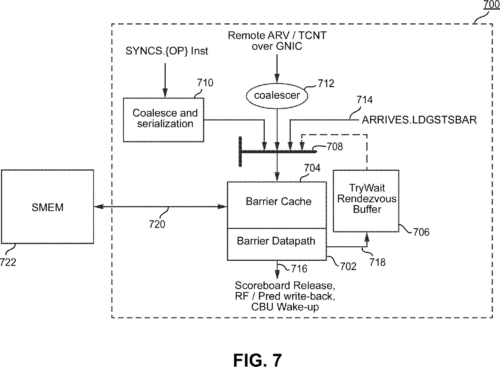
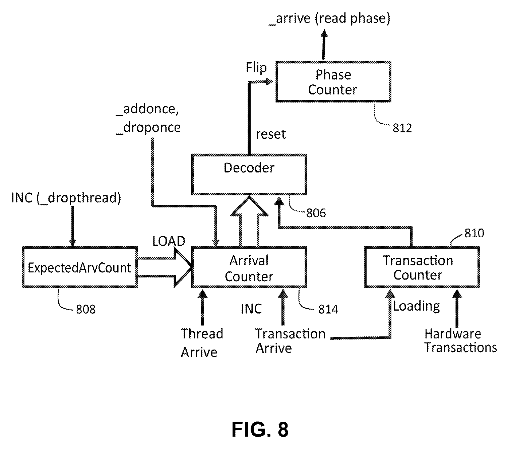
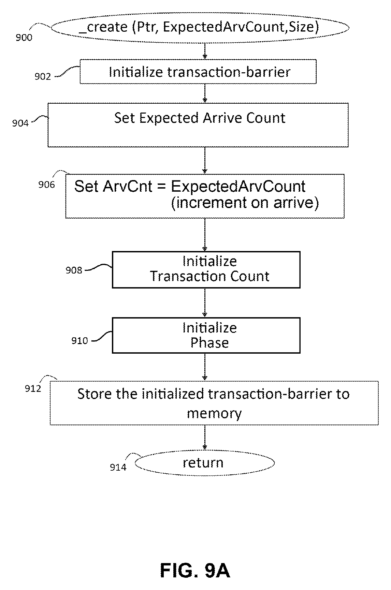
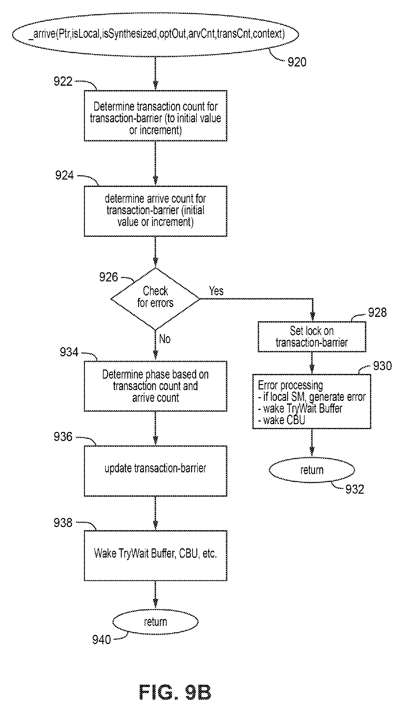
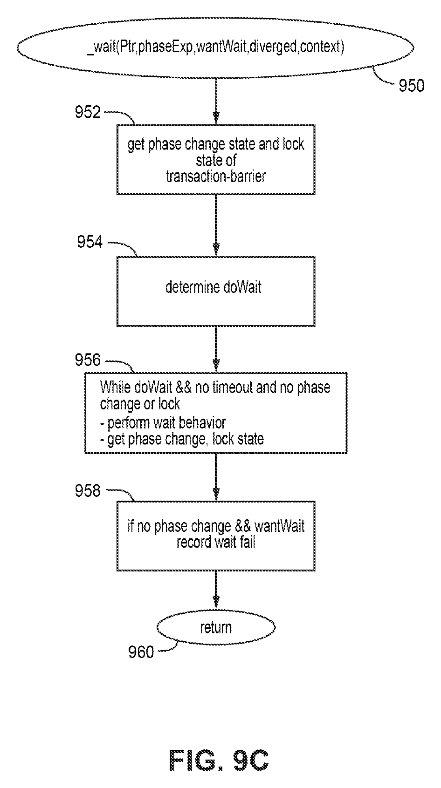

# mbarrier：SM100a 语义、对象与实现规范

版本 v3；依据 NVIDIA PTX ISA **9.4**；查阅日期 **2026-09-11**。
本文件是工程mbarrier的唯一规范，公开语义决定目标。
标记：[NV]官方规则、[MAP]项目表示、[RTL]实现、[OPEN]外部责任/未定义行为、[TODO]范围外未实现。

## 1. 实现与范围

[`mbarrier_frontend`](../rtl/mbarrier/mbarrier_frontend.sv)提供统一命令、排序握手、普通cp.async登记/完成与report-on。
[`mbarrier_unit`](../rtl/mbarrier/mbarrier_unit.sv)提供对象cache、计数更新、wait队列和32B SMEM接口。
类型及私有编码位于[`tma_mbarrier_pkg`](../rtl/common/tma_mbarrier_pkg.sv)。
当前对象和等待者属于本CTA；跨CTA对象、multicast和远端完成路由未实现。

| opcode | 操作 | 当前接口行为 |
| --- | --- | --- |
| 0 / 5 | INIT / INVAL | 选择layout v0/v1；失效后允许重新初始化 |
| 1 / 8 | ARRIVE / ARRIVE_DROP | count次到达；drop永久减少后续expected；可选择noComplete |
| 2 / 7 | EXPECT_TX / COMPLETE_TX | 软件tx加/减，无隐含arrival |
| 3 / 9 | ARRIVE_EXPECT_TX / DROP_EXPECT_TX | 先expect，再执行一次arrival或drop |
| 4 / 6 | TRY_WAIT / TEST_WAIT | state/parity，独立完成谓词；try有限潜在等待 |
| 10 / 11 | PENDING_COUNT / CHECK_LAYOUT | token的操作前pending / 对象layout比较谓词 |
| 12 | CP_ASYNC_ARRIVE | 捕获issuer此前普通cp.async的完成前缀，可选择noinc |

内部FAULT、REPORT、PENDING_INC、TX_COMPLETE不是软件opcode，软件不能借此绕过生命周期检查。
TMA使用独立transaction完成入口，普通cp.async使用独立arrival路径，二者的单位和事件不能混用。

## 2. 对象、计数与phase

[NV] 对象为shared中的64 bit、8B对齐opaque状态；软件不得解码/伪造NVIDIA存储布局。
初始化expected为1..2^20−1（v0）或1..511（v1）；pending范围分别为0..2^20−1、0..511。
tx为有符号计数，两个布局均限制在−(2^20−1)..2^20−1，不包括−2^20。
expect增加、complete减少；正负顺序均须遵守phase和范围前提。

初始化primary/conditional phase和report为零，pending=expected，tx=0。
pending与tx同时为零才完成primary phase，翻转primary并将pending重装expected。
v0的conditional随primary推进。v1当前report为零才推进conditional；有report时conditional保持。
新primary phase从report=0开始，上一primary的8-bit report保留供相应成功等待观察。

[NV] 每个phase完成后至少一次成功test/try wait，再进行下一phase的arrival。
state/parity仅对当前及紧邻前一phase有规定意义；一位parity不能识别跨两次phase的陈旧请求。
前端负责这些程序前提、对象所属CTA和生命周期，不把任意历史token当永久有效句柄。

正常复用顺序为“结束使用→INVAL→INIT”，INVAL不代替排空仍在执行的异步生产者。
对未初始化对象、错误phase或越界计数的使用属于公开未定义行为；工程错误码只提供诊断。

## 3. Arrival、token与report

ARRIVE减pending；DROP同时减expected，expected不得降到0。
combined expect操作只执行一次arrival/drop，不能把无关count字段解释成多次arrival。
noComplete不得完成phase：最后一次arrival若tx仍非零可以合法，不是简单拒绝pending降到0。
noComplete仅使用其合法release.cta形式。

[MAP] arrival返回独立64-bit opaque token，捕获**操作前primary phase**和pending，
不使用输入phase token控制arrival，也不把backing-memory snapshot当通用返回值。
项目token含valid、layout、noComplete、旧phase、旧pending和校验标识；调用方不得依赖其位编码。
PENDING_COUNT仅接受v0 noComplete的合法arrival token，返回该arrival之前的pending，**不访问对象内存**。

REPORT接口供外部异步生产者进行report-on，payload为8 bit；该接口有独立tag/响应。
项目把同phase生产者payload按位OR组合；这是一项明确的生产者接口约定，不声称NVIDIA保证任意payload的组合算法。
TMA后端错误、LSU错误和项目锁定**不转换成NVIDIA payload report**。

v1 state等待观察primary；parity可选择primary或conditional。
report及report_predicate仅在对应成功等待时有效；失败/超时/排序错误时不能使用残留report。
跨primary phase保存上一report，不能只用“当前report”回答旧primary token。

## 4. 等待与顺序

TEST_WAIT不进入等待CAM：未完成返回status=OK、wait_complete=0。
TRY_WAIT可以有限等待。timeHint为纳秒提示，项目换算为
`ceil(timeHint/CLOCK_PERIOD_NS)`周期；零hint使用WAIT_DEFAULT_CYCLES。
默认周期10ns、默认时限64cycle。时限从进入CAM计算；cache miss和结果反压另受后端进度制约。
超时不等于错误；成功观察优先于同时到期。未确认的新phase不能被提前报告成功。

统一`bar_cmd_t`含opcode、issuer/tag/seq、addr、arrive_count32、tx_bytes64、
state64、parity选择/值、layout、conditional、no_complete、report8、noinc、time_hint32、sem/scope。
PTX软件tx操作数为u32；项目较宽承载字段仍检查合法数值范围。
`bar_rsp_t`把status与wait_complete、value32、predicate、report8、report_predicate分开。
phase/locked只是项目诊断；arrival的返回token才是state等待的输入。

| 操作 | sem / scope |
| --- | --- |
| 普通arrival/drop/combined | release或relaxed，CTA/cluster；noComplete限定release.cta |
| test/try wait | acquire或relaxed，CTA/cluster |
| 软件expect/complete | relaxed，CTA/cluster |
| init/inval/pending_count/check_layout/普通cp.async提交 | 不提供额外release/acquire，使用项目relaxed编码 |
| TMA complete-tx | 数据与release.cluster确认后由专用入口更新 |

[RTL] release命令先等待`bar_order_req/rsp`，确认后才提交核心状态更新。
成功acquire等待先完成核心观察，再等待排序确认，确认后才返回成功谓词。
同issuer后来的状态命令不能越过尚未确认的release。不同issuer可占用独立事务项。
错误ack或ID不匹配返回MEMORY并清除成功等待谓词。

[OPEN] `bw_order_req_t`携带issuer、序号、scope、proxy、对象地址/范围。
release确认发布该issuer此前相关内存操作，不能只确认barrier对象本身；acquire确认提供对应可见性。
前端不得让依赖读取越过尚未返回的成功等待。init发布、CTA线程同步和proxy转换也必须实际执行。
本模块不实现通用LSU、cache coherence或前端指令调度；外部ack不能仅表示“已放进队列”。

## 5. 普通cp.async登记与完成

`async_req`登记issuer/seq，`async_cpl_req`独立报告完成及status；响应共享带issuer/seq的结果通道。
两条请求通道独立valid-ready，完成优先，登记表满也能接收释放表项的完成。
每个issuer登记序号严格递增、活跃上下文内不回绕；完成允许乱序；重复/未知完成返回BAD_TOKEN。
前端必须在发出cp.async.mbarrier.arrive前登记它所跟踪的普通cp.async。

CP_ASYNC_ARRIVE捕获该issuer中seq小于命令seq的未完成集合。
无noinc先增加pending一次，随后异步arrival一次，净变化为零；noinc不增加pending，
调用方在初始arrival计数中预留这一份。提交响应只表示登记成功，不表示异步arrival已经完成。
此前集合排空后才提交一次arrival；后来登记的操作和其他issuer不属于该前缀。

普通cp.async生产者失败会锁定关联对象并报告诊断；issuer故障保留到上下文reset。
这不是NVIDIA对backend故障的保证；不能通过INVAL单个对象清除整个issuer的故障记录。
外部report-on与普通完成status通道分离。

## 6. 私有backing与资源

[MAP] 对象bit0 valid、bit1 primary、bit2 layout。故障锁定放在内部sidecar，**不占对象bit2**。

| 布局 | 私有字段 |
| --- | --- |
| v0 | expected[22:3]、pending[42:23]、signed tx[63:43] |
| v1 | expected[11:3]、pending[20:12]、signed tx[41:21]、conditional[42]、两个8-bit report[50:43]/[58:51]，其余保留 |

SMEM总线保持32B；按对象地址[4:3]选一个8B子字，写mask为`0xff << (slot*8)`。
cache key、等待匹配、写冲突匹配使用完整8B地址，同一行四个对象不能互相覆盖。
锁定、有waiter或有未确认写入的cache项不逐出；资源不足反压。
默认4项对象cache、8项write-through FIFO、32项wait CAM、16项普通异步登记表。
容量是项目参数，不是NVIDIA硬件结构声明。

状态操作在backing写确认后返回。后端错误会poison相关排队更新，并保持锁定直到INVAL。
必须先排空旧生产者再失效重建；不提供部分写入回滚。
单独INVAL不能使仍在进行的普通cp.async或TMA操作合法地重新关联新对象。

| status | 项目意义 |
| --- | --- |
| 00 | 命令成功；等待还必须检查wait_complete |
| 40 / 41 / 42 | 不支持opcode / 未初始化 / 锁定 |
| 43 / 44 / 45 | tx范围 / arrival范围 / backend或排序协议错误 |
| 47 / 48 / 49 | 对齐 / opaque token或普通async序号 / modifier组合 |

所有接受的命令恰好一个诊断响应；内部deferred arrival不产生第二个提交响应。
错误、超时、未完成等待和成功完成分别表示。

## 7. 官方条款、实现与验收

[实现验收矩阵](sm100a_implementation_matrix.md)逐项记录官方条款、合法组合、接口、RTL和测试。
回归包含两种layout、四对象同行、计数边界、noComplete/drop、旧phase token、conditional/report、
有限等待、独立排序确认、普通async乱序、登记表容量与恢复。
执行位置与入口遵守[AGENTS](../AGENTS.md)；产物仅在`build/blackwell/`。
### 1.2 cluster 对象访问目标

本节全部为 **[NV/TODO]**。远端 `.shared::cluster` 对象允许 `arrive`、`arrive_drop`、
`expect_tx`、`complete_tx`；前两者必须丢弃返回值，不能取得远端 opaque state。
其他操作（含 init/inval、test/try wait、pending_count、check_layout）不支持对远端对象直接执行。
对象所属 CTA 初始化并发布对象；其他 CTA 更新它；需要等待的线程遵守本地对象访问限制。
所有参与 CTA 在 DSMEM 访问和同步结束前必须保持存活。

目标 cluster scope 的 release/acquire 需要前端和 DSMEM 系统共同实现，
不能用同一条本地 SMEM 总线或不同 issuer 数值模拟远端可见性。
SM100a 不纳入 SM107f 的32-bit mbarrier multicast；TMA group2 的远端completion
路由单独定义在 [TMA目标契约](tma_spec.md#11-clustermulticast-与-cta-pair-的完整目标契约)。

## 8. 引用与非规范性架构参考

- **S1** [PTX 9.4 — mbarrier object、counts、lifecycle、phases](https://docs.nvidia.com/cuda/parallel-thread-execution/index.html#parallel-synchronization-and-communication-instructions-mbarrier)。
- **S2** [PTX — mbarrier.arrive](https://docs.nvidia.com/cuda/parallel-thread-execution/index.html#parallel-synchronization-and-communication-instructions-mbarrier-arrive)。
- **S3** [PTX — mbarrier.expect_tx](https://docs.nvidia.com/cuda/parallel-thread-execution/index.html#parallel-synchronization-and-communication-instructions-mbarrier-expect-tx)，及同章 complete_tx。
- **S4** [PTX — test_wait / try_wait](https://docs.nvidia.com/cuda/parallel-thread-execution/index.html#parallel-synchronization-and-communication-instructions-mbarrier-test-wait-try-wait)。
- **S5** [PTX — Memory Consistency Model](https://docs.nvidia.com/cuda/parallel-thread-execution/index.html#memory-consistency-model)。
- **S6** [PTX — mbarrier shared-memory support](https://docs.nvidia.com/cuda/parallel-thread-execution/index.html#parallel-synchronization-and-communication-instructions-mbarrier-smem)。
- **S7** [本工程 TMA 完成规范](tma_spec.md#5-完成域线程与内存顺序)。

在线页面可能更新，以上版本/查阅日期限定此次审查。以下专利图片仅提供缓存、计数与等待组织的设计背景：
[US20230289242A1](https://patents.google.com/patent/US20230289242A1/en)。

