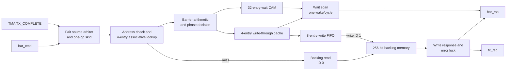

# Memory-backed mbarrier RTL 规范

文档版本：v1.0  
规范对象：`src/main/mbarrier_unit.sv`  
公共常量：`src/main/tma_mbarrier_pkg.sv`

## 1. 目的与适用范围

本文档定义本项目 memory-backed transaction barrier（简称 mbarrier）的状态、
接口、操作语义、缓存策略、错误恢复和 waiter 唤醒规则。本文中的“必须”“应当”
以当前已验证的 SystemVerilog RTL 为准；公开专利只用于解释 transaction barrier
的基本思想。

mbarrier 同时等待两类事件：

1. 软件/线程 arrival，使 `remaining_arrive_count` 递减；
2. 异步 transaction expectation 与 completion，通过 signed 64 bit
   `transaction_balance` 配对。

只有 arrival 和 transaction 两类条件同时满足时，barrier 才翻转 phase。waiter
持有旧 phase token；当前 phase 已不等于 token 时立即完成，否则进入 wait CAM。

本模块支持：

- `INIT`、`ARRIVE`、`EXPECT_TX`、原子 `ARRIVE_EXPECT_TX` 和 `TRY_WAIT`；
- TMA 内部 `TX_COMPLETE`；
- completion-before-expectation 和 expectation-before-completion；
- 4 项全相联非一致性 cache；
- 8 项 write-through FIFO；
- 32 项 wait CAM；
- backing-memory 错误锁定和 `INIT` 恢复；
- cache hit 且无输出/写缓冲阻塞时每周期接受一个操作。

> 本实现是依据公开语义独立设计的开放研究 RTL，不是 NVIDIA 私有 RTL、
> ISA 编码、周期精确微架构或物理实现规范。

## 2. 顶层功能约束

### 2.1 时钟、复位与一致性

- 单时钟域，所有状态在 `clk` 上升沿更新。
- `rst_n` 为异步低有效复位。
- 复位清空 cache valid、wait CAM、write FIFO、响应 valid 和内部控制状态。
- barrier backing memory 与 cache 非一致；软件不得绕过本单元读写 barrier state。
- barrier 地址必须 32 byte 对齐。
- 不包含 CDC、RDC、DFT、cache coherence 或真实 TileLink 协议。

### 2.2 参数

| 参数 | 默认值 | 约束 | 说明 |
| --- | ---: | --- | --- |
| `ADDR_W` | 64 | 不小于 32 | barrier backing-memory 地址宽度 |
| `CACHE_ENTRIES` | 4 | 不小于 1 | 全相联 barrier cache 项数 |
| `WAIT_ENTRIES` | 32 | 不小于 1 | wait CAM 项数 |
| `WRITE_BUF_DEPTH` | 8 | 不小于 2 | write-through FIFO 深度 |
| `MEM_ID_W` | 2 | 不小于 1 | backing-memory transaction ID 宽度 |

### 2.3 核心不变量

- 每个被接受的 `bar_cmd` 最终恰好产生一个 `bar_rsp`。
- 每个被接受的 `tx_cpl` 最终恰好产生一个 `tx_rsp`。
- `TRY_WAIT` 可以延迟响应，但不会产生第二个响应。
- state-changing 操作的响应必须等待 backing-memory write response。
- phase 只允许在 `remaining == 0 && transaction_balance == 0 && !locked`
  时翻转。
- phase 翻转后 `remaining` 重装为 `expected`，`expected` 自身不变。
- locked barrier 除 `INIT` 外不再改变状态。
- waiter 不得在同一地址的旧 write-through 更新全部确认前观察到 phase 翻转。
- valid-ready 输出在阻塞期间必须保持 payload 稳定。

## 3. 架构

### 3.1 专利架构参考


图 1：US20230289242A1 Fig.7。该图仅用于说明 barrier cache、barrier datapath、
wait buffer 和 backing SMEM 的公开组织方式。


图 2：US20230289242A1 Fig.8。该图仅用于说明 expected arrival、arrival、
transaction 和 phase 的联合完成概念。

### 3.2 专利流程参考


图 3：US20230289242A1 Fig.9A，transaction barrier 初始化流程。


图 4：US20230289242A1 Fig.9B，arrival 与 transaction 更新流程。


图 5：US20230289242A1 Fig.9C，phase-token wait 流程。

以上专利图仅用于架构语义说明；当前 RTL 的状态位宽、错误码、cache 替换、
write-through 确认和具体握手规则由本文后续章节定义。

### 3.3 当前 RTL 架构



`bar_cmd` 与 TMA `tx_cpl` 共享一个串行 operation datapath。当两者同时持续有效时，
仲裁方向逐次翻转，避免固定优先级饥饿。cache hit、响应槽可用且 write FIFO 未满时，
当前 operation 完成的同一周期可接受下一 operation。

实例化到 `tma_mbarrier_subsystem` 后，`mem_req`/`mem_rsp` 作为 32 byte backing
channel，与 TMA 的 SMEM channel 经过交替公平仲裁后共用外部 SMEM 端口。集成层用
外部 SMEM ID 最高位区分来源：mbarrier 为 1，TMA 为 0；mbarrier address 的高位还
必须能无损落入 `SMEM_ADDR_W`，否则集成层断言报错。

## 4. Barrier backing-state ABI

每个 barrier 占用一个 32 byte、256 bit backing-memory beat。

| Bit 范围 | 宽度 | 字段 | 含义 |
| --- | ---: | --- | --- |
| `[0]` | 1 | `valid` | 1 表示已初始化 |
| `[1]` | 1 | `phase` | 当前 1 bit phase |
| `[2]` | 1 | `lock` | 1 表示 barrier 锁定，仅 `INIT` 可恢复 |
| `[18:3]` | 16 | `expected_arrive_count` | 每个 phase 期望的 arrival 总数 |
| `[34:19]` | 16 | `remaining_arrive_count` | 当前 phase 尚未完成的 arrival 数 |
| `[98:35]` | 64 | `transaction_balance` | signed 二补码 transaction balance |
| `[255:99]` | 157 | reserved | 普通更新保持原值；`INIT` 清零 |

`INIT(expected)` 建立：

```text
valid                       = 1
phase                       = 0
lock                        = (expected == 0)
expected_arrive_count       = expected
remaining_arrive_count      = expected
transaction_balance         = 0
reserved                    = 0
```

transaction balance 定义为：

$$
transaction\_balance = completed\_bytes - expected\_bytes
$$

因此：

- `EXPECT_TX(bytes)` 执行 `balance -= bytes`；
- `TX_COMPLETE(bytes)` 执行 `balance += bytes`；
- balance 为负表示 expectation 领先；
- balance 为正表示 completion 领先；
- 两者都允许，只要 signed 64 bit 不溢出。

phase 推进条件：

$$
advance = valid \land \lnot locked \land remaining = 0 \land transaction\_balance = 0
$$

满足后：

```text
phase     = !phase
remaining = expected
```

## 5. Opcode 与状态码

### 5.1 软件可见 opcode

| 名称 | 编码 | `arrive_count` | `tx_bytes` | `phase_token` | 功能 |
| --- | ---: | --- | --- | --- | --- |
| `MBAR_OP_INIT` | `3'd0` | expected | 忽略 | 忽略 | 初始化或恢复 barrier |
| `MBAR_OP_ARRIVE` | `3'd1` | 到达数 | 忽略 | 必须等于当前 phase | 递减 remaining |
| `MBAR_OP_EXPECT_TX` | `3'd2` | 忽略 | expectation bytes | 忽略 | balance 减少 |
| `MBAR_OP_ARRIVE_EXPECT_TX` | `3'd3` | 到达数 | expectation bytes | 必须等于当前 phase | 原子 arrival + expectation |
| `MBAR_OP_TRY_WAIT` | `3'd4` | 忽略 | 忽略 | 旧 phase token | phase 已变化则立即返回，否则排队 |

### 5.2 内部 opcode

| 名称 | 编码 | 来源 | 功能 |
| --- | ---: | --- | --- |
| `MBAR_OP_TX_COMPLETE` | `3'd7` | TMA `tx_cpl` | balance 增加；不通过 `bar_cmd` 暴露 |

### 5.3 mbarrier status

| 名称 | 值 | 是否锁定状态 | 含义 |
| --- | ---: | --- | --- |
| `MBAR_STATUS_OK` | `8'h00` | 否 | 成功 |
| `MBAR_STATUS_BAD_OPCODE` | `8'h40` | 否 | 未定义软件 opcode |
| `MBAR_STATUS_UNINITIALIZED` | `8'h41` | 否 | backing state 的 valid 为 0 |
| `MBAR_STATUS_LOCKED` | `8'h42` | 已锁定 | barrier 已锁定或 waiter 因锁定被唤醒 |
| `MBAR_STATUS_OVERFLOW` | `8'h43` | 是 | signed transaction balance 溢出 |
| `MBAR_STATUS_BAD_ARRIVE` | `8'h44` | 是 | arrival 为 0 或大于 remaining；`INIT(0)` 也返回此码 |
| `MBAR_STATUS_MEMORY` | `8'h45` | 写错误时是 | backing-memory response 错误或 ID 错误 |
| `MBAR_STATUS_BAD_PHASE` | `8'h46` | 是 | arrival token 不等于当前 phase |
| `MBAR_STATUS_BAD_ALIGN` | `8'h47` | 否 | barrier 地址非 32 byte 对齐 |
| `MBAR_STATUS_INTERNAL` | `8'h4f` | 实现相关 | 内部一致性错误保留码 |

当前 RTL 对未初始化访问返回 `UNINITIALIZED`，但不会构造一个新的 locked state；
调用方必须使用 `INIT` 建立状态。backing read 失败同样返回 `MEMORY`，因为不存在
可安全写回的有效 cache state。backing write 失败会锁定已经更新的 cache state。

## 6. 接口定义

### 6.1 输入信号

| 分组 | 信号名 | 位宽（默认） | 提供方 | 说明 |
| --- | --- | ---: | --- | --- |
| Clock | `clk` | 1 | SoC | 上升沿时钟 |
| Reset | `rst_n` | 1 | SoC | 异步低有效复位 |
| Barrier command | `bar_cmd_vld_i` | 1 | 软件命令源 | 软件命令有效 |
| Barrier command | `bar_cmd_opcode_i` | 3 | 软件命令源 | mbarrier opcode |
| Barrier command | `bar_cmd_tag_i` | 16 | 软件命令源 | 命令/waiter ID，响应原样返回 |
| Barrier command | `bar_cmd_addr_i` | `ADDR_W`（64） | 软件命令源 | 32 byte 对齐的 barrier 地址 |
| Barrier command | `bar_cmd_arrive_count_i` | 16 | 软件命令源 | `INIT` expected 或 arrival decrement |
| Barrier command | `bar_cmd_tx_bytes_i` | 64 | 软件命令源 | expectation bytes |
| Barrier command | `bar_cmd_phase_token_i` | 1 | 软件命令源 | arrival/current phase token 或 wait old phase token |
| Barrier response | `bar_rsp_rdy_i` | 1 | 软件响应接收方 | 允许消费 barrier response/wakeup |
| TX completion | `tx_cpl_vld_i` | 1 | TMA | TMA completion 有效 |
| TX completion | `tx_cpl_tag_i` | 16 | TMA | TMA command tag |
| TX completion | `tx_cpl_addr_i` | `ADDR_W`（64） | TMA | barrier 地址 |
| TX completion | `tx_cpl_bytes_i` | 64 | TMA | completed logical bytes |
| TX response | `tx_rsp_rdy_i` | 1 | TMA | 允许消费 completion response |
| Memory request | `mem_req_rdy_i` | 1 | backing memory | 允许接收 32 byte memory request |
| Memory response | `mem_rsp_vld_i` | 1 | backing memory | backing response 有效 |
| Memory response | `mem_rsp_data_i` | 256 | backing memory | read state；write response 时忽略 |
| Memory response | `mem_rsp_status_i` | 2 | backing memory | 0 成功，非零失败 |
| Memory response | `mem_rsp_id_i` | `MEM_ID_W`（2） | backing memory | 必须返回 request ID |

### 6.2 输出信号

| 分组 | 信号名 | 位宽（默认） | 接收方 | 说明 |
| --- | --- | ---: | --- | --- |
| Barrier command | `bar_cmd_rdy_o` | 1 | 软件命令源 | 当前 operation 槽可用、命令被仲裁选中且资源可用 |
| Barrier response | `bar_rsp_vld_o` | 1 | 软件响应接收方 | 命令响应或 waiter wakeup 有效 |
| Barrier response | `bar_rsp_tag_o` | 16 | 软件响应接收方 | 原命令 tag 或 waiter ID |
| Barrier response | `bar_rsp_status_o` | 8 | 软件响应接收方 | mbarrier status |
| Barrier response | `bar_rsp_phase_o` | 1 | 软件响应接收方 | 操作后的 phase 或 wake 时当前 phase |
| Barrier response | `bar_rsp_locked_o` | 1 | 软件响应接收方 | 响应时 barrier 是否 locked |
| TX completion | `tx_cpl_rdy_o` | 1 | TMA | 当前 TX completion 被仲裁选中且可接受 |
| TX response | `tx_rsp_vld_o` | 1 | TMA | completion response 有效 |
| TX response | `tx_rsp_tag_o` | 16 | TMA | completion tag |
| TX response | `tx_rsp_status_o` | 8 | TMA | completion 的 mbarrier status |
| TX response | `tx_rsp_phase_o` | 1 | TMA | completion 后 phase |
| Memory request | `mem_req_vld_o` | 1 | backing memory | 32 byte request 有效 |
| Memory request | `mem_req_write_o` | 1 | backing memory | 1 写、0 读 |
| Memory request | `mem_req_addr_o` | `ADDR_W`（64） | backing memory | barrier backing address |
| Memory request | `mem_req_data_o` | 256 | backing memory | 完整 barrier state；读请求置零 |
| Memory request | `mem_req_mask_o` | 32 | backing memory | 写请求全 1，读请求全 0 |
| Memory request | `mem_req_id_o` | `MEM_ID_W`（2） | backing memory | 0 为 cache miss read，1 为 write-through |
| Memory response | `mem_rsp_rdy_o` | 1 | backing memory | 有 outstanding request 且目标响应槽可用时为 1 |

### 6.3 握手、仲裁和响应规则

所有通道使用 valid-ready：

```text
fire = valid && ready
```

发送方在 `valid=1 && ready=0` 时必须保持 payload 稳定。`bar_rsp`、`tx_rsp` 和
`mem_req` 均使用寄存 payload。

软件 command 与 TX completion 的仲裁规则：

- 只有一个 operation skid 槽；
- 当仅一个来源有效时接受该来源；
- 两个来源同时有效时按 `arb_tx_turn` 交替选择；
- 如果 software command 是 `TRY_WAIT` 且 CAM 无空项，允许 TX completion 前进；
- `bar_cmd_rdy_o` 和 `tx_cpl_rdy_o` 只对本周期被选中的有效来源拉高。

backing memory 同时最多有一个 outstanding request。默认 ID 约定：

- `mem_req_id_o == 0`：cache miss read；
- `mem_req_id_o == 1`：write-through；
- response 必须返回相同 ID；
- 2 bit status 的 0 表示成功，非零表示失败。

## 7. 操作语义

### 7.1 Cache hit/miss

- cache 按完整 barrier address 全相联匹配。
- `INIT` 可直接使用可替换 cache 项，不需要先读 backing state。
- 其他操作 miss 时先发起 backing read，读回后再执行原操作。
- victim 选择顺序：无效项、round-robin 项（若无 resident waiter）、第一个无
  resident waiter 的项。
- 若所有 cache 项都有 waiter，则需要新 cache 项的操作保持阻塞。
- cache 不一致；外部不得直接更新 backing state。

### 7.2 Write-through 退休

所有 state-changing 操作先更新 cache，并把完整 256 bit next state、tag、status、
phase 和响应类型写入 8 项 FIFO。操作的唯一 response 在对应 backing write response
到达后产生，而不是在 FIFO 入队时产生。

同一 barrier 的 phase/lock 变化在存在未确认 write 时不会触发 waiter wakeup。这一
规则保证 backing write 错误有机会先把 barrier 锁定，waiter 不会提前报告成功。

### 7.3 Wait CAM

- CAM 保存 barrier address、16 bit waiter tag 和旧 phase token。
- `TRY_WAIT` 发现 `current_phase != token` 时立即返回。
- phase 相同且 barrier 正常时，命令进入 CAM并延迟响应。
- CAM 满时，对新的 `TRY_WAIT` 撤销 ready；普通命令和 TX completion 不因 CAM 满
  而被阻塞。
- phase 变化或 barrier locked 后，按最低 CAM index 每周期最多唤醒一个 waiter。
- waiter wakeup 低于直接 operation response 和 backing write response 的优先级。

## 8. 功能伪代码

### 8.1 公共接收、地址检查与 cache dispatch

```text
function ACCEPT_OPERATION():
    fairly choose one source from bar_cmd and tx_cpl
    accept only when operation slot and required resource are available
    latch opcode, tag, address, arrive count, bytes and phase token

    if address mod 32 != 0:
        respond BAD_ALIGN without changing state
    else if opcode == INIT:
        allocate or hit a cache entry and execute INIT directly
    else if cache hit:
        execute operation on cached state
    else:
        select a cache victim without resident waiters
        read 256-bit state from backing memory using ID 0
        on successful read insert state and retry operation
        on read error respond MEMORY
```

### 8.2 `INIT`

```text
function INIT(expected):
    next = all zeros
    next.valid = 1
    next.phase = 0
    next.expected = expected
    next.remaining = expected
    next.transaction_balance = 0

    if expected == 0:
        next.locked = 1
        status = BAD_ARRIVE
    else:
        next.locked = 0
        status = OK

    WRITE_THROUGH_AND_RESPOND(next, status)
```

`INIT` 可覆盖未初始化、正常或 locked barrier，是 locked state 的唯一恢复路径。

### 8.3 `ARRIVE`

```text
function ARRIVE(count, token):
    require state.valid and not state.locked

    if token != state.phase:
        state.locked = 1
        WRITE_THROUGH_AND_RESPOND(state, BAD_PHASE)
        return

    if count == 0 or count > state.remaining:
        state.locked = 1
        WRITE_THROUGH_AND_RESPOND(state, BAD_ARRIVE)
        return

    state.remaining -= count
    ADVANCE_PHASE_IF_COMPLETE(state)
    WRITE_THROUGH_AND_RESPOND(state, OK)
```

### 8.4 `EXPECT_TX`

```text
function EXPECT_TX(bytes):
    require state.valid and not state.locked

    candidate = signed65(state.transaction_balance) - unsigned64(bytes)
    if candidate does not fit signed 64 bits:
        state.locked = 1
        WRITE_THROUGH_AND_RESPOND(state, OVERFLOW)
        return

    state.transaction_balance = candidate
    ADVANCE_PHASE_IF_COMPLETE(state)
    WRITE_THROUGH_AND_RESPOND(state, OK)
```

### 8.5 原子 `ARRIVE_EXPECT_TX`

```text
function ARRIVE_EXPECT_TX(count, bytes, token):
    require state.valid and not state.locked

    validate token and count exactly as ARRIVE
    if validation fails:
        lock state and write one error update
        return

    candidate = signed65(state.transaction_balance) - unsigned64(bytes)
    state.remaining -= count

    if candidate does not fit signed 64 bits:
        state.locked = 1
        status = OVERFLOW
    else:
        state.transaction_balance = candidate
        status = OK

    ADVANCE_PHASE_IF_COMPLETE(state)
    WRITE_THROUGH_AND_RESPOND(state, status)
```

arrival decrement 与 expectation 更新作为同一个 cached-state 更新和同一个 backing
write 退休，不会被其他 barrier operation 观察到中间状态。

### 8.6 `TRY_WAIT` 立即完成

```text
function TRY_WAIT_IMMEDIATE(old_phase):
    require state.valid

    if state.locked:
        respond LOCKED with current phase and locked=1
    else if state.phase != old_phase:
        respond OK with current phase and locked=0
    else:
        not an immediate completion
```

### 8.7 `TRY_WAIT` CAM 排队

```text
function TRY_WAIT_ENQUEUE(tag, address, old_phase):
    if state.phase == old_phase and not state.locked:
        if wait CAM has no free entry:
            keep bar_cmd_rdy_o low
            do not accept the command
        else:
            allocate lowest free CAM entry
            store address, tag and old_phase
            produce no response yet
```

### 8.8 内部 `TX_COMPLETE`

```text
function TX_COMPLETE(bytes, tag):
    require state.valid and not state.locked

    candidate = signed65(state.transaction_balance) + unsigned64(bytes)
    if candidate does not fit signed 64 bits:
        state.locked = 1
        status = OVERFLOW
    else:
        state.transaction_balance = candidate
        status = OK

    ADVANCE_PHASE_IF_COMPLETE(state)
    WRITE_THROUGH_AND_TX_RESPOND(state, tag, status)
```

该加法允许 completion 在 expectation 之前到达，届时 balance 为正；后续
`EXPECT_TX` 把 balance 减回零。

### 8.9 Phase 翻转与 remaining 重装

```text
function ADVANCE_PHASE_IF_COMPLETE(state):
    if not state.locked
       and state.remaining == 0
       and state.transaction_balance == 0:
        state.phase = not state.phase
        state.remaining = state.expected
```

`INIT` 不调用该函数，因此即使初始化后的内部数值满足零条件，也不会在初始化操作
中翻转 phase。

### 8.10 多 waiter 逐项唤醒

```text
function WAKE_WAITERS_EACH_CYCLE():
    scan wait CAM from lowest index to highest
    select first entry whose barrier is cached and has no pending same-address write

    if cached barrier is locked:
        emit one bar_rsp(tag, LOCKED, current_phase, locked=1)
        free CAM entry
    else if cached phase != waiter.old_phase:
        emit one bar_rsp(tag, OK, current_phase, locked=0)
        free CAM entry
    else:
        keep waiter resident
```

### 8.11 Cache miss与替换

```text
function SELECT_CACHE_SLOT():
    if any invalid cache entry exists:
        return first invalid entry
    if round_robin victim has no resident waiter:
        return round_robin victim
    if any cache entry has no resident waiter:
        return first such entry
    return NO_SLOT

function SERVICE_CACHE_MISS(address):
    slot = SELECT_CACHE_SLOT()
    if slot == NO_SLOT:
        stall operation
    else:
        issue backing read(address, id=0)
        if response status == 0 and response id == 0:
            cache[slot] = response data
            retry operation
        else:
            respond MEMORY
```

### 8.12 Write-through 与写响应后退休

```text
function WRITE_THROUGH_AND_RESPOND(next_state, status):
    if write FIFO is full:
        stall current operation
        return

    update cache with next_state
    enqueue address, next_state, tag, status, phase and response type

    when memory port is idle:
        issue full-mask backing write using id=1

    wait for matching write response
    if response status == 0 and response id == 1:
        emit exactly one saved response
    else:
        lock cached state and poison queued same-address writes
        emit MEMORY with locked=1 for software operation
        emit MEMORY for TX completion
```

### 8.13 CAM/写缓冲满时的 backpressure

```text
function RESOURCE_BACKPRESSURE(operation):
    if operation changes state and write FIFO count == WRITE_BUF_DEPTH:
        do not finish operation and do not accept a replacement operation

    if operation is TRY_WAIT and no CAM entry is free:
        do not assert bar_cmd_rdy_o for that command

    if cache miss needs replacement and every cache entry has a waiter:
        stall until a waiter is removed
```

### 8.14 重复 phase、下溢、溢出和后端错误锁定

```text
function LOCK_ON_ERROR(reason):
    if reason is stale/wrong arrival phase:
        state.locked = 1
        status = BAD_PHASE
    else if reason is zero arrival or arrival exceeds remaining:
        state.locked = 1
        status = BAD_ARRIVE
    else if reason is signed transaction balance overflow:
        state.locked = 1
        status = OVERFLOW
    else if reason is backing write failure:
        state.locked = 1
        status = MEMORY for triggering operation

    persist or propagate the locked state through write-through ordering
    wake resident waiters with LOCKED after older same-address writes retire
```

非对齐、非法 opcode、未初始化访问和 backing read failure 返回错误，但当前 RTL
不会凭空创建一个 locked backing state。

### 8.15 Locked barrier 的 `INIT` 恢复

```text
function RECOVER_LOCKED_BARRIER(new_expected):
    issue INIT(new_expected) to the same address
    INIT ignores the previous lock bit and constructs a new state from zero
    wait for backing write acknowledgement

    if new_expected > 0 and write succeeds:
        response = OK, phase = 0, locked = 0
    else:
        barrier remains locked and response reports the corresponding error
```

## 9. 响应顺序与可见性

- 非 state-changing 错误和立即完成的 `TRY_WAIT` 可直接使用 response skid。
- state-changing software operation 的 `bar_rsp` 在 backing write response 后产生。
- `TX_COMPLETE` 的 `tx_rsp` 同样在 backing write response 后产生。
- backing write response 高于 waiter wakeup，避免同周期响应覆盖。
- 同一地址只要存在 queued/in-flight write，waiter 即使在 cache 中看到新 phase 也不
  会唤醒。
- 不同 barrier address 共享串行 operation datapath、单 outstanding memory port 和
  公共响应通道，因此不存在固定的跨地址完成延迟保证。
- 每个 response 在 ready 为 0 时保持 tag、status、phase 和 lock 稳定。

## 10. 软件和集成责任

- 软件必须先 `INIT` 再使用 barrier。
- 所有 arrival 必须携带读取时的当前 phase token；重复使用旧 token 会锁定 barrier。
- `TRY_WAIT` 应携带等待开始时保存的旧 phase token。
- expectation bytes 和 TMA completion bytes 必须使用同一逻辑计量单位；当前 TMA
  使用 logical bytes。
- backing memory 不得由普通 load/store 路径直接修改。
- backing memory 必须为每个已接受 request 返回且只返回一次相同 ID 的 response。
- 系统必须最终释放 response backpressure，否则 write retirement 和 waiter wakeup
  可能停止。

## 11. 参考资料

- US20230289242A1：Fig.7、Fig.8、Fig.9A-Fig.9C，用于 transaction barrier
  架构、计数器和 wait 语义说明。
- `src/main/mbarrier_unit.sv`：本文档的规范实现。
- `src/main/tma_mbarrier_pkg.sv`：opcode、status 和 backing-state 位域常量。
- `src/test/cocotb/tma_mbarrier_ref.py`：cycle-independent transaction-balance
  参考模型。
