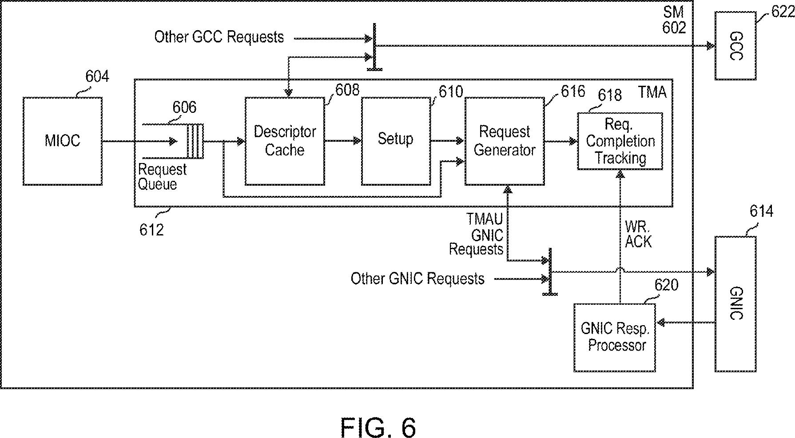
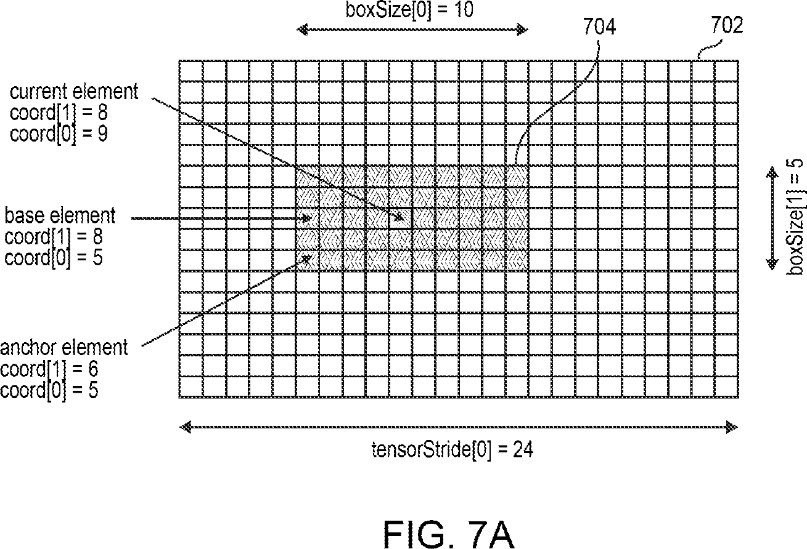
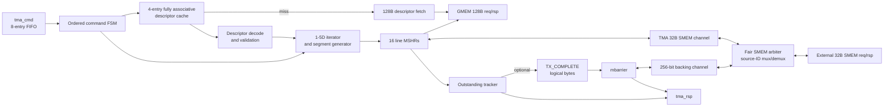

# TMA 数据搬运引擎 RTL 规范

文档版本：v1.0  
规范对象：`src/main/tma_engine.sv`  
公共常量：`src/main/tma_mbarrier_pkg.sv`

## 1. 目的与适用范围

本文档定义本项目 TMA（Tensor Memory Access）研究模型的可观察行为、接口、
descriptor ABI、错误语义和完成顺序。本文中的“必须”“应当”以当前已验证的
SystemVerilog RTL 为准；公开专利仅用于解释设计思路和术语来源。

本模块支持：

- 1-5D tensor load 和 tensor store；
- 任意字节数的 linear load 和 linear store；
- 1、2、4、8、16 byte 元素；
- signed 起始坐标、负起始坐标和任意正 traversal stride；
- load 越界补零、store 越界丢弃；
- 128 byte GMEM line 与 32 byte SMEM beat 的自动拆分；
- 8 项命令队列、4 项全相联 descriptor cache 和 16 项 line MSHR；
- GMEM/SMEM 响应按 ID 乱序返回，命令响应按接收顺序完成；
- 数据搬运完成后向 mbarrier 发送一次合并的 transaction completion。

本模块不支持 im2col、constant fill、swizzle、prefetch、multicast、reduction、
CGA/远端 coalescer、CUDA/PTX 指令编码或真实 L2/TileLink 协议。

> 本实现是依据公开语义独立设计的开放研究 RTL，不是 NVIDIA 私有 RTL、
> ISA 编码、周期精确微架构或物理实现规范。

## 2. 顶层功能约束

### 2.1 时钟与复位

- 单时钟域，所有状态在 `clk` 上升沿更新。
- `rst_n` 为异步低有效复位。
- 不包含 CDC、RDC、DFT 或低功耗隔离逻辑。
- 复位清空命令队列、descriptor cache valid、MSHR、输出 valid 和内部 FSM。

### 2.2 参数

| 参数 | 默认值 | 约束 | 说明 |
| --- | ---: | --- | --- |
| `ADDR_W` | 64 | v1 必须为 64 | GMEM、descriptor 和 barrier 地址宽度 |
| `SMEM_ADDR_W` | 32 | 不小于 32 | SMEM 地址宽度 |
| `CMD_QUEUE_DEPTH` | 8 | 不小于 2 | TMA 命令 FIFO 深度 |
| `DESC_CACHE_ENTRIES` | 4 | 不小于 1 | 全相联 descriptor cache 项数 |
| `MSHR_ENTRIES` | 16 | 不小于 2 | 可并行在途 line transaction 数 |
| `GMEM_ID_W` | 5 | `2^GMEM_ID_W > MSHR_ENTRIES` | MSHR ID，并额外保留一个 descriptor fetch ID |
| `SMEM_ID_W` | 5 | `2^SMEM_ID_W >= MSHR_ENTRIES` | SMEM transaction ID |

在 `tma_mbarrier_subsystem` 中，TMA 内部 SMEM ID 宽度取
`clog2(MSHR_ENTRIES)`；子系统再增加 source 位，与 mbarrier backing-memory
访问共享外部 SMEM 端口。独立 `tma_engine` 的接口表仍以其参数默认值为准。

### 2.3 不变量

- 每个被 `tma_cmd` 接受的命令最终恰好产生一个 `tma_rsp`。
- 命令只在 `tma_cmd_vld_i && tma_cmd_rdy_o` 时被接受。
- 同一输出通道在 `vld=1 && rdy=0` 时必须保持全部 payload 稳定。
- descriptor cache 与 GMEM 非一致；软件修改 descriptor 后必须显式失效。
- `tma_cmd_smem_addr_i` 必须 32 byte 对齐。
- tensor descriptor pointer 必须 128 byte 对齐。
- tensor 元素 GMEM 地址必须满足元素宽度对齐；linear 地址允许任意字节对齐。
- `tma_rsp_bytes_o` 表示逻辑搬运字节数，不表示实际访问 GMEM 的字节数。

## 3. 架构

### 3.1 专利架构参考



图 1：US20230289304A1 Fig.6。该图仅用于说明 descriptor cache、setup、request
generator 和 completion tracking 的公开架构语义；本项目的队列深度、接口和周期
行为由当前 RTL 定义。



图 2：US20230289304A1 Fig.7A。该图仅用于说明 tensor 坐标、box 和 stride 的关系。

### 3.2 当前 RTL 架构



模块一次只执行一个 active command，但可提前在命令 FIFO 中接收最多 8 个命令。
active command 的 line transaction 可占用多个 MSHR 并重叠执行。响应按 MSHR ID
匹配，因此后端不需要保持响应顺序；下一个命令仅在当前命令的最终响应被消费后
进入执行，从而保证命令级按序完成。

在 `tma_mbarrier_subsystem` 中，TMA 的 32 byte SMEM channel 与 mbarrier 的
256 bit backing-memory channel 共享同一个外部 SMEM 端口。两者同时请求时采用
交替公平仲裁；外部 SMEM ID 的最高位标识来源，0 路由回 TMA，1 路由回
mbarrier。该 source 位只属于集成层，不改变两个独立子模块的接口语义。

### 3.3 控制状态

| 状态 | 行为 |
| --- | --- |
| `ST_IDLE` | 从命令 FIFO 取最老命令 |
| `ST_DESC_LOOKUP` | 检查对齐并查询 descriptor cache |
| `ST_DESC_WAIT` | 发起并等待 128 byte descriptor read |
| `ST_SETUP` | 解码 descriptor 或设置 linear command |
| `ST_GENERATE` | 生成 segment，分配 MSHR并推进 iterator |
| `ST_WAIT_MSHR` | 等待全部数据 transaction 响应 |
| `ST_TX_REQ` | 向 mbarrier 发送合并 completion |
| `ST_TX_RSP` | 等待 mbarrier 确认 |
| `ST_RESP` | 保持最终 TMA response 直到握手 |
| `ST_DESC_INV` | 执行 descriptor cache 失效 |

## 4. Descriptor ABI

descriptor 固定为 128 byte、1024 bit，按小端字节顺序存放。维度 0 是最快变化
维度。所有未使用维度的字段应写零。

| Bit 范围 | 宽度 | 字段 | 约束与含义 |
| --- | ---: | --- | --- |
| `[7:0]` | 8 | `version` | v1 必须为 `1` |
| `[10:8]` | 3 | `dims_m1` | `dims - 1`，合法值 0-4 |
| `[13:11]` | 3 | `elem_log2` | 元素字节数的 log2，合法值 0-4 |
| `[15:14]` | 2 | reserved | 当前 RTL 忽略；写入方应置零 |
| `[79:16]` | 64 | `gmem_base` | tensor GMEM 基地址，按元素宽度对齐 |
| `[239:80]` | 5 x 32 | `tensor_size[d]` | 每维 tensor 元素数；有效维必须非零 |
| `[559:240]` | 5 x 64 | `tensor_stride[d]` | 每维 byte stride，按元素宽度对齐 |
| `[639:560]` | 5 x 16 | `box_size[d]` | 每维本次访问元素数；有效维必须非零 |
| `[719:640]` | 5 x 16 | `traversal_stride[d]` | 每次 iterator 推进的坐标步长；有效维必须非零 |
| `[1023:720]` | 304 | reserved | 必须为零，否则返回 `BAD_DESC` |

元素宽度定义：

| `elem_log2` | 元素字节数 |
| ---: | ---: |
| 0 | 1 |
| 1 | 2 |
| 2 | 4 |
| 3 | 8 |
| 4 | 16 |

逻辑访问字节数为：

$$
logical\_bytes = elem\_bytes \times \prod_{d=0}^{dims-1} box\_size[d]
$$

该乘积必须能用无符号 64 bit 表示。descriptor setup 还必须满足：有效维的
`tensor_size`、`box_size`、`traversal_stride` 非零；`gmem_base` 和有效维
`tensor_stride` 按 `elem_bytes` 对齐。

## 5. Opcode 与状态码

### 5.1 TMA opcode

| 名称 | 编码 | 使用字段 | 功能 |
| --- | ---: | --- | --- |
| `TMA_OP_LOAD_TENSOR` | `3'd0` | descriptor、coord、SMEM、barrier | 1-5D GMEM 到 SMEM |
| `TMA_OP_STORE_TENSOR` | `3'd1` | descriptor、coord、SMEM、barrier | 1-5D SMEM 到 GMEM |
| `TMA_OP_LOAD_LINEAR` | `3'd2` | linear address/bytes、SMEM、barrier | 线性 GMEM 到 SMEM |
| `TMA_OP_STORE_LINEAR` | `3'd3` | linear address/bytes、SMEM、barrier | 线性 SMEM 到 GMEM |
| `TMA_OP_DESC_INV` | `3'd4` | descriptor pointer | descriptor cache 失效 |

`DESC_INV` 的 descriptor pointer 为 0 时全局失效，否则只失效地址完全匹配的项。

### 5.2 TMA status

| 名称 | 值 | 含义 |
| --- | ---: | --- |
| `TMA_STATUS_OK` | `8'h00` | 成功 |
| `TMA_STATUS_BAD_OPCODE` | `8'h20` | 未定义 opcode |
| `TMA_STATUS_BAD_DESC_ALIGN` | `8'h21` | descriptor pointer 非 128 byte 对齐 |
| `TMA_STATUS_BAD_DESC` | `8'h22` | descriptor 内容非法或 linear bytes 为 0 |
| `TMA_STATUS_BAD_DIM` | `8'h23` | 维数不在 1-5 |
| `TMA_STATUS_BAD_ELEM` | `8'h24` | 元素宽度不在 1/2/4/8/16 byte |
| `TMA_STATUS_BAD_SMEM_ALIGN` | `8'h25` | SMEM base 非 32 byte 对齐 |
| `TMA_STATUS_ADDR_OVERFLOW` | `8'h26` | 地址或逻辑字节数溢出 |
| `TMA_STATUS_GMEM` | `8'h30` | GMEM descriptor/data transaction 错误 |
| `TMA_STATUS_SMEM` | `8'h31` | SMEM transaction 错误 |
| `TMA_STATUS_MBARRIER` | `8'h32` | mbarrier completion 错误或 tag 不匹配 |
| `TMA_STATUS_INTERNAL` | `8'h3f` | 响应 ID 对应非法 MSHR 状态等内部一致性错误 |

后端 2 bit status 约定 `2'd0` 为成功，任意非零值为失败。

## 6. 接口定义

### 6.1 输入信号

| 分组 | 信号名 | 位宽（默认） | 提供方 | 说明 |
| --- | --- | ---: | --- | --- |
| Clock | `clk` | 1 | SoC | 上升沿时钟 |
| Reset | `rst_n` | 1 | SoC | 异步低有效复位 |
| TMA command | `tma_cmd_vld_i` | 1 | 命令源 | 命令有效；与 `tma_cmd_rdy_o` 握手 |
| TMA command | `tma_cmd_opcode_i` | 3 | 命令源 | TMA opcode |
| TMA command | `tma_cmd_tag_i` | 16 | 命令源 | 命令 tag，原样返回 |
| TMA command | `tma_cmd_desc_ptr_i` | `ADDR_W`（64） | 命令源 | tensor descriptor 地址；`DESC_INV` 的失效地址 |
| TMA command | `tma_cmd_coord_i` | 160 | 命令源 | 5 x signed 32 bit 起始坐标，维度 d 位于 `[32d +: 32]` |
| TMA command | `tma_cmd_smem_addr_i` | `SMEM_ADDR_W`（32） | 命令源 | SMEM 逻辑 buffer base，必须 32 byte 对齐 |
| TMA command | `tma_cmd_linear_addr_i` | `ADDR_W`（64） | 命令源 | linear GMEM byte address |
| TMA command | `tma_cmd_linear_bytes_i` | 32 | 命令源 | linear 搬运字节数，必须非零 |
| TMA command | `tma_cmd_barrier_addr_i` | `ADDR_W`（64） | 命令源 | mbarrier 地址；0 表示不发送 completion |
| TMA response | `tma_rsp_rdy_i` | 1 | 响应接收方 | 允许消费 TMA response |
| GMEM request | `gmem_req_rdy_i` | 1 | GMEM | 允许接收 128 byte request |
| GMEM response | `gmem_rsp_vld_i` | 1 | GMEM | GMEM response 有效 |
| GMEM response | `gmem_rsp_data_i` | 1024 | GMEM | 128 byte read data；write response 时忽略 |
| GMEM response | `gmem_rsp_status_i` | 2 | GMEM | 0 成功，非零失败 |
| GMEM response | `gmem_rsp_id_i` | `GMEM_ID_W`（5） | GMEM | 返回原 request ID |
| SMEM request | `smem_req_rdy_i` | 1 | SMEM | 允许接收 32 byte request |
| SMEM response | `smem_rsp_vld_i` | 1 | SMEM | SMEM response 有效 |
| SMEM response | `smem_rsp_data_i` | 256 | SMEM | 32 byte read data；write response 时忽略 |
| SMEM response | `smem_rsp_status_i` | 2 | SMEM | 0 成功，非零失败 |
| SMEM response | `smem_rsp_id_i` | `SMEM_ID_W`（5） | SMEM | 返回原 request ID |
| TX completion | `tx_cpl_rdy_i` | 1 | mbarrier | 允许接收合并 completion |
| TX response | `tx_rsp_vld_i` | 1 | mbarrier | completion response 有效 |
| TX response | `tx_rsp_tag_i` | 16 | mbarrier | completion tag，必须等于 active command tag |
| TX response | `tx_rsp_status_i` | 8 | mbarrier | mbarrier status，必须为 `MBAR_STATUS_OK` |
| TX response | `tx_rsp_phase_i` | 1 | mbarrier | completion 后 phase；当前 TMA 不参与最终状态判定 |

### 6.2 输出信号

| 分组 | 信号名 | 位宽（默认） | 接收方 | 说明 |
| --- | --- | ---: | --- | --- |
| TMA command | `tma_cmd_rdy_o` | 1 | 命令源 | 命令 FIFO 未满时为 1 |
| TMA response | `tma_rsp_vld_o` | 1 | 响应接收方 | 最终响应有效 |
| TMA response | `tma_rsp_tag_o` | 16 | 响应接收方 | 对应命令 tag |
| TMA response | `tma_rsp_status_o` | 8 | 响应接收方 | TMA status |
| TMA response | `tma_rsp_bytes_o` | 64 | 响应接收方 | 逻辑搬运字节数；setup 前失败通常为 0 |
| GMEM request | `gmem_req_vld_o` | 1 | GMEM | 128 byte request 有效 |
| GMEM request | `gmem_req_write_o` | 1 | GMEM | 1 为写，0 为读 |
| GMEM request | `gmem_req_addr_o` | `ADDR_W`（64） | GMEM | 128 byte line base；descriptor read 为 descriptor pointer |
| GMEM request | `gmem_req_data_o` | 1024 | GMEM | 写数据；读请求置零 |
| GMEM request | `gmem_req_mask_o` | 128 | GMEM | 每 bit 对应 1 byte；读请求置零 |
| GMEM request | `gmem_req_id_o` | `GMEM_ID_W`（5） | GMEM | MSHR 或 descriptor fetch ID |
| GMEM response | `gmem_rsp_rdy_o` | 1 | GMEM | 当前实现恒为 1 |
| SMEM request | `smem_req_vld_o` | 1 | SMEM | 32 byte request 有效 |
| SMEM request | `smem_req_write_o` | 1 | SMEM | 1 为写，0 为读 |
| SMEM request | `smem_req_addr_o` | `SMEM_ADDR_W`（32） | SMEM | 32 byte beat base |
| SMEM request | `smem_req_data_o` | 256 | SMEM | 写数据；读请求置零 |
| SMEM request | `smem_req_mask_o` | 32 | SMEM | 每 bit 对应 1 byte；读请求置零 |
| SMEM request | `smem_req_id_o` | `SMEM_ID_W`（5） | SMEM | MSHR ID |
| SMEM response | `smem_rsp_rdy_o` | 1 | SMEM | 当前实现恒为 1 |
| TX completion | `tx_cpl_vld_o` | 1 | mbarrier | 全部数据 response 到达后置 1 |
| TX completion | `tx_cpl_tag_o` | 16 | mbarrier | active command tag |
| TX completion | `tx_cpl_addr_o` | `ADDR_W`（64） | mbarrier | command 指定的 barrier 地址 |
| TX completion | `tx_cpl_bytes_o` | 64 | mbarrier | 本命令 logical bytes |
| TX response | `tx_rsp_rdy_o` | 1 | mbarrier | 仅在 `ST_TX_RSP` 为 1 |

### 6.3 握手和 ID 规则

所有通道使用 valid-ready：

```text
fire = valid && ready
```

发送方在 `valid=1 && ready=0` 时必须保持 valid 和 payload 稳定。TMA 对 GMEM、
SMEM、TMA response 和 TX completion 的输出均使用寄存 payload，满足该要求。

默认 `MSHR_ENTRIES=16` 时：

- GMEM ID 0-15 属于 line MSHR；
- GMEM ID 16 专用于 descriptor fetch；
- GMEM ID 17-31 保留，后端不得返回未发出的 ID；
- SMEM ID 0-15 属于 line MSHR；
- 每个已发出的 request 必须返回且只返回一次相同 ID 的 response。

## 7. 地址、分段与数据路径

### 7.1 Tensor 坐标

对有效维度 d：

$$
coord[d] = signed\_start[d] + iter[d] \times traversal\_stride[d]
$$

$$
gmem\_element\_addr = gmem\_base + \sum_{d=0}^{dims-1} coord[d] \times tensor\_stride[d]
$$

若任一有效维 `coord[d] < 0` 或 `coord[d] >= tensor_size[d]`，该元素越界。
dimension 0 最快变化；当 dimension 0 回卷时向更高维进位。

SMEM 为紧凑的逻辑 box buffer：

$$
smem\_byte\_addr = smem\_base + logical\_offset
$$

### 7.2 Segment 限制

每个 MSHR segment 同时满足：

- 不跨越 128 byte GMEM line；
- 不跨越 32 byte SMEM beat；
- tensor segment 不拆分单个元素；
- linear segment 最大 32 byte；
- 只有当 dimension 0 的 traversal stride 为 1 且 tensor byte stride 等于
  `elem_bytes` 时，才合并相邻元素。

linear segment 长度：

```text
segment_bytes = min(
    remaining_bytes,
    32 - (smem_addr mod 32),
    128 - (gmem_addr mod 128)
)
```

tensor dimension 0 合并元素数：

```text
group_elems = min(
    box_size[0] - iter[0],
    tensor_size[0] - coord[0],
    floor((128 - gmem_line_offset) / elem_bytes),
    floor((32 - smem_beat_offset) / elem_bytes)
)
```

### 7.3 Load 数据路径

```text
GMEM read -> shift by GMEM line offset -> SMEM write with 32B byte mask
```

GMEM read error时，该 segment 数据强制为零，仍完成对应 SMEM masked write，并记录
`TMA_STATUS_GMEM`。越界 load 不访问 GMEM，直接生成全零 SMEM write。

### 7.4 Store 数据路径

```text
SMEM read -> shift into GMEM line position -> GMEM write with 128B byte mask
```

SMEM read error时，后续 GMEM write 的 mask 清零，因此不修改 GMEM，并记录
`TMA_STATUS_SMEM`。越界 store 不分配 MSHR，不访问 GMEM/SMEM，但仍推进逻辑
iterator 和 logical byte count。

## 8. 功能伪代码

### 8.1 命令入队与按序调度

```text
function ACCEPT_AND_DISPATCH(command):
    if tma_cmd_vld_i and FIFO_not_full:
        enqueue all command fields

    if FSM == IDLE and FIFO_not_empty and no_pending_tma_response:
        active = dequeue oldest command
        clear active status, logical offset, outstanding count and iterator
        dispatch by opcode:
            tensor load/store -> DESC_LOOKUP
            linear load/store -> SETUP
            descriptor invalidate -> DESC_INV
            otherwise -> respond BAD_OPCODE with 0 bytes
```

### 8.2 Descriptor lookup、fetch 与校验

```text
function PREPARE_DESCRIPTOR(desc_ptr):
    if desc_ptr mod 128 != 0:
        return BAD_DESC_ALIGN

    if fully_associative_cache contains desc_ptr:
        desc = cached 128-byte value
    else:
        issue one 128-byte GMEM read using reserved descriptor ID
        wait for response
        if backend status != 0:
            return GMEM error with 0 bytes
        insert response into round-robin cache slot
        desc = response data

    decode desc
    validate version, dims, elem width, active fields, alignment and reserved bits
    logical_bytes = elem_bytes * product(active box_size)
    if logical_bytes does not fit 64 bits:
        return ADDR_OVERFLOW
    return decoded descriptor
```

### 8.3 Descriptor 单地址与全局失效

```text
function INVALIDATE_DESCRIPTOR(desc_ptr):
    for each cache entry:
        if desc_ptr == 0 or entry.address == desc_ptr:
            entry.valid = false
    respond OK with 0 bytes
```

### 8.4 Tensor 坐标与地址生成

```text
function TENSOR_ELEMENT(desc, start_coord, iterator):
    in_bounds = true
    gmem_addr = desc.gmem_base

    for d in 0 .. desc.dims-1:
        coord[d] = sign_extend(start_coord[d])
                 + iterator[d] * desc.traversal_stride[d]
        if coord[d] < 0 or coord[d] >= desc.tensor_size[d]:
            in_bounds = false
        gmem_addr += coord[d] * desc.tensor_stride[d]

    smem_addr = command.smem_base + logical_offset
    return gmem_addr, smem_addr, in_bounds
```

### 8.5 Dimension 0 合并与边界拆分

```text
function FORM_TENSOR_SEGMENT(element):
    segment_elems = 1

    if element is in bounds
       and traversal_stride[0] == 1
       and tensor_stride[0] == elem_bytes:
        segment_elems = minimum of:
            remaining elements in box dimension 0
            remaining in-bounds elements in tensor dimension 0
            elements before current 128-byte GMEM line ends
            elements before current 32-byte SMEM beat ends

    segment_bytes = segment_elems * elem_bytes
    return segment_elems, segment_bytes
```

### 8.6 `LOAD_TENSOR`

```text
function LOAD_TENSOR(command, descriptor):
    require command.smem_base is 32-byte aligned
    initialize iterator and logical_offset to zero

    while logical_offset < logical_bytes:
        gaddr, saddr, in_bounds = TENSOR_ELEMENT(...)
        segment = FORM_TENSOR_SEGMENT(...)

        wait until one MSHR is free
        if in_bounds:
            allocate MSHR in LOAD_GMEM_REQUEST state
        else:
            allocate MSHR in LOAD_SMEM_REQUEST state with zero data

        advance iterator by segment elements
        logical_offset += segment bytes

    wait until every allocated MSHR is free
    COMPLETE_COMMAND()
```

### 8.7 `STORE_TENSOR`

```text
function STORE_TENSOR(command, descriptor):
    require command.smem_base is 32-byte aligned
    initialize iterator and logical_offset to zero

    while logical_offset < logical_bytes:
        gaddr, saddr, in_bounds = TENSOR_ELEMENT(...)
        segment = FORM_TENSOR_SEGMENT(...)

        if in_bounds:
            wait until one MSHR is free
            allocate MSHR in STORE_SMEM_REQUEST state
        else:
            do not allocate an MSHR and do not access memory

        advance iterator by segment elements
        logical_offset += segment bytes

    wait until every allocated MSHR is free
    COMPLETE_COMMAND()
```

### 8.8 `LOAD_LINEAR`

```text
function LOAD_LINEAR(command):
    require command.smem_base is 32-byte aligned
    require command.linear_bytes != 0

    logical_offset = 0
    while logical_offset < command.linear_bytes:
        gaddr = command.linear_addr + logical_offset
        saddr = command.smem_base + logical_offset
        segment_bytes = LINEAR_SEGMENT_LENGTH(gaddr, saddr)
        wait until one MSHR is free
        allocate MSHR in LOAD_GMEM_REQUEST state
        logical_offset += segment_bytes

    wait until every allocated MSHR is free
    COMPLETE_COMMAND()
```

### 8.9 `STORE_LINEAR`

```text
function STORE_LINEAR(command):
    require command.smem_base is 32-byte aligned
    require command.linear_bytes != 0

    logical_offset = 0
    while logical_offset < command.linear_bytes:
        gaddr = command.linear_addr + logical_offset
        saddr = command.smem_base + logical_offset
        segment_bytes = LINEAR_SEGMENT_LENGTH(gaddr, saddr)
        wait until one MSHR is free
        allocate MSHR in STORE_SMEM_REQUEST state
        logical_offset += segment_bytes

    wait until every allocated MSHR is free
    COMPLETE_COMMAND()
```

### 8.10 MSHR 分配与乱序响应回收

```text
function SERVICE_MSHR(id, response):
    locate MSHR directly by response.id

    case MSHR state:
        LOAD_GMEM_RESPONSE:
            capture and align 128-byte GMEM data
            on error replace segment data with zero and remember GMEM error
            move to LOAD_SMEM_REQUEST

        LOAD_SMEM_RESPONSE:
            remember SMEM error if present
            free MSHR

        STORE_SMEM_RESPONSE:
            align 32-byte SMEM data into 128-byte GMEM line
            on error clear GMEM byte mask and remember SMEM error
            move to STORE_GMEM_REQUEST

        STORE_GMEM_RESPONSE:
            remember GMEM error if present
            free MSHR

        otherwise:
            remember INTERNAL error

    decrement active outstanding count when the terminal response is accepted
```

### 8.11 OOB load 写零与 OOB store 丢弃

```text
function HANDLE_OOB(operation, smem_addr, elem_bytes):
    if operation is load:
        allocate a load MSHR without issuing GMEM read
        write elem_bytes of zero to the correct SMEM byte lanes
    else if operation is store:
        issue no GMEM or SMEM transaction

    always advance iterator and logical byte count
```

### 8.12 数据完成后的 `TX_COMPLETE`

```text
function COMPLETE_COMMAND():
    wait until generation is finished and outstanding MSHR count is zero

    if barrier_addr == 0:
        emit final TMA response
        return

    send exactly one TX_COMPLETE(tag, barrier_addr, logical_bytes)
    wait for tx response
    if response tag mismatches or response status is not MBAR_STATUS_OK:
        final status = TMA_STATUS_MBARRIER
    else:
        final status = remembered data-path status
    emit final TMA response
```

该顺序保证最后一个 GMEM/SMEM 目标响应先于 barrier phase 变化被确认。

### 8.13 最终响应与错误返回

```text
function EMIT_TMA_RESPONSE(tag, status, bytes):
    drive tma_rsp_vld_o, tag, status and bytes
    hold all fields stable while tma_rsp_rdy_i == 0
    after handshake:
        clear response valid
        return FSM to IDLE
```

错误优先记录本命令遇到的第一个 GMEM/SMEM 错误。若启用 barrier 且 barrier
确认失败，最终 status 被 `TMA_STATUS_MBARRIER` 覆盖。descriptor/setup 阶段失败时
不发数据 transaction，也不发送 `TX_COMPLETE`。

## 9. 完成、顺序与背压

- 命令 FIFO 可在 active command 执行期间继续接收命令。
- descriptor fetch 优先于普通 MSHR GMEM request。
- GMEM 和 SMEM 各自每周期最多发出一个 request，但两类 request 可并行。
- 同一周期可分配一个新 MSHR，同时接收一个 GMEM terminal response 和一个 SMEM
  terminal response。
- GMEM/SMEM response 通道当前恒 ready；系统集成方必须保证只返回已发出的 ID。
- active command 完成前不执行下一条命令，因此 `tma_rsp` 顺序等于命令接受顺序。
- `tma_rsp`、GMEM request、SMEM request 和 TX completion 均可承受无限期背压，
  但系统整体活性要求相应接收方最终拉高 ready 或返回 response。

## 10. 非一致性与软件责任

- descriptor cache 不监听 GMEM 写入。
- 软件更新 descriptor 后，必须先保证旧访问完成，再执行对应地址的 `DESC_INV`；
  地址为 0 的 `DESC_INV` 可用于全局失效。
- 软件不得在 descriptor 更新和失效之间发起依赖新内容的 tensor command。
- barrier backing state 只能通过 mbarrier 单元访问，相关规则见 `mbarrier_spec.md`。

## 11. 参考资料

- US20230289304A1：Fig.6、Fig.7A，用于 TMA 架构和遍历语义说明。
- `src/main/tma_engine.sv`：本文档的规范实现。
- `src/main/tma_mbarrier_pkg.sv`：opcode、status 和 descriptor 位域常量。
- `src/test/cocotb/tma_mbarrier_ref.py`：cycle-independent descriptor 参考模型。
