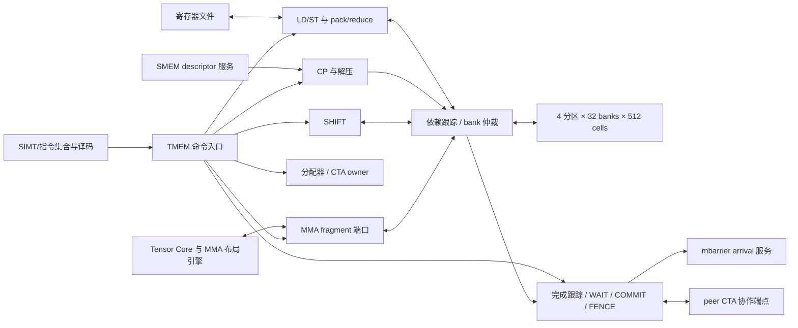
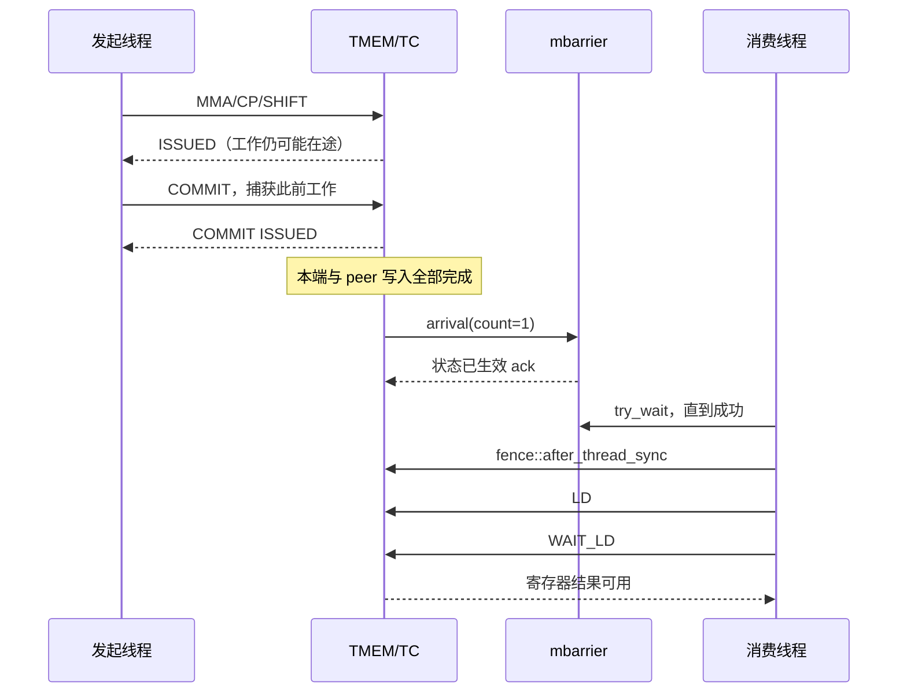

# TMEM RTL 设计目标规范

文档版本：v0.1  
文档状态：设计目标；尚未据此实现或验证 RTL  
规范对象：拟设计的 `tmem_subsystem` 及其存储、分配、访问和完成跟踪模块  
语义基准：NVIDIA PTX ISA 9.3，查阅日期 2026-09-02  
配套接口常量：本文第 5、6 节定义；后续实现时建立独立 SystemVerilog package

## 1. 目的与适用范围

本文根据 NVIDIA 公开的 Tensor Memory（TMEM）语义，定义可供后续 RTL 设计使用的
行为、接口、参考微架构和验证契约。文档格式参考本目录 TMA、mbarrier 规范，
功能和接口不受已有 `tmem_array` 或固定 tile 实现约束。

### 1.1 规范等级与边界

全文使用以下标记，避免把自行设计的硬件结构误认为 NVIDIA 的内部实现：

| 标记 | 含义 | 使用方式 |
| --- | --- | --- |
| **[NV]** | PTX 明确规定的公开行为 | 合法程序必须满足；引用见第 11 节 |
| **[MAP]** | 由公开布局图及 NVIDIA CUTLASS 映射交叉推导的公式 | 给出推导依据；不代表实测硬件结果 |
| **[RTL]** | 本项目选定的接口、资源和实现策略 | 是后续本项目 RTL 的约束 |
| **[OPEN]** | 公开资料未说明、存在表述歧义或 PTX undefined behavior | 不虚构 NVIDIA 的确定行为；另给项目处理规则 |

没有单独标记的端口、参数、队列、状态码、仲裁和周期规则均为 **[RTL]**。
功能段落中引用的 PTX 限制为 **[NV]**；推导公式另外标记 **[MAP]**。
“必须”表示本目标规范的要求，不表示已经具备 RTL 或通过验证。

TMEM 是专用存储及其控制路径。Tensor Core 数值计算、SIMT 指令译码/线程集合、
寄存器文件、SMEM 实体、cluster 路由和 mbarrier 实体属于外部模块。
本规范同时约束这些模块与 TMEM 相接的协议；不得用“外部负责”省略握手或完成条件。
TMA 的 GMEM↔SMEM 搬运与 `tcgen05.cp` 的 SMEM→TMEM 搬运是不同操作。

### 1.2 功能清单

- 列分配、释放和 allocation permit；CTA 生命周期及所有权隔离。
- `tcgen05.ld/st` 的五种形状、全部合法 repeat、16-bit pack/unpack。
- `tcgen05.ld.red` 的 f32/u32/s32 min/max，以及 f32 的 abs/NaN 修饰。
- `tcgen05.cp` 的五种形状、warp multicast、4/6-bit 容器解压和 SMEM descriptor。
- `tcgen05.shift`、`.cta_group::1/2`、peer CTA 协作。
- MMA 的 TMEM A/D、scale、sparsity metadata 访问，A–G 布局、掩码、
  `.ws`、`.ashift` 和 collector 对 TMEM 访问的影响。
- `wait::ld/st`、`commit`、thread fence、隐式流水顺序和跨线程同步边界。

不定义 NVIDIA SASS 编码、私有 bank 组织、真实延迟/带宽、SRAM 工艺宏、GPU 调度、
数值 MMA 算术实现、CDC/DFT 或完整 CUDA/PTX 执行环境。

### 1.3 架构支持矩阵

**[NV]** 下表按 PTX 9.3 的各指令 Target ISA Notes 记录，不使用“Blackwell 全部支持”
或“SM 版本号更大就支持”的推断。[S1–S10]

| 功能 | 公开目标限制 | 本项目处理 |
| --- | --- | --- |
| alloc/dealloc/relinquish、普通 ld/st、wait、cp、fence、commit | `sm_100a`、`sm_101a`（9.0 起改名 `sm_110a`）；8.8 起列出 `sm_100f`、`sm_101f` 同 family 后继，及改名后的 `sm_110f` family | 以 `cap_base` 开关接收 |
| `ld.red` | PTX 8.8 引入；列出 `sm_101a`→`sm_110a`、`sm_101f`→`sm_110f` family、`sm_103f` family | 独立 `cap_ld_red`；不得并入 SM100a 基础能力 |
| `shift` | 指令页明确列出 `sm_100a`、历史 `sm_101a`、`sm_103a`、`sm_110a` | 独立 `cap_shift`；不自行补写 family 支持 |
| MMA `.kind::i8` | `sm_100a`、历史 `sm_101a`、`sm_110a`；不包含普通 MMA 的 family 泛化 | 外部译码检查 `cap_mma_i8` |
| sparse MMA `.kind::mxf4/mxf4nvf4` | `.mma.sp` 指令页单列 `sm_100a`、历史 `sm_101a`、`sm_103a`、`sm_110a`，从普通 family 条款中排除 | decoder 按 sparse 指令页单独检查 |
| MMA `scale-input-d` | `sm_100a`；8.8 起 `sm_100f` 同 family 后继 | 外部译码检查 `cap_scale_d` |
| `.scale_vec::{1X,2X,4X}` | 指令页要求 `sm_100a` | 保留原 qualifier 与有效 scale 数 |
| `.block16/.block32` | 8.8 引入，指令页列出 `sm_100f` 或 `sm_110f` | 按 kind/K 展开，不能机械替换成固定 NX |
| MMA K=96 | `sm_103a` | 独立 `cap_k96` |
| SMEM leading dimension absolute-address mode | `sm_103a`；另有限制见 4.5 | 独立 `cap_abs_ld` |
| 128×512×32-bit 逻辑容量 | TMEM 章节明确针对 `sm_100a/sm_100f` 描述 | 参考物理实例采用此容量；不外推其他架构 |

架构 capability 由集成层根据所选择的 PTX target 配置，在 CTA 建立后不可修改。
参考配置 `REF_ALL` 打开本文实现的全部能力，用于覆盖验证；它是研究功能集合，
不是任何单颗 NVIDIA GPU 的型号。`SM100A` 配置关闭 `ld.red/K96/abs_ld`。
其他目标必须按上述原始 Target ISA Notes 配置，不按数字大小推导。
PTX 9.3 没有授予某目标的功能，不因后续 CUTLASS main 出现相关代码而自动纳入。

## 2. 顶层功能约束

### 2.1 时钟与复位

- 单时钟域；`clk` 上升沿更新状态，`rst_n` 异步低有效。
- 清空上下文有效位、owner、permit、请求队列、事务/依赖表、响应有效位及 peer 状态。
- 存储阵列不复位、不在 alloc 时清零；未初始化数据无有效内容保证。
- 复位是整个 TMEM 实例和外部事务端点的联合 quiesce/reset 边界。禁止仅复位本模块后
  将复位前的 SMEM/TC/peer 响应当作新事务接收。
- 正常释放 CTA 不等于 reset；仍须满足显式 dealloc 和在途事务排空要求。

### 2.2 参数与默认资源

| 参数 | 默认值 | 约束/用途 |
| --- | ---: | --- |
| `LANES` | 128 | 本版固定；4 个分区，每区 32 lanes |
| `COLS` | 512 | 本版固定；32 columns 为一个分配单元 |
| `CELL_W` | 32 | 每 cell 位数；4 个 byte write-enable |
| `BANKS` | 128 | `bank=lane`，每 bank 深度 512，1R1W |
| `SRAM_RD_LATENCY` | 1 | bank 接受读请求到数据可捕获的时钟数，本版固定 |
| `CTX_ENTRIES` | 32 | 本实例最多 32 个 CTA context；context ID 为 5 bit |
| `WARPS_PER_CTA` | 32 | warp ID 5 bit；thread-in-warp ID 5 bit |
| `CMD_Q_DEPTH` | 8 | LD/ST、CP/SHIFT、MMA 三类入口各 8 项 |
| `CTRL_Q_DEPTH` | 8 | WAIT/FENCE/COMMIT 控制记录深度 |
| `ALLOC_WAIT_DEPTH` | 8 | 独立分配等待表；不占数据执行槽 |
| `RELEASE_Q_DEPTH` | 2 | dealloc/permit 专用入口，独立于 alloc |
| `OP_ENTRIES` | 16 | 运行中操作和完成记录总数；分配等待不占此表 |
| `EVENT_ENTRIES` | 64 | 命令 lifetime/event 记录；入队至 DONE 被接收前保持占用 |
| `COMMIT_ENTRIES` | 8 | 已发起但未完成 barrier 通知的 commit 记录 |
| `PEER_ENTRIES` | 4 | 每方向在途 peer 工作，另保留 1 个配对管理槽 |
| `SMEM_IDS` | 16 | 外部 SMEM 服务在途 ID 数，ID 宽 4 bit |
| `FRAG_CELLS` | 32 | 一个 TC/bank 数据拍最多 32 个 32-bit cell |
| `TAG_W` | 16 | 外部命令标识；同 context epoch 中未 DONE 前不重用 |
| `SEQ_W` | 32 | context 内接受顺序；回绕前排空并重新建立 context |
| `EPOCH_W` | 8 | context 重用代数；复用前所有端点必须排空 |

参考容量为 262144 bytes（256 KiB）。一个数据执行槽最多需要 32×128×4=16384 bytes
的 warp 数据暂存；参考实现为 4 个共享此大小的 RF buffer，LD/ST 无 buffer 时等待，
不固定把 16 个 OP_ENTRIES 都映射为大数据 buffer。CP/SHIFT 各有 1024-bit 双缓冲。
这些 buffer 不计入 TMEM 容量，也不是 NVIDIA 的额外容量说明。
所有多拍计数使用能表达“最后一拍之后”的宽度；例如 128 个 RF register index 用
7 bit，剩余数量用 8 bit。

EVENT_ENTRIES 每项保存 ISSUED-pending、DONE-pending、status 和原 key，并带控制类
保留配额 6 项；数据命令不得消耗最后 6 项，其中最后 2 项仅供 DEALLOC/RELINQUISH，
WAIT/COMMIT/ALLOC 不能消耗。队列入队即占一个 event record，
执行时才另占 OP_ENTRIES；因此错误或完成事件不因主响应通道阻塞而丢失。
OP slot 在内部 data_complete 后可释放，event record 在 DONE handshake 后释放。

### 2.3 不变量

1. 仅在 `vld && rdy` 时接受传输；stall 时 valid 和全部 payload 保持稳定。
2. 一个已接受命令获得一次 `ISSUED` 和一次 `DONE` 事件；前置检查失败仅产生一次
   `DONE(error)`。运行后失败仍只产生一次 `DONE(error)`。
3. `ISSUED` 表示允许发起线程继续；数据可见和异步完成由第 9 节定义，不能仅看 ISSUED。
4. 任一可访问 cell 必须属于当前 `(ctx,epoch)`；peer 访问也携带目标 owner 身份。
5. 一个 bank 每周期最多一次读和一次写。同一 cell 同周期读写不发往 SRAM，先仲裁。
6. 数据拍接受、数据写入、对外完成和资源释放均只计数一次；backpressure 不重复执行。
7. 错误事务不得发送成功的 mbarrier arrival；commit 必须覆盖 peer 的实际完成。
8. 等待资源的 alloc、等待工作完成的 WAIT/COMMIT 不能占住它们所等待的执行端口。
9. 合法请求的活性要求外部端点最终响应、消费者最终 ready、peer 最终参与；
   软件不释放 TMEM 时，不保证 alloc 在有限时间内返回。

## 3. 架构

### 3.1 公开逻辑边界

**[NV]** TMEM 地址描述 lane/column，不是 GMEM 或 SMEM byte pointer。
寄存器访问受 warp 在 warpgroup 内的 rank 限制，Tensor Core/CP 的访问粒度不同。
两个 CTA 的 TMEM 是两个有所有权边界的资源；`.cta_group::2` 不把它们变成普通共享
load/store 地址空间。[S1, S3, S4]



### 3.2 参考模块职责

| 模块 | 状态与责任 |
| --- | --- |
| `tmem_ctx_alloc` | context、owner bitmap、allocation records、permit、配对资源管理 |
| `tmem_issue` | 输入校验、队列分流、seq、同步类别和 capability 检查 |
| `tmem_ldst` | warp fragment 映射、RF buffer、pack/unpack、ld.red |
| `tmem_copy_shift` | descriptor 请求、CP destination 展开、解压、SHIFT 快照与写回 |
| `tmem_mma_port` | 向外部 TC 发起工作，接收带 parent tag 的 TMEM fragment 请求 |
| `tmem_bank_array` | 128 个 1R1W bank、byte-enable、读响应寄存与冲突仲裁 |
| `tmem_completion` | per-issuer pending 集合、WAIT 水位、COMMIT 快照及 barrier event |
| `tmem_peer` | 双 CTA prepare/execute/ack、分配管理 rendezvous 和错误汇合 |

模块名是设计划分，不要求每个都成为一个独立综合层次。
参考实现的 fragment 端口每拍只访问同一 32-lane 分区；跨分区请求先拆拍。
每拍最多每 bank 一个 cell，重复 bank 的 fragment 必须拆成多拍。

### 3.3 状态与调度

| 操作类别 | 状态序列 | 等待时允许的独立工作 |
| --- | --- | --- |
| ALLOC | CHECK → WAIT_PEER/WAIT_SPACE → RESERVE → WRITE_PTR → DONE | dealloc、其他 CTA 数据操作 |
| DEALLOC | CHECK → WAIT_PEER → DRAIN → RELEASE → DONE | 被等待操作继续执行 |
| LD/ST | CHECK → WAIT_BUFFER → GATHER/READ → TRANSFER → DRAIN → DONE | 其他分区、无冲突操作 |
| CP | CHECK → DESC_STREAM → DECOMPRESS → WRITE → DRAIN → DONE | RF/TC 无冲突请求 |
| SHIFT | CHECK → SNAPSHOT → WRITE → DRAIN → DONE | 无重叠 footprint 请求 |
| MMA | CHECK → RESERVE → TC_ISSUE → TC_ACCESS → DRAIN → DONE | 无重叠 footprint 请求 |
| WAIT | SNAPSHOT → WAIT_PENDING → DONE | 所有被跟踪操作 |
| COMMIT | SNAPSHOT → WAIT_PENDING → ARRIVE → WAIT_ACK → DONE | 较新的无依赖操作 |
| FENCE | CLOSE_ISSUE_BOUNDARY → DONE | 已发起异步操作仍可在途 |

管理队列与数据队列不共享 head-of-line。释放和 permit 请求有独立接收容量。
数据仲裁按分区 round-robin，指针只在成功发拍后更新；无请求的 client 被跳过。
外部响应进入预留 buffer，不等待命令入口腾位置；各 engine 先拿输出 credit 再发读。
控制事件、RF 数据和 peer 管理消息不共用一个不可旁路的 FIFO。

WAIT_BUFFER/WAIT_SPACE/WAIT_PEER 等启动前等待保留在入口/管理表中，不占 OP slot。
数据操作在依赖可执行、所需 buffer/响应 credit 可用时，原子取得 OP slot、buffer 和
footprint reservation；失败则全部不取。ST 也先取得依赖资格再捕获 RF source，
不得让较新的 ST 拿满 RF buffer 后阻塞其所依赖的较老 LD。运行后不得再等待一个
启动时本应保留的完整操作 buffer。这是参考实现的防资源环路约束。

## 4. TMEM 地址、分配状态及数据布局

### 4.1 地址编码和权限

**[NV]** `taddr` 为 32 bit：`lane=taddr[31:16]`，`column=taddr[15:0]`。[S1]
参考实例合法范围为 lane 0–127、column 0–511；不得先截取 7/9 bit 再检查范围。

```text
taddr(L, C) = (L << 16) | C
physical_bank = L
physical_row  = C
allocation_unit = C // 32
```

**[RTL]** 参考实现返回物理 column 编号，不另设地址翻译；每个分配单元带 owner。
不同 CTA 可共享物理实例的不同 columns。逻辑最大视图不是给每个 resident CTA
额外复制一份 256 KiB。目标集成若另加虚拟地址翻译，不得改变本规范可观察行为。

**[NV]** `ld/st` 的可访问 lane 必须位于 `32*(warp_id % 4)` 开始的 32-lane 区间。
同一 CTA 的不同 warpgroups 具有相同 rank-to-lane 关系；并非只有前四个 warp 可访问。
SIMT thread ID 与 TMEM lane 是不同概念，16-lane 形状尤其不能混用。[S4]

一个多拍命令在任何写入前检查其全部地址、权限和 shape。地址加法使用扩展精度，
column 溢出不得进位成另一个 lane，也不得绕回 allocation 内。

### 4.2 分配记录

| 状态 | 内容 |
| --- | --- |
| Context | valid、epoch、kernel ID、cluster ID/rank、group、capabilities、faulted |
| Allocation permit | 每 CTA 一个 bit；context 建立为 1，relinquish 后为 0 |
| Allocation history | `last_ncols`，初始 512；dealloc 不重置它 |
| Owner table | 16 项；free/reserved/live、ctx、epoch、allocation ID |
| Allocation record | base column、ncols、owner、pair key、live unit bitmap |
| Operation record | parent key、seq、issuer mask、类别、footprint、完成/错误状态 |

footprint 用 128-bit lane mask × 16-bit allocation-unit mask 的保守矩形表示，
再带 read/write 类别；multi-region 操作可以保守合并。共享只读 footprint 可并行，
任一方写且两个 mask 都相交时构成冲突。已保留整个 allocation 的 MMA 同样遵循此规则。

**[NV]** ncols 取 32、64、128、256 或 512，分配所有 128 lanes；同 CTA 后续 allocation
的列数不得增加；relinquish 不释放已分配数据；kernel 退出前必须显式释放。[S3]
**[RTL]** 分配起点按 ncols 对齐并选择最低可用起点，初次分配不保证返回 0。
allocation record 最多 16 项，与最小粒度的物理容量匹配。

**[OPEN]** PTX 没有在该段完整展开 partial-dealloc 后 residual allocation 的行为。
本版正常 ABI 要求 dealloc 精确匹配一个 live allocation 的 base/ncols；不匹配返回
项目 `ERR_ALLOC_MATCH`。该限制是项目 profile 边界，不宣称 NVIDIA 禁止所有部分释放。

### 4.3 LD/ST 形状与 register 数

**[NV]** `.num=2^p`，p∈[0,7]。下表的 register 数为每个线程的 32-bit register 数，
pack/unpack 不减半这个数。[S4]

| shape | 编号 | registers/thread | 合法 `.num` | 访问的 TMEM lanes |
| --- | ---: | ---: | --- | --- |
| `.32x32b` | 0 | num | 1…128 的 2 次幂 | 32 |
| `.16x64b` | 1 | num | 1…128 的 2 次幂 | 16 |
| `.16x128b` | 2 | 2×num | 1…64 的 2 次幂 | 16 |
| `.16x256b` | 3 | 4×num | 1…32 的 2 次幂 | 16 |
| `.16x32bx2` | 4 | num | 1…128 的 2 次幂 | 两段各 16，地址可有列偏移 |

shape 是原子数据模式，repeat 沿列扩展；它不是本模块的物理 SRAM 端口宽度。
实际 footprint 还必须满足 column 范围和 allocation 边界。

### 4.4 可执行的寄存器映射

以下 **[MAP]** 公式由 PTX fragment 图及 NVIDIA CUTLASS copy traits 推导。[S4, S11]
`t` 为 thread-in-warp，`j` 为该线程 register index，`L/C` 为完整 base。
先按无 pack 的模式得到 `(lane, relative_column)`，再进行容器展开：

```python
def reg_coord(shape, t, j, num):
    assert 0 <= t < 32 and num in (1, 2, 4, 8, 16, 32, 64, 128)
    if shape == "32x32b":
        assert j < num
        return t, j
    if shape == "16x64b":
        assert j < num
        return t // 4 + 8 * (t % 2), 2 * j + (t // 2) % 2
    if shape == "16x128b":
        assert num <= 64 and j < 2 * num
        return t // 4 + 8 * (j % 2), 4 * (j // 2) + t % 4
    if shape == "16x256b":
        assert num <= 32 and j < 4 * num
        return t // 4 + 8 * ((j // 2) % 2), 8 * (j // 4) + 2 * (t % 4) + j % 2
    if shape == "16x32bx2":
        assert j < num
        return t % 16, j
    raise ValueError("shape")

def reg_cells(shape, t, j, num, L, C, pack16=False, half_offset=0):
    dl, dc = reg_coord(shape, t, j, num)
    scale = 2 if pack16 else 1
    # half_offset 为 TMEM columns，不乘 4，也不随 pack 再乘 2。
    split = half_offset if shape == "16x32bx2" and t >= 16 else 0
    c = C + split + scale * dc
    return [(L + dl, c + k) for k in range(scale)]
```

`.16x32bx2` 两个 half 的第二 base 是 `taddr+immHalfSplitoff`。当 offset=1、num=1
时，t0/t16 分别访问同一 lane 的相邻两列；不是自动为第二 half 加 16 个 lanes。
PTX 图的两段垂直排版容易造成误读；CUTLASS `16dp32b1x` 使用 offset=1，packed 版本
使用 offset=2，是公式的交叉依据。不能把该示例 offset 固定用于所有 repeat。

| 示例，L=C=0 | 期望地址 |
| --- | --- |
| `16x64b.x1`，t=1/2/4，j=0 | (8,0)/(0,1)/(1,0) |
| `16x128b.x2`，t=0，j=0/1/2/3 | (0,0)/(8,0)/(0,4)/(8,4) |
| `16x256b.x1`，t=3，j=0/1/2/3 | (0,6)/(0,7)/(8,6)/(8,7) |
| `16x32bx2.x2`，offset=8，t=0/16，j=1 | (0,1)/(0,9) |
| `32x32b.x128.pack`，t=31，j=127 | (31,254) 和 (31,255) |

**[RTL]** 32-lane 形状要求 base lane 按 32 对齐；16-lane 形状按 16 对齐，且全部 lane
位于该 warp 的分区。此为参考 profile 的明确输入约束；PTX 图中未列出的非对齐起点
不在本版验证承诺中。split offset 使用 32-bit unsigned column offset，执行前以扩展
精度检查；两 half 若发生重叠写入，本版返回 `ERR_OVERLAP`，不定义覆盖顺序。

### 4.5 SMEM descriptor 与服务边界

**[NV]** CP 使用 64-bit matrix descriptor，而不是普通 SMEM linear base。[S5]

| 位 | 字段 | 解码/限制 |
| --- | --- | --- |
| 13:0 | start | `field << 4`，SMEM byte offset |
| 15:14 | reserved | 0 |
| 29:16 | leading dimension | `field << 4`，relative offset 或 absolute address |
| 31:30 | reserved | 0 |
| 45:32 | stride dimension | `field << 4` |
| 48:46 | fixed | `3'b001` |
| 51:49 | base offset | 3 bit，swizzle pattern 起点信息 |
| 52 | leading mode | 0 relative，1 absolute |
| 60:53 | fixed | 0 |
| 63:61 | swizzle | 0 无，1 128B/32B atomic，2 128B，4 64B，6 32B；3/5/7 非法 |

relative canonical layout 的解释必须包含 major-ness、LBO、SBO 和 swizzle。
16B-atomic 的 32/64/128B 模式分别对应 `Swizzle<1/2/3,4,3>`；
128B/32B-atomic 不能复用 16B-atomic 的 XOR 掩码。
pattern base 为非零时必须参与地址恢复，不得忽略 descriptor[51:49]。
absolute 模式的公开限制是 K-major、128B/16B-atomic、base offset=0，针对 K=48B
分成两个 buffer 的 MMA 情形；不能把这个模式解释为一般的 stride 替换。

**[RTL]** 本模块对接 **SMEM descriptor 服务**：服务接收完整 descriptor、CP shape、
source format 和逻辑 source chunk index，返回解 swizzle 后的 16-byte chunk。
该接口不是物理 SRAM 接口。服务负责根据 PTX canonical layouts 形成 byte 地址，
执行 byte transaction、聚合错误，包含 SMEM 地址空间/proxy 验证。
因此 TMEM engine 无须另造一套不兼容的 descriptor-to-byte-address 算法。
第 6.4 节把该服务的输入、输出次序及失败行为作为必须实现的集成契约。

CP 没有独立 transpose 操作数，服务使用 CP 定义的矩阵模式；不得从 MMA 的任意
major 配置猜测 CP 的 source 排列。对于 PTX 没有规定用于 CP 的 absolute 模式组合，
参考 profile 返回 `ERR_DESC`；保留 descriptor 原字段供 MMA 的合法 K96 路径使用。

### 4.6 MMA 相关布局与存储类型

**[NV]** D 总在 TMEM；A 可在 TMEM 或 SMEM，B 在 SMEM；block scale 与 sparsity
metadata 可通过 TMEM 地址提供。D 的 16-bit 元素每 32-bit cell 只使用低 16 bit，
不能按普通 packed FP16 array 连续解释。[S7]

| 布局 | M/group/模式 | TMEM lane 起点 | D 的逻辑元素 (m,n) 映射，base column=C |
| --- | --- | --- | --- |
| A | M256/group2 | 0 | CTA=m//128，lane=m%128，column=C+n |
| B | M128/group2/dense | 0 | CTA=m//64，lane=m%64+64*(n//(N/2))，column=C+n%(N/2) |
| C | M128/group2/sparse | 0 或 16 | CTA=m//64，lane=32*((m%64)//16)+m%16+L，column=C+n |
| D | M128/group1 | 0 | lane=m，column=C+n |
| E | M64/group1/ws | 0 | lane=m+64*(n//(N/2))，column=C+n%(N/2) |
| F | M64/group1/non-ws | 0 或 16 | lane=32*(m//16)+m%16+L，column=C+n |
| G | M32/group1/ws | 0 | lane=m+32*(n//(N/4))，column=C+n%(N/4) |

上表公式为 **[MAP]**，CTA 0/1 分别指 pair 的 even/odd rank，不是发起者/接收者。
F/C 的 A、D、metadata 必须选同一个 0/16 对齐半区。A 和 scale 的列打包不能直接套用
D 的一元素一列公式；外部 MMA layout engine 按 operand 类型生成 fragment。

| 内容 | 必须遵守的存储契约 |
| --- | --- |
| f32/i32 D | 每 cell 一个 32-bit 元素 |
| f16 D | 元素位于 cell[15:0]；上半字不作为第二个 D 元素 |
| `mxf8f6f4` 的 4/6-bit A | 每元素一个 8-bit container，4 个 container/cell；容器转换见 7.5 |
| `mxf4/mxf4nvf4` 的 A | 每 byte 两个 4-bit 元素，每 cell 八个元素 |
| scale 1X | 每逻辑 row 1 byte，ID 选择 byte offset 0–3 |
| scale 2X | 2 bytes，ID 只能 0/2 |
| scale 4X | 4 bytes，ID 必须 0 |
| K96 block32 | 每逻辑 row 3 个 scale，按公开 K96 图跨 cell 选择，ID 0–3 |
| K96 block16 | 每逻辑 row 6 个 scale，按公开 K96 图跨 cell 选择，ID 0/2 |
| sparse metadata | 按 kind/M/group 的 selector 布局生成地址，不使用统一 FP32 D 布局 |

scale B 的 N≤128/N>128、group1/group2 分布必须分别遵守公开图；不能仅对 SFA 地址
做转置得到 SFB。第 11 节单列完整 scale 与 sparse 章节作为 layout engine 的规范输入。
TMEM array 对这些内容只做位保持读写，类型解释发生在外部 TC/layout engine。

## 5. 操作编码与项目状态码

以下编码是本项目命令 ABI，不是 NVIDIA PTX/SASS 编码。

### 5.1 Opcode

| opcode（5 bit） | 值 | 功能 | ISSUED 的产生条件 |
| --- | ---: | --- | --- |
| `ALLOC` | 0 | 列分配并向本 CTA SMEM 写 pointer | pointer write ack 成功后，与 DONE 先后发出 |
| `DEALLOC` | 1 | 释放一个 allocation | 排空并释放完成 |
| `RELINQUISH` | 2 | 放弃后续 allocation 权利 | permit 更新，group2 双端确认 |
| `LD` | 3 | TMEM→RF | footprint 校验及执行资源已保留 |
| `ST` | 4 | RF→TMEM | 全部 RF source 拍已捕获，后续修改 RF 不影响此命令 |
| `LD_RED` | 5 | load 加每线程结果归约 | 同 LD |
| `WAIT_LD` | 6 | 等待该 warp 之前的 loads | 快照中的 loads 全部完成 |
| `WAIT_ST` | 7 | 等待该 warp 之前的 stores | 快照中的 stores 全部完成 |
| `CP` | 8 | SMEM→TMEM | source 服务和目标执行资源已保留；group2 含 peer prepare |
| `SHIFT` | 9 | TMEM lane shift | footprint 和快照资源已保留；group2 含 peer prepare |
| `MMA` | 10 | 外部 TC 操作的 TMEM 生命周期 | TC 接受请求；group2 资源全部 ready |
| `COMMIT` | 11 | 拍摄完成集合并注册 barrier 通知 | commit record 已建立，不等于 barrier 已到达 |
| `FENCE_BEFORE` | 12 | 关闭此前异步指令的发起边界 | 相关先前操作已经 ISSUED |
| `FENCE_AFTER` | 13 | 建立后续异步发起边界 | 外部 thread-sync 前提已满足，边界安装完成 |

### 5.2 返回事件与错误

`rsp_kind=0` 为 ISSUED，`rsp_kind=1` 为 DONE；tag 在 DONE 被消费者接收之后才能重用。
对同步类命令，两事件可位于相邻周期；同 tag 的 ISSUED 必须先于 DONE。
`rsp_status` 只在 DONE 中有效，ISSUED 固定为 OK。

| status（8 bit） | 值 | 含义 |
| --- | ---: | --- |
| `OK` | 0 | 成功 |
| `ERR_OPCODE` | 1 | 未定义操作/修饰组合 |
| `ERR_CAPABILITY` | 2 | 配置的架构不支持 |
| `ERR_CONTEXT` | 3 | context/epoch 无效，或 CTA 已 faulted |
| `ERR_COLLECTIVE` | 4 | warp mask/一致性证明不符合操作粒度 |
| `ERR_ADDR` | 5 | 完整地址越界、对齐错误、列加法溢出 |
| `ERR_OWNER` | 6 | 未分配、跨 owner 或 allocation 已在释放 |
| `ERR_ALLOC_SIZE` | 7 | ncols 非法或后续 allocation 增大 |
| `ERR_PERMIT` | 8 | permit 已 relinquish |
| `ERR_ALLOC_MATCH` | 9 | dealloc 不精确匹配 live allocation |
| `ERR_SHAPE` | 10 | shape/repeat/pack/reduction 组合非法 |
| `ERR_DESC` | 11 | descriptor 编码/模式非法 |
| `ERR_OVERLAP` | 12 | 本 profile 不允许的重复目标写 |
| `ERR_PEER` | 13 | 配对身份/操作不匹配或 peer 异常退出 |
| `ERR_BACKEND` | 14 | SMEM、TC、peer 或 barrier 后端错误 |
| `ERR_PROTOCOL` | 15 | tag/beat/last/响应协议错误 |
| `ERR_DEPENDENCY` | 16 | COMMIT/WAIT 的依赖操作失败 |
| `ERR_CTX_BUSY` | 17 | context 退出时仍有 allocation/在途工作 |

资源不足产生 backpressure 或等待，不返回“out of memory”。PTX 的 undefined behavior
不意味着必须有硬件错误响应：上述诊断是项目额外能力。无法从接口发现的线程分歧、
跨 proxy 数据竞争仍是调用者责任，不能承诺全部捕获。

## 6. 接口定义

### 6.1 公共约定与 packed payload

所有通道含 `<name>_vld_<dir>`、反向 `<name>_rdy_<dir>`，宽度各 1 bit；
payload 用 `<name>_<field>_<dir>` 展开。表中的字段就是端口名中间部分，不能省略。
例如 `cmd.taddr:32` 对应 `cmd_taddr_i[31:0]`。

`key={ctx[4:0],epoch[7:0],tag[15:0]}`，共 29 bit；内部 op ID 为 4 bit，
仅在本实例内使用，不能代替外部 key。寄存器/fragment 数据每项低位优先：
`data[32*t +:32]` 对应 item/thread t；mask bit t 与之对应。
未使用字段置 0。除 status 外不使用 X 编码表示“无效”。

key 在单个实例内解释。软件侧命令 tag[15]=0；tag[15]=1 保留给本实例接收的 peer
子操作，子 tag 由 tmem_peer 分配且同样在 drain 前不重用。peer 保存
`(pair_id,origin_rank,origin_key) ↔ local_child_key` 对应关系。TC、SMEM 请求均使用
端口所在实例的 local key；跨实例不能直接拿 origin 的 ctx 编号检查 peer owner。

### 6.2 输入信号

| 分组 | 信号/字段 | 位宽 | 提供方与含义 |
| --- | --- | ---: | --- |
| Clock/reset | `clk`, `rst_n` | 各 1 | 系统时钟与联合 reset |
| Context | `ctx_cmd_vld_i`, `ctx_cmd_rdy_o` | 各 1 | 集成层建立/退出 CTA 的独立通道 |
| Context payload | `action`, `ctx`, `epoch`, `kernel`, `cluster`, `rank`, `group2`, `caps` | 1,5,8,16,16,4,1,16 | action 0 enter/1 exit；kernel/cluster 是活跃分配域内唯一 ID |
| Command | `cmd_vld_i`, `cmd_rdy_o` | 各 1 | 指令集合与译码端 |
| Command identity | `opcode`, `key`, `warp`, `thread`, `active_mask`, `uniform` | 5,29,5,5,32,1 | uniform 为上游完成全部操作数一致性检查的证明 |
| Command payload | `taddr`, `ncols`, `shape`, `repeat_log2`, `pack16`, `half_offset` | 32,32,3,3,1,32 | LD/ST shape；CP shape 复用同字段的独立枚举 |
| Command reduction | `red_type`, `red_max`, `red_abs`, `red_nan` | 2,1,1,1 | type 0 u32/1 s32/2 f32；3 非法 |
| Command copy | `sdesc`, `src_fmt`, `multicast` | 64,2,2 | source 0 raw/1 b4/2 b6；3 非法；multicast 见 7.4 |
| Command control | `smem_dst`, `bar_addr`, `cta_mask`, `bar_multicast`, `sync_ticket` | 32,32,16,1,32 | SMEM byte offset、cluster barrier offset、通知 mask、同步序号 |
| MMA payload | `mma_desc` | 1024 | 保留完整已译码 MMA operand 包，字段见 6.5 |
| Response sink | `rsp_rdy_i` | 1 | 命令事件接收方 |
| RF source | `rf_src_vld_i`, `rf_src_rdy_o` | 各 1 | ST source stream |
| RF source payload | `key`, `reg_index`, `data`, `last` | 29,7,1024,1 | 每拍全 warp 同一个 register index；只接受已请求的 ST key |
| RF load sink | `rf_dst_rdy_i` | 1 | RF 确认可写入并使数据可读 |
| SMEM service response | `sm_rsp_vld_i`, `sm_rsp_rdy_o` | 各 1 | descriptor read 或 pointer write 的应答 |
| SMEM response payload | `id`, `data`, `status` | 4,128,2 | 任意非零 status 为后端错误 |
| TC accept/response | `tc_issue_rdy_i`, `tc_done_vld_i`, `tc_done_rdy_o` | 各 1 | TC 工作接受和数值处理结束 |
| TC done payload | `key`, `status` | 29,2 | 不代替 TMEM write drain |
| TC fragment request | `tc_mem_vld_i`, `tc_mem_rdy_o` | 各 1 | TC 请求读 A/D/scale/meta 或写 D/shifted A |
| TC fragment payload | `key`, `id`, `role`, `write`, `partition`, `lane_mask`, `cols`, `data`, `byte_en` | 29,8,3,1,2,32,288,1024,128 | 每局部 lane 一个 9-bit column，role 见 6.5 |
| TC read sink | `tc_rsp_rdy_i` | 1 | TC 读取结果接收方 |
| Barrier response | `bar_rsp_vld_i`, `bar_rsp_rdy_o` | 各 1 | arrival 已对 barrier 状态生效的确认 |
| Barrier response payload | `key`, `target_rank`, `status` | 29,4,2 | 每个目的 CTA 恰好一次 ack |
| Peer | `peer_rx_vld_i`, `peer_rx_rdy_o`, `peer_tx_rdy_i` | 各 1 | 双向、可靠、有序的 peer 消息通道；payload 见 6.6 |

### 6.3 输出信号

| 分组 | 信号/字段 | 位宽 | 接收方与含义 |
| --- | --- | ---: | --- |
| Context response | `ctx_rsp_vld_o`, `ctx_rsp_rdy_i` | 各 1 | enter/exit 每次一个响应 |
| Context response payload | `ctx`, `epoch`, `status` | 5,8,8 | enter 不使用普通命令 tag |
| Command response | `rsp_vld_o`, `rsp_rdy_i` | 各 1 | ISSUED/DONE 事件 |
| Response payload | `key`, `opcode`, `kind`, `status`, `taddr` | 29,5,1,8,32 | taddr 仅 alloc 有效，软件仍须从 SMEM 正常获取 |
| RF source request | `rf_req_vld_o`, `rf_req_rdy_i` | 各 1 | 请求捕获整个 ST source vector |
| RF request payload | `key`, `reg_count` | 29,8 | reg_count 范围 1–128 |
| RF destination | `rf_dst_vld_o`, `rf_dst_rdy_i` | 各 1 | load/reduction register 写回 |
| RF destination payload | `key`, `reg_index`, `is_red`, `data`, `last` | 29,7,1,1024,1 | reduction 拍 is_red=1，reg_index=0；普通 r[] 不被替代 |
| SMEM service request | `sm_req_vld_o`, `sm_req_rdy_i` | 各 1 | descriptor-aware read/pointer write |
| SMEM request payload | `id`, `key`, `kind`, `sdesc`, `shape`, `src_fmt`, `chunk`, `ptr_addr`, `ptr_data` | 4,29,1,64,3,2,8,32,32 | kind 0 CP_READ/1 PTR_WRITE |
| TC issue | `tc_issue_vld_o`, `tc_issue_rdy_i` | 各 1 | 向外部 TC 提交已保留资源的 MMA |
| TC issue payload | `key`, `mma_desc`, `group2`, `pair_id`, `origin_rank`, `origin_key`, `local_rank` | 29,1024,1,24,4,29,4 | operand 包不变，附带单次 pair 操作身份和本端身份 |
| TC response | `tc_rsp_vld_o`, `tc_rsp_rdy_i` | 各 1 | 每个已接受 tc_mem 恰好一次 read/write ack |
| TC response payload | `key`, `id`, `data`, `status` | 29,8,1024,2 | 写 ack 的 data=0；读无效 lanes=0 |
| Barrier arrival | `bar_req_vld_o`, `bar_req_rdy_i` | 各 1 | 逐目的 CTA 发送 arrival |
| Barrier payload | `key`, `cluster`, `target_rank`, `addr`, `count` | 29,16,4,32,32 | count 固定为 1，不含 transaction bytes |
| Peer output | `peer_tx_vld_o`, `peer_tx_rdy_i` | 各 1 | 与 peer_rx 同格式 |
| Diagnostic | `fault_vld_o`, `fault_rdy_i`, `fault_key_o`, `fault_status_o` | 1,1,29,8 | context 故障通知，保持至接受 |

所有表中握手的反向信号方向以名字为准；同一信号在输入/输出分组中重复展示不代表
两个端口。`caps[6:0]` 顺序为 base、ld_red、shift、mma_i8、scale_d、k96、abs_ld，
高位保留为 0。完整 target qualifier 合法性由上游 decoder 检查，本模块复查所需能力。

同一 ctx_cmd 通道一次最多一个等待响应的 context 请求；enter 要求该 ctx 无任何有效
epoch、owner 或事务，epoch 由 scheduler 提供并与 key 一致。enter 设置 permit=1、
last_ncols=512、next_seq=0。exit 的响应不能先于相关 DONE 的消费。
bar_addr 是经过前端地址空间解析的 shared::cluster **byte offset**，须 8-byte 对齐；
generic PTX pointer 到该 offset 的转换由前端完成，不是截断 64-bit pointer。
非零通知 mask 中每个 rank 必须属于存活 cluster，违规在发任何 arrival 前报 ERR_ADDR。

### 6.4 SMEM 服务和 RF 数据顺序

CP_READ 的 chunk 表示 source 矩阵按 `(source_row, 16-byte group_in_row)` 枚举后的
顺序编号，row 优先、每 row 内列 group 递增；该序列是解 swizzle 后的逻辑序列，
不是物理地址加 `16*chunk`。每个回复恰好 16 bytes，b4/b6 的 padding 包含在其中。
第 7.4 节的 source_rows/source_bytes 决定总 chunk 数，最大 256，因此 chunk 为 8 bit。
SMEM 服务必须根据请求 key 找到 CTA 的 SMEM window；group2 在 peer 上分别读自己的
window，不能把发起 CTA 的数据复制给两端代替执行。

PTR_WRITE 忽略 descriptor/shape/chunk，以 4-byte mask 向 `ptr_addr` 写 `ptr_data`；
offset 必须 4-byte 对齐，ack 表示该 CTA 正常 shared load 可观察此写入。
SMEM 服务保证与普通 shared 操作的同址顺序，跨线程观察仍需线程同步。
服务 ID 在回复握手后释放，允许不同 ID 乱序返回；write ack 后才完成 alloc。

ST 的 rf_req 接受后，source 以 j=0…reg_count−1 送入；不得交错同 key 的 j 顺序。
LD 的 rf_dst 也按 j 递增输出，LD_RED 最后追加一个全 warp reduction 拍。
不同 key 可交错；消费者不能等待 DONE 才接收 rf_dst，否则形成协议死锁。

### 6.5 MMA operand 包与 fragment 责任

`mma_desc` 是项目位域容器；字段低位在前，未定义高位为 0。

| 位域 | 内容 |
| --- | --- |
| 31:0 / 63:32 | `d_taddr` / `a_taddr` |
| 127:64 / 191:128 | `a_sdesc` / `b_sdesc` |
| 223:192 | 原始 PTX `idesc` |
| 255:224 / 287:256 / 319:288 | `scale_a_taddr` / `scale_b_taddr` / `meta_taddr` |
| 575:320 | 256-bit disable-output-lane mask；group1 高 128 bit=0 |
| 639:576 | zero-column-mask descriptor |
| 671:640 | `scale_input_d` 原始 operand；解释由 TC 决定 |
| 703:672 | flags：bit0 A-in-TMEM，1 input-D，2 sparse，3 ws，4 ashift，5 block-scale，6 scale-input-D-present，7 zero-mask-present，其余 0 |
| 719:704 | kind[3:0]、scale-mode[3:0]、collector-buffer[2:0]、collector-op[1:0]，其余 0 |
| 751:720 | M[8:0]、N[8:0]、K[8:0]、layout[2:0]，其余 0 |
| 767:752 | A/D/SFA/SFB/meta base 所属 allocation unit 的 union mask |
| 1023:768 | 保留 0 |

kind 编码依次 0 f16、1 tf32、2 f8f6f4、3 mxf8f6f4、4 mxf4、5 mxf4nvf4、6 i8；
scale-mode 0 none、1 1X、2 2X、3 4X、4 block16、5 block32；layout 0…6 对应 A…G。
collector-buffer 0 none、1 A、2…5 B0…B3；op 0 discard、1 fill、2 use、3 lastuse。
稀疏 selector、SFA/SFB ID、类型、转置等保留在 idesc 中，decoder/TC 按对应 PTX 表解释。
冗余 M/N/K/layout 必须与 idesc 一致，上游声明 `uniform` 前完成一致性检查。

**[RTL]** TMEM 在 MMA ISSUED 前保留相关 **完整 allocation** 的访问权限，
unit mask 必须覆盖每个 operand 实际可访问的 allocation；本版保守阻塞这些 allocation
上的其他冲突操作。TC 每次请求仍需逐 cell owner 检查，不因已有 reservation 绕过。
group2 两端的 reservation 先 prepare，再允许 TC 发起任何访问。

TC fragment role 编码：0 A-read，1 D-read，2 D-write，3 SFA-read，4 SFB-read，
5 metadata-read，6 A-shift-write，7 非法。write 与 role 必须一致。
TC layout engine 负责按照 4.6 的完整公开布局生成物理 lane/column/byte-enable；
这包含 scale K96 与 sparse selector 的专用映射，不由 array 猜测数值类型。
没有 `input-D` 的 MMA 不得发 D-read；被 disable mask 屏蔽的 D lane 不得写。
TC 发 `tc_done` 后不能再提交该 key 的访问。只有 tc_done 成功、全部 fragment ack
和实际 bank writes 排空后，TMEM 才标记 MMA 的异步部分完成。

group2 时外部 TC/layout engine 将两端 tc_issue 识别为同一个
`(pair_id,origin_rank,origin_key)` 的两个执行部分；不是再次发起独立的完整 MMA。
它通过两端各自的 tc_mem/tc_rsp 端口取 operand 和写结果，跨端数值数据交换属于该
外部 TC 组合体。本端只接受本端 key、partition、column；peer key 通过上述关联表
转换，不能让一个 32-cell fragment 隐式同时写两个实例。

### 6.6 Peer 协议

peer payload 字段为：`type:4, pair_id:24, origin_rank:4, origin_key:29, target_ctx:5,
target_epoch:8, ordinal:32, opcode:5, ncols:32, taddr:32, free_units:16,
status:8, cmd_payload:1536`。cmd_payload 携带除握手外的命令字段，按 6.2 顺序
低位在前拼接并零扩展；发送前必须静态检查总宽度不超过 1536 bit。
`pair_id={cluster[15:0], even_rank[3:0], generation[3:0]}`；复用前两端排空。

type：0 JOIN，1 PREPARE，2 PREPARED，3 EXECUTE，4 LOCAL_DONE，5 ABORT，
6 RELEASE_ACK，7 PERMIT_ACK，8 FREE_QUERY，9 FREE_REPLY；其余非法。
ordinal 对 allocation-management collective 在 pair 生命周期内递增，用来匹配两端
同一操作；数据命令用 origin_key 匹配。发起者可以是 even 或 odd CTA，管理协调者固定
为 even CTA 所在端点，以避免双方各拿一半资源后互等。

两端 group2 alloc 选择共同空闲且对齐的最低 base；PREPARE 成功后 owner=reserved，
全部就绪才转 live 并分别向自己的 `smem_dst` 写 pointer。资源不能满足时全部撤销
临时 reservation，稍后重试；等待不得占住释放通道。即使软件可以看到两个 pointer
处于相同逻辑 base，也不能据此绕过各自 CTA owner 检查。

同一 pair 同时最多一个操作处于跨端 PREPARE；even 端协调者为来自两端的请求统一
排序。数据准备过程拿不到另一端资源时释放暂存 reservation 再重试，不能双方持有
各自 footprint 后互等。已 EXECUTE 且无冲突的操作可并行，管理释放不受 PREPARE 阻塞。

参考 peer fabric 为管理、数据 dispatch 和 ack 分别提供 credit；其中一个类停顿不得
阻止另一个类消费。LOCAL_DONE/ABORT 具有保留返回 credit。传输可靠且不重放；
重复 key/type 是 `ERR_PROTOCOL`，不能重复写数据或重复发 barrier arrival。

## 7. 操作语义和数据路径

### 7.1 ALLOC、DEALLOC 与 RELINQUISH

**[NV]** alloc 是 warp collective；group2 则由 pair 两端各一个 warp 共同执行。
`.sync.aligned` 要求整个 warp 参与，操作数一致、没有已退出线程；不足时阻塞。
指令成功后把 32-bit taddr 写入本 CTA shared memory，而不是仅返回给一个通用寄存器。
group2 dealloc 前软件必须保证两端的 TMEM 访问已经适当同步，不能依赖 dealloc
一定阻塞去代替 cluster/thread synchronization。[S3]

**[RTL]** alloc 接受时先检查 ncols/permit，并在该 CTA 的 allocation-management
流中保持顺序；等待请求不提前消耗阵列数据端口。`last_ncols` 只在分配成功时更新。
分配等待表满只降低 alloc 的 ready；dealloc/permit 的 ready 独立计算。
分配唤醒在资源变更后的下一次管理仲裁进行；数据阵列内容保持原样。

dealloc 设置 allocation 为 draining，禁止新访问；已接受访问继续完成，直到其
footprint reservation 和 bank/response 管线排空才释放。对无正确软件同步的输入，
该保守 drain 不能解释为 NVIDIA 提供了额外同步保证。relinquish 仅关闭 permit，
不等待所有计算，不释放 allocation。group2 仍须双端 collective。

Context exit 仅在 owner 为空、没有请求/完成/peer 记录时成功，否则返回 ERR_CTX_BUSY。
context 进入 fault 状态后不能直接通过 enter 覆盖；错误恢复规则见 7.9。

### 7.2 LD/ST 与 pack/unpack

**[NV]** LD/ST 是 warp collective 的异步操作；`.sync` 使 warp 汇合，不表示数据搬运
已经结束。一个 warp 的 TMEM lane 权限与其他 warp rank 不同。[S4]

- LD：读取 4.4 的全部 cell，按 `(thread,reg_index)` 重排到 RF；普通 load 不转换数值。
- ST：先完整捕获所有 RF source，再写 TMEM；已捕获数据不能因之后的 RF 修改而变化。
- pack16 LD：一个 register 接收相邻两列各自低 16 bit，较低列放 register[15:0]。
- unpack16 ST：register 低/高 16 bit 分别写较低/较高列的低半字。
- **[RTL]** unpack 保留目标 cell 的高 16 bit；这不授予程序可移植地依赖 NVIDIA 高半字
  内容的权利。普通 32-bit ST 写四个 bytes，unpack 的 byte-enable 为 `4'b0011`。

pack 增加物理列跨度，不改变 register 数。例如 `16x128b.x1` 每线程两个 register：
普通模式访问 16×4 cells，pack 模式访问 16×8 cells 的低半字。
物理列范围按展开后的 footprint 验证，不能只按 shape 的未展开宽度检查。

LD 只有在所有 rf_dst 拍被 RF 接收、寄存器写入已可见且没有未确认读时才完成。
ST 只有在全部写入已到达 bank、无待写 buffer 时完成。
完成后设置 per-warp 类别计数，并产生 DONE；WAIT 观察内部完成状态，不依赖主机
是否已经消费该 DONE 事件。但事件 buffer 没有 credit 时不能无限制接收新操作。

### 7.3 LD.RED

**[NV]** 仅 `32x32b/16x32bx2` 形状；num≥2；每个线程仍得到普通 r[]，另外得到一个
32-bit `redVal`。归约沿所加载的 columns 进行，不是把全 warp 汇成一个标量。
类型为 f32/u32/s32，运算为 min/max；abs/NaN 仅适用于 f32；不和 pack16 组合。[S4]

**[RTL]** 对 thread t，将该次操作的 `r[t][0..num-1]` 作为 reduction 输入。
split 形状的两个 half 分别对各自加载的区间归约，不跨 half 合并。
abs 仅作用于 reduction 输入；原始 r[] 原样返回。
整数使用 32-bit unsigned 或二补码比较，无饱和与加法溢出。
f32 比较按数值比较，不做格式转换，不将 subnormal flush 为零：

- 指定 `.NaN` 时任一 NaN 输入使 redVal=`0x7fc00000`。
- 未指定 `.NaN` 时，参考 profile 忽略 NaN 与数值的比较；全 NaN 返回上述 canonical NaN。
- 同值 ±0：min 取 −0，max 取 +0；abs 先清符号位。
- ±Inf 正常参与比较；reduction 不修改 NaN payload 到 r[] 的原始写回。

**[OPEN]** ld.red 指令页没有逐项展开默认 NaN、signed-zero 和 reduction-tree 的全部
细节。上述是与 PTX 标量 min/max 原则一致的确定化项目规则；硬件对照应把公开未明确
的位级结果列为单独检查项，不能以参考模型自身结果声称 NVIDIA 一致性。

### 7.4 CP 形状、复制与 multicast

**[NV]** CP 由单线程发起；group2 也是 pair 中一个线程发起，触发两端各从自己的 SMEM
读并写自己的 TMEM。不是让 peer 再执行一遍 PTX 指令。[S2, S6]

| CP shape | 编号 | source_rows × bytes/row | destination | 必要修饰 |
| --- | ---: | --- | --- | --- |
| `128x256b` | 0 | 128×32 | 128 lanes × 8 columns | multicast=0 |
| `128x128b` | 1 | 128×16 | 128 lanes × 4 columns | multicast=0 |
| `64x128b` | 2 | 64×16 | 复制到 128 lanes × 4 columns | multicast=1 或 2 |
| `32x128b` | 3 | 32×16 | 复制到 128 lanes × 4 columns | multicast=3 |
| `4x256b` | 4 | 4×32 | 四个分区各一个 lane × 8 columns | multicast=0 |

multicast 编码：0 none，1 `warpx2::02_13`，2 `warpx2::01_23`，3 `warpx4`。
**[MAP]** 全 128-lane 目标的 source row 由以下函数指定；CP source 各 row 的 byte 顺序
由 descriptor 服务恢复，不能把物理 bank 编号当作 SMEM byte offset。[S6, S11]

```python
def cp_source_row(shape, multicast, dest_lane):
    assert 0 <= dest_lane < 128
    if shape in ("128x256b", "128x128b"):
        assert multicast == 0
        return dest_lane
    if shape == "64x128b" and multicast == 1:  # 0/2、1/3
        return dest_lane % 64
    if shape == "64x128b" and multicast == 2:  # 0/1、2/3
        return (dest_lane // 64) * 32 + dest_lane % 32
    if shape == "32x128b" and multicast == 3:
        return dest_lane % 32
    raise ValueError("shape/multicast")

def cp_four_lanes(L):
    assert 0 <= L < 32
    return [L + 32 * q for q in range(4)]
```

128-lane 目标要求 L=0；4x256b 使用 L∈[0,31]，source row q 写 L+32q。
其用途包括补充各分区滑窗边缘，例如 L=31 时写 31/63/95/127，而非四个连续 lanes。
这一映射基于 CUTLASS 公开 4DP copy traits；不是从 shape 名称简单推断的行优先复制。

CP 从 source buffer 向各目标重复写 bit-identical 内容，multicast 不是数值归约。
整个目标范围预先做 owner/越界验证；CP 没有 TMA 的越界补零或越界丢弃语义。
访问 descriptor 解码后的非法 SMEM 地址返回错误，不静默补零。

### 7.5 CP 解压

**[NV]/[MAP]** 每个 16-byte source chunk 含 16 个连续元素和 padding，解压后仍为
16 bytes。下面是容器位重排，不是 FP4/FP6→IEEE FP8 的浮点数值转换。[S6]

| source | 有效数据 | padding | 每元素输出 byte |
| --- | --- | --- | --- |
| raw | 16 bytes | 无 | 原样 |
| `.b4x16_p64` | 16×4=64 bits | 后 64 bits | `00000000 OR (x4 << 2)`，即 00 S E2 M1 00 |
| `.b6x16_p32` | 16×6=96 bits | 后 32 bits | `x6 & 0x3f`，高 2 bit=0；E3M2/E2M3 位序保持 |

元素 0 从 chunk 的最低有效位开始；padding 内容忽略，不要求软件写零。
16 个输出 bytes 按原元素顺序组合为 4 个 TMEM cells。
CP source format 不改变本节 source_rows/bytes，也不扩大 destination columns。

```python
def decompress_chunk(chunk_bytes, src_fmt):
    assert len(chunk_bytes) == 16
    if src_fmt == "raw":
        return bytes(chunk_bytes)
    v = int.from_bytes(chunk_bytes, "little")
    bits = {"b4": 4, "b6": 6}[src_fmt]
    mask = (1 << bits) - 1
    return bytes((((v >> (bits*i)) & mask) << (2 if bits == 4 else 0))
                 for i in range(16))
```

### 7.6 SHIFT

**[NV]** SHIFT 异步作用于一个 32-lane 分区中 8 columns 宽的数据；base lane 按 32
对齐。group2 对两端 TMEM 都执行，并由一次操作的完成跟踪合并。[S6]

**[MAP]** 本文把 down 定义为与 lane-down 访问一致的 `new[r]=old[r+1]`，r=0…30，
即有效移动形状 31×256b。执行前读取完整 32×8 的快照，不使用逐行写后再读的新数据。
**[OPEN]** PTX 文本没有给边缘填充值或逐索引伪代码；参考实现保持末 lane 原值，
不把“边缘自动补零”写为 NVIDIA 保证。方向及边缘值应进入独立硬件对照用例，
不能仅以软件模型闭环作为对照证据。

参考实现一次暂存一个 column 的 32 cells，再产生 31 个目标 cell；对 8 columns
重复。footprint 保留整个 32×8 区域，最后一个 column 写入完成后才能解锁。
这允许 1 KiB 以下暂存实现快照语义，不需要把全部 TMEM 复制一遍。

### 7.7 MMA、scale、稀疏、collector 与 ASHIFT

MMA 算术由外部 TC 执行，但以下 TMEM 契约必须满足：[S7]

1. `input-D=0` 时覆盖 D，不能读取未初始化 accumulator；`input-D=1` 才读取旧 D。
   `scale-input-d` 由 TC 在算术中处理，不解释为 TMEM 地址缩放。
2. disable-output-lane 的 bit0 对应 TMEM lane0；group1 四个 32-bit mask，group2
   八个。屏蔽 lane 保留原值；不能把输出屏蔽实现成向 D 写零。
3. `.ws` 仅 group1，使用 D/E/G 布局；zero-column-mask 是对 B 的逻辑零替换，
   不写 SMEM B，也不是 D lane disable mask。
4. sparse A 存 M×K/2 个非零值；tf32 为 1:2，f16/f8f6f4/mxf8f6f4/i8 为 2:4，
   mxf4/mxf4nvf4 为按 pair 的 4:8。metadata 地址及 selector 使用各自公开布局。
   TMEM 存储器不通过数值零检测重新压缩 A。
5. block scale：mxf8f6f4 默认 block32/1X；mxf4 默认 block32/2X；mxf4nvf4 必须给出
   scale-vector qualifier。K96 的 3/6 个 scale 不可误用 2/4 个 scale 的 cell 数。
6. collector A/B 的 fill/use/lastuse/discard 由 TC 维护带 context/epoch 的有效状态。
   use/lastuse 可以不访问 TMEM 原 A，但不能复用其他 CTA 的 collector。
   TMEM dealloc 不自动使已合法捕获的 collector 数据变成另一 allocation 的数据。
7. `.ashift` 只允许 M128/M256，且是 MMA 对 A 的副作用。不能将它实现成无条件全 TMEM
   SHIFT；TC 指定 A 的实际列范围，并在读完需要的旧 A 后提交 A-shift-write。
   ashift 不能和 collector A fill/use 组合；合法 lastuse/discard 由 decoder 检查。
8. ashift、collector 依赖、D 写入及 peer 处理全部结束才算 MMA 完成。

**[RTL]** 本版不允许同一 MMA 的 D 写 footprint 和仍需读取的 A/scale/metadata 发生
未声明 alias；前端在 operand footprint 建立时拒绝该类请求。可证明安全的 in-place
扩展须另立 profile，不能由 bank 仲裁偶然决定数学结果。
所有 sparse/scale 非法 bit pattern 的判断属于 TC 数值/布局前端；发现时回报错误，
不得以输出全零伪造一次成功 MMA。

### 7.8 双 CTA 的发起、顺序与完成

**[NV]** pair 中两个 `%cluster_ctarank` 仅最低位不同；`.mma/.cp/.shift/.commit`
由 pair 内单个线程发起，alloc/dealloc/relinquish 由两端各一 warp collective。
LD/ST/WAIT 仍是当前 CTA 内的 warp 操作，不因为 group2 就自动访问 peer 的 RF/TMEM。
同一 kernel 的 tcgen05 操作须使用一致的 `.cta_group`。[S2]

**[RTL]** 上游 scheduler 保证 pair peer 已启动且活跃。peer JOIN 迟到可以等待；
发起线程不能在 peer 尚未准备时提前观察 group2 ISSUED。
数据命令到达 peer 后通过同样的 capability/owner/范围检查，但不产生第二份软件
ISSUED/DONE；只回 LOCAL_DONE 给 origin。origin 以本端与 peer 成功完成的合取
作为该操作的完成状态，任何一端失败都使 parent 失败。

peer 子操作使用保留 tag 命名空间建立本端 record；完成后由 LOCAL_DONE handshake
回收，不能发到软件 rsp 通道。JOIN/PREPARE 的 origin_key 和本端执行 key 分别保存。

两个实例不共享组合 ready 链；跨实例消息全部寄存。配对管理的两阶段 reservation
不能用于声称数据写操作有全局事务回滚：一端在运行中失败时另一端可能已经写入部分
数据，处理为 pair fault 并停止后续成功通知，见下一节。

### 7.9 失败、取消与诊断

- 前置检查失败：不读写 TMEM、不修改 owner，返回一次 DONE(error)，无 ISSUED。
- 运行中后端错误：锁定相关 context，group2 同时锁定 peer context；停止新命令，
  已接受请求 drain，丢弃未提交写 buffer，保留已发生的 bank 写入，不承诺 rollback。
- 依赖失败的 WAIT/COMMIT 返回 ERR_DEPENDENCY；COMMIT 不发送新的成功 arrival。
  若 multicast 已有部分目的 ack，记录已通知 mask，禁止重发或假装撤回已有 arrival。
- allocation pointer 的写失败同样是 context fault；已保留资源保持隔离，不能把可能
  已写到软件可见位置的 pointer 对应区域立即转给另一个 CTA。
- fault_vld 输出持有首个错误；同时把各未结束 parent 的错误 DONE 排入保留响应容量。
  后续错误可以累积诊断计数，但不能覆盖首错 key。
- 正常软件没有 fault-clear opcode。集成层中止 kernel/pair、排空外部端点后，采用
  联合 reset 恢复；禁止仅清 owner bitmap 复用仍有迟到写响应的区域。

**[OPEN]** 未初始化读取、缺少线程同步、未使用 proxy fence、操作数不一致等 PTX
未定义行为不作为正确性测试的 golden 输出。参考模型可报告可检测错误，但不能把
这些情况下的确定读值、等待时长或错误码宣称为 NVIDIA 语义。

## 8. 功能伪代码

本节的 `await` 表示硬件条件等待，不是额外的软件线程；循环由计数器、队列和 FSM
实现。`emit` 产生寄存的 valid/payload，并保持到接收。`complete_data` 更新内部完成
集合；它与用户消费 DONE 事件不是同一个时刻。

### 8.1 接受、标识与前置检查

```text
on cmd_fire:
    reject if context/epoch invalid or faulted
    reject if software cmd key.tag[15] != 0
    reject if key is already queued, executing, or awaiting DONE consumption
    reject unsupported opcode/capability/qualifier
    if opcode is warp_collective:
        require active_mask == 0xffffffff and uniform == 1
    else:
        require active_mask[thread] == 1
    validate all shape-derived addresses before any data side effect
    assign seq = context.next_seq; context.next_seq += 1
    snapshot issuer = (ctx, epoch, warp, participant_threads)
    enqueue selected class; reserve response record

    # 已接受命令的校验错误也走响应记录；不通过组合 error 脉冲丢失。
```

上游按同一线程的程序顺序提交；warp collective 的 `participant_threads` 是整个 warp。
command ready 随 opcode 对应队列计算；为避免 sender 等 ready 才给 opcode 形成死锁，
sender 必须先驱动稳定的 valid/opcode/payload。

### 8.2 列分配、等待与释放

```text
allocate(request):
    require ncols in {32,64,128,256,512}
    require permit && ncols <= last_ncols
    units = ncols / 32
    if group2: rendezvous same pair/ordinal/opcode/ncols
    candidates = own_free_units
    if group2: candidates &= peer_free_units
    find smallest b in {0,units,2*units,...,16-units}:
        all candidates[b : b+units] are free
    if not found:
        park in ALLOC_WAIT; release temporary peer reservations
        retry after free bitmap changes; do not stall RELEASE queue
    reserve both sides, rechecking free bitmap under allocator lock
    mark live owner; record (b*32,ncols); last_ncols = ncols
    await local pointer_write(smem_dst, taddr(0,b*32)) acknowledgement
    if group2: await peer pointer_write acknowledgement
    emit ISSUED; emit DONE(OK,taddr)

deallocate(request):
    require exact live allocation match and correct owner
    if group2: rendezvous, then mark both allocations draining
    else: mark allocation draining
    await all accepted operations touching allocation and backend acks drain
    clear owner/live record on both required endpoints
    emit ISSUED; emit DONE(OK)

relinquish(request):
    execute after earlier management requests for this CTA
    if group2: rendezvous matching ordinal
    permit = 0 on all participating endpoints
    emit ISSUED; emit DONE(OK)
```

### 8.3 LD/ST 数据展开

```text
execute_load(op):
    await RF buffer + read-response credits + hazard eligibility
    emit ISSUED
    for j in [0, reg_count):
        for t in [0,32):
            cells = reg_cells(shape,t,j,num,L,C,pack16,half_offset)
            values = bank_read(cells)                # tagged, scheduled reads
            r[t,j] = values[0]                       # ordinary 32-bit load
            if pack16:
                r[t,j] = low16(values[0]) | (low16(values[1]) << 16)
        emit rf_dst(key,j,is_red=0,data=r[:,j],last=is_final_regular_beat)
    if opcode == LD_RED:
        emit rf_dst(key,0,is_red=1,data=reduce_each_thread(r),last=1)
    await all RF writes accepted and all read acks drained
    complete_data(op); emit DONE(OK)

execute_store(op):
    await hazard eligibility + RF buffer + OP slot, reserve atomically
    emit rf_req(key,reg_count)
    gather rf_src j=0..reg_count-1; require correct last and key
    emit ISSUED                            # source snapshot is now immutable
    for j in [0,reg_count):
        for t in [0,32):
            cells = reg_cells(shape,t,j,num,L,C,pack16,half_offset)
            if not pack16: bank_write(cells[0],r[t,j],byte_en=0xf)
            else:
                bank_write(cells[0],low16(r[t,j]),byte_en=0x3)
                bank_write(cells[1],high16(r[t,j]),byte_en=0x3)
    await all bank writes drained
    complete_data(op); emit DONE(OK)
```

普通 LD 的 final regular beat 为 j=reg_count−1；LD_RED 的所有普通拍 last=0。
本节嵌套循环描述映射，不要求每周期处理一个 t；硬件按分区最多 32 cells 发拍。

### 8.4 CP 与 SHIFT

```text
execute_copy(op):
    await whole destination footprint validation/reservation
    if group2: await peer PREPARED; send EXECUTE
    emit ISSUED
    for source chunk index in [0, chunk_count):
        issue sm_req(CP_READ, sdesc, shape, src_fmt, chunk)
        capture by returned id; reorder into source row/group order
        output_bytes = decompress_chunk(source_chunk,src_fmt)
        fan out each source row to destination lanes from 7.4
        submit byte-preserving full-cell writes
    await all SMEM replies and TMEM writes
    if group2: await peer LOCAL_DONE
    complete_data(op); emit DONE(OK)

execute_shift(op):
    require L % 32 == 0 and 0 <= L <= 96 and C+8 <= COLS
    reserve read/write footprint (lanes L..L+31,columns C..C+7)
    if group2: await peer PREPARED; send EXECUTE
    emit ISSUED
    for c in [C,C+8):
        old[0:32] = read_complete_column(L,c)
        for r in [0,31): write(L+r,c,old[r+1])
        # reference policy: do not modify lane L+31
    await bank drain and required peer completion
    complete_data(op); emit DONE(OK)
```

### 8.5 MMA 访问与完成

```text
execute_mma(op):
    validate operand allocation masks and descriptor-derived restrictions
    await all operand allocation reservations and dependency eligibility
    if group2: await peer reservations
    emit tc_issue(key,mma_desc); await tc_issue_fire
    emit ISSUED
    while not received_tc_done:
        accept tc_mem only for live key/role/owner/epoch
        split into eligible bank transactions
        emit exactly one tc_rsp for each accepted fragment id
    await all issued reads, writes and tc_rsp handshakes drained
    await all TC side effects (collector/ashift) and peer successful completion
    complete_data(op); release reservations; emit DONE(OK)
```

### 8.6 WAIT、COMMIT 和 FENCE

```text
wait(op,kind):
    targets = accepted earlier LD/LD_RED or ST records for same warp/context/epoch
    snapshot targets at acceptance; never add newer requests
    park control record without occupying data engine
    await every target has data_complete or failed
    if any failed: emit DONE(ERR_DEPENDENCY)
    else: emit ISSUED; emit DONE(OK)

commit(op):
    targets = all earlier accepted MMA/CP/SHIFT for executing thread,
              same ctx/epoch and cta_group
capture immutable snapshot; reserve commit record and event credits
    emit ISSUED
    await all targets data_complete or failed, including their peer effects
    if any failed: emit DONE(ERR_DEPENDENCY); stop
    destinations = cta_mask if bar_multicast else {current rank}
    for each destination in ascending rank:
        emit bar_req(key,cluster,destination,bar_addr,count=1)
        await matching bar_rsp before marking that destination acknowledged
    emit DONE(OK) only after every destination acknowledged

fence_before(op):
    await all prior async commands of issuing thread are ISSUED
    close issue-order boundary; emit ISSUED; emit DONE(OK)
    # no wait for data_complete; not a substitute for wait/commit

fence_after(op):
    require external scheduler's prior synchronization ticket is satisfied
    install boundary preventing later async issue from moving before that ticket
    emit ISSUED; emit DONE(OK)
```

COMMIT 是对之前所有相应工作建立完成观察，不是一次性消费“未 commit 列表”。
同一已完成工作之后两个 commit 各自仍产生一次合法 arrival；空集合 commit 也产生一次
arrival。`cta_mask` 与 bar_multicast 不能混淆：multicast=0 时 mask 忽略，multicast=1
且 mask=0 时本 profile 为空通知集合，立即 DONE，不隐式改成当前 CTA。

硬件用 `(issuer,group,kind,seq_watermark)` 表示 targets，不保存会随 OP slot 复用而
失效的裸 bitmap。判断完成时查询 **所有入口队列及运行中记录** 中不大于水位的匹配
操作；已经内部完成并移出运行表的操作视为完成。任一失败保存在 context fault 状态，
直到所有相关控制请求收到失败响应，不能因错误 OP slot 被释放而漏掉依赖失败。
所以 COMMIT/WAIT 不能只扫描当时已经分配 OP_ENTRIES 的请求。

### 8.7 Bank 仲裁、流水和部分写

```text
each cycle for each partition:
    collect engine requests with all response credits reserved
    eligible = requests whose dependencies are satisfied
               and whose footprints do not conflict with older queued/running writers
               or older queued/running readers when this request writes
    select round-robin candidates, up to one read and one write per bank
    if selected read and write address same cell:
        grant older operation; if same operation, follow its explicit stage order
    at edge T:
        accept granted read addresses
        apply granted writes with byte enables
    at edge T+1:
        capture read results into credited response buffer
        expose response valid; downstream stall holds payload
    rotate granted client's round-robin pointer
```

同 bank 不同 cell 的 1R1W 可同时进行；同址不依赖 SRAM macro 的 read-during-write
模式。unpack 的半字写使用 byte-enable，不另做可被打断的未保护 read-modify-write。
SHIFT/ASHIFT 需要旧值快照；读取旧值和写新值之间保持 footprint reservation。

## 9. 完成、顺序、可见性与背压

### 9.1 完成域

| 操作域 | 内部完成条件 | 软件观察方式 |
| --- | --- | --- |
| LD/LD_RED | 全部 register 拍已被 RF 接收并可读 | `tcgen05.wait::ld`；PTX 允许的真寄存器依赖另见 9.3 |
| ST | 所有 TMEM writes 已提交，无暂存写 | `tcgen05.wait::st` |
| CP | SMEM source 读取成功、全部目标 writes、peer 均完成 | commit 对 mbarrier 的 arrival |
| SHIFT | 所有目标写和 peer 完成 | commit 对 mbarrier 的 arrival |
| MMA | TC 算术/副作用、TMEM accesses、peer 完成 | commit 对 mbarrier 的 arrival |
| ALLOC | owner 已建立且 pointer 的 shared write ack 成功 | 同步指令返回，配合需要的线程同步 |

**[NV]** `commit.mbarrier::arrive::one` 的通知在 cluster scope 下对 mbarrier 做一次
count=1 的 arrival，mbarrier 访问属于 generic proxy。multicast 的 16-bit mask 按
cluster_ctarank 寻址，在各目标 shared memory 的同一 offset 通知。[S9]
它不能连接为 TMA 的 TX_COMPLETE(bytes)，也不能自行递增 expected transaction count。



### 9.2 公开隐式流水关系

**[NV]** 异步操作不是天然按指令顺序完成。下面是必须实现的特定 pairing。[S8]

| 前项 → 后项 | 条件 |
| --- | --- |
| MMA → MMA | 同 group、accumulator、shape、kind |
| CP → MMA | 同 group |
| SHIFT → MMA | 同 group |
| SHIFT → CP.4x256b | 同 group |
| MMA → SHIFT | 同 group |
| MMA/CP/SHIFT → COMMIT | 同发起线程、同 group，commit 捕获的工作 |
| LD → WAIT_LD；ST → WAIT_ST | 相同发起线程/warp 的此前对应工作 |

**[RTL]** 同线程指令接受时记录上述依赖；同 allocation 的 RAW/WAR/WAW 另外采用
保守 scoreboard 顺序。该保守策略可以比 NVIDIA 的最低 ordering 保证更强，但不改变
软件必须使用公开同步机制的要求，也不作为缺少同步程序的正确性证明。

不重叠 footprint 的不同操作可并行。控制记录等待时不能阻止被跟踪操作前进。
seq 只用于项目调度和快照，不对外宣称 NVIDIA 的全局顺序。

### 9.3 跨线程 fence、SMEM proxy 和寄存器依赖

**[NV]** `fence::before_thread_sync/after_thread_sync` 与外部线程同步组合建立执行
顺序；单独 fence 既不是 warp/CTA barrier，也不是所有异步数据完成的 wait。
生产/消费跨线程时，上游 SIMT 调度器负责 `sync_ticket` 的真实同步满足，不能仅
给 ticket 加 1 后宣称线程已汇合。[S8, S10]

**[NV]** MMA/CP 读 SMEM 使用 async proxy；与 generic-proxy 的普通 shared 写共享
数据时，软件必须使用相应 `fence.proxy.async`。TMEM 的 thread fence 不代替该 fence。
descriptor 服务必须在已满足此同步前提的访问点读到数据，不采用“总读最新值”的
模拟捷径掩盖缺少 proxy fence 的问题。

LD 真寄存器依赖可形成 PTX 所述的线程内 register ordering，但不自动形成 memory
ordering，也不覆盖反依赖。参考实现可以晚于最早允许时刻提供结果；写 RF 之后才能
释放真依赖，WAIT_LD 仍用于所需的内存顺序。load buffer 不得在外部 RF 接收前复用。

PTX 9.3 的操作分类表把 commit 列在同步类，而 commit 指令说明强调异步通知。
本文以“发起动作有执行顺序，barrier notification 等待后台工作”的两个阶段解释，
避免把其中任何一句改写成 commit 必须等待所有数据完成后才允许线程继续。

### 9.4 典型时序

下列代码是同步模式示意，省略指令 operand 和 shape；不作为可直接汇编的程序。

**模式 A：同一 warp 写入，再由参与写入的线程发起 MMA。**

```text
all 32 threads: tcgen05.st.sync.aligned ...
all 32 threads: tcgen05.wait::st.sync.aligned
issuing thread: tcgen05.mma ...
```

若数据来自多个 warps，则各 producer warp 完成 wait::st 后执行 before_thread_sync，
经过 CTA/cluster 同步；MMA issuer 完成对应 after_thread_sync 后再发起 MMA。

**模式 B：同一线程的 CP → MMA → COMMIT。**

```text
SMEM producers: shared stores; required fence.proxy.async + thread synchronization
issuing thread: tcgen05.cp ...
issuing thread: tcgen05.mma ...       # same group，CP→MMA pairing
issuing thread: tcgen05.commit ...   # tracks both; no extra wait::st for CP
```

若 CP/MMA 由不同线程发起，必须在 producer before_thread_sync 与 consumer
after_thread_sync 之间建立真实线程同步，不能跨线程套用“同线程无需额外同步”。

**模式 C：MMA 结果读到寄存器。**

```text
producer: tcgen05.mma ...
producer: tcgen05.commit.mbarrier::arrive::one [bar]
consumer: mbarrier.try_wait ...     # until successful, correct phase/token
consumer: tcgen05.fence::after_thread_sync
consumer warp: tcgen05.ld.sync.aligned ...
consumer warp: tcgen05.wait::ld.sync.aligned
consumer: use registers
```

commit 已包含该 completion pipeline 所需的 before-thread-sync 效果；无需为了此模式
再插一个独立 before fence。group2 的 commit 覆盖被跟踪操作的双端效果；消费 warp
读取的仍是自身 CTA 所属的 TMEM。

### 9.5 延迟和吞吐口径

只承诺本项目资源模型：bank read latency=1，registered response，分区内每 bank
最多 1R1W。一次 shape 操作完成时间取决于列数、pack、仲裁、RF/SMEM/TC/peer/barrier
背压，不能从 shape 名称推导一周期完成。
参考数据端口的一个 fragment 最多 128 bytes；四个分区可独立工作。此为设计上限，
不声称 NVIDIA 的指令吞吐、SM 带宽或 microbenchmark 结果。

响应事件、RF 写回、SMEM response、TC response、peer ack 和 barrier ack 的 credit
必须在发出对应请求前预留。多拍事务不得中途依赖一个已经被自己占满的队列。
所有成功事件都必须晚于其数据可见点；错误事件不伪造成功可见点。

## 10. 软件、集成责任与验证要求

### 10.1 集成责任

- SIMT 前端：warp 汇合、uniform 操作数、thread 身份、程序顺序、capabilities、
  全 kernel group 一致性，以及真实的 thread-sync ticket。
- CTA scheduler：context/epoch 分配、cluster rank、pair 存活、退出排空与 fault 中止。
- RF：ST source capture，LD destination 确认即具有寄存器可见性；按 key/reg_index 写回。
- SMEM 服务：descriptor 完整译码、canonical layout/swizzle、合法空间和 proxy 语义，
  pointer write 的同址排序，以及各 ID 恰好一个响应。
- TC/layout engine：idesc 合法性、A–G/scale/sparse 的完整映射、数值和 collector
  语义；用 6.5 的 role/byte-enable 精确表达全部 TMEM 访问和副作用。
- mbarrier：初始化、expected arrival、phase/token、wait 和按 count=1 到达；
  本模块只发到达事件，不私自解释外部 barrier backing-state 布局。
- peer fabric：身份路由、credit、可靠有序传输和管理/ack 通道的独立前进。

### 10.2 验证用例与预期

下表是后续 RTL 验收要求，不表示本次已运行 RTL 测试。

| ID | 场景 | 必须检查的结果 |
| --- | --- | --- |
| T01 | 全 ncols、多个 CTA、碎片、耗尽后释放 | 不重叠、最低合法 base、正确阻塞唤醒；无资源不足 error |
| T02 | allocation 增大、permit 后 alloc、错误 dealloc | 对应项目错误；不改动其他 owner |
| T03 | 两端 alloc/dealloc/permit，peer 迟到 | 单次配对、相同逻辑 base、两份 pointer 写；释放不被等待 alloc 卡住 |
| T04 | context/epoch 重用、错误 owner、越界高位 | 拒绝非法请求；不得因截位而访问另一个有效 cell |
| T05 | 全 5 shapes×全部 repeat×普通/pack | 对照地址集合、thread/register 顺序、端点列；pack 不减少 RF register 数 |
| T06 | split offset=0/1/2/8/边界，重复目标写 | 正确列偏移；允许的读地址与被拒绝的冲突写分开检查 |
| T07 | packed ST/LD、D16、上半字 sentinel | 低半字正确；参考 preserve-upper 策略独立标注 |
| T08 | LD_RED 各类型/运算、abs/NaN、±0/Inf/subnormal | r[] 不变、额外 redVal；公开未指定结果与项目确定化分开 |
| T09 | CP 五形状、两类 pair multicast、warpx4 | source row 到 destination lane 扇出与 7.4 一致 |
| T10 | b4/b6 解压、任意 padding、全部元素码 | 位扩展公式逐元素一致，不做 IEEE FP8 数值转换 |
| T11 | SMEM 五种 swizzle、非零 base offset、LBO/SBO | descriptor 服务与独立 byte-address golden 一致；错误保留位被拒绝 |
| T12 | SHIFT 四分区、首末 lane、8-column 边界 | 读旧值快照、31 行移动；末行参考策略单列 |
| T13 | A–G D 布局、f16/f32 D、单/双 CTA | 每逻辑输出恰好一次正确位置；F/C half 对齐一致 |
| T14 | 所有 scale 模式、K96、SFA/SFB ID、N≤128/N>128 | 专用布局 golden；不能只验证已实现的连续布局 |
| T15 | sparse 各 kind/selector/half alignment | 对照公开 metadata 布局；不把 metadata 当作 dense D |
| T16 | input-D、disable-output、ws zero-mask、collector、ashift | overwrite 不读旧 D；掩码保留；全部副作用进入 MMA completion |
| T17 | 同 bank 同址/异址、多 engine 公平性 | 同址无不确定 SRAM 冲突；无丢失、重复、饥饿于持续可执行请求 |
| T18 | RF/SMEM/TC/peer/barrier 随机背压与乱序响应 | payload 稳定、tag/ID 对应、预留 credit、不死锁 |
| T19 | WAIT 类别分离与快照后新工作 | WAIT_LD 不等 ST；WAIT_ST 不等 LD；不被较新工作无限延迟 |
| T20 | 空 commit、重复 commit、多发起线程、较新工作 | 每 commit 独立一次 arrival；只跟踪正确 issuer 的既定集合 |
| T21 | group2 MMA/CP/SHIFT、peer 慢/错 | 不提前 complete；peer 使用自己的 SMEM；错误不发成功 arrival |
| T22 | cluster multicast、mask0、部分 ack 后故障 | 逐目的恰好一次；mask0 无通知；已通知 mask 可诊断、不重放 |
| T23 | 模式 A/B/C 及跨线程变体 | 所需 wait/fence/barrier 缺一时不作为合法 golden；正例可见性成立 |
| T24 | reset、半途失败、pointer write 失败、退出仍忙 | 控制清空、数据不假定零、迟到响应不复用、无静默资源重分配 |
| T25 | capability profile、sm103a K96/abs、ld.red/shift 限制 | unsupported 在副作用前失败；不靠架构数字大小推导功能 |

### 10.3 文档及参考模型的验收

1. 对各合法 shape 枚举全部 `(t,j)`，与官方图/CUTLASS 独立映射比较，不能只用同一个
   reg_cells 函数完成写后读自洽测试。另检查每种 shape 的已知 sentinel 示例。
2. 对 pack/unpack 检查 lower/upper half 与实际列跨度；对 split 单列测试两个 half
   在相同 lane、不同 column 的行为，防止把图片排版误当 lane 偏移。
3. source-to-destination CP 映射与物理 SMEM swizzle 分别验证；descriptor 服务单测
   不得只返回按请求顺序伪造的连续字节。
4. 文档内每个输入、输出、状态及完成事件都有生产者/消费者，所有多拍 payload 有
   顺序和 last 规则；位域容量与最大数据尺寸相符。
5. Mermaid、Markdown 表格、代码块和来源链接可正常阅读；条款与测试 ID 可相互追溯。
6. RTL 仿真和 lint 遵守仓库 AGENTS.md，在配置远端经 `make test-blackwell` / `make lint-blackwell` 执行。
   当前工程不提供综合或 PPA 入口。
   本次文档检查与映射公式检查不替代这些验证，也不把 RTX 5080 当作 TMEM 的硬件
   对照设备；硬件对照必须选择实际支持相应 tcgen05 target 的设备。

本次 v0.1 的文档级核对：五种 shape 的 74 种合法 repeat/pack 组合，共 81344 个
thread/register 映射、2603008 个 bit 位置与 S11 的独立 CuTe layout 展开一致；
4/6-bit 容器共 80 种输入码的解压公式检查通过。另检查 CP 扇出、全部来源锚点、
Markdown 表格和 packed 接口位宽。它们只验证文档公式和内部一致性；SHIFT/ld.red
公开未明确的边缘结果、外部 TC/SMEM 服务及 RTL 时序不在这些检查的证明范围内。

### 10.4 公开边界与项目 profile 的已知差异

| 条目 | 公开信息/剩余不确定性 | 本版明确处理 |
| --- | --- | --- |
| 物理 bank、队列、流水 | NVIDIA 未公开完整实现 | 使用第 2、3 节参考设计，不报告 NVIDIA PPA/周期 |
| 非 SM100 的 TMEM 物理容量 | 不能由 SM100 专属容量描述外推 | 固定参考容量；架构支持与物理容量分开 |
| partial dealloc | 本文采用的 PTX 段落没有展开 residual 语义 | 仅 exact allocation 释放；显式 profile 限制 |
| LD/ST 非常规 base 对齐、重叠 ST | 不扩大公开图所覆盖的承诺 | 按 4.4 对齐；重复写目标报项目错误 |
| unpack 高半字、SHIFT 边缘 | 未给完整确定值 | preserve；golden 只把公开定义部分列为 NV 必检 |
| SHIFT 逐索引方向 | 文本给 down，没有索引方程 | 采用 7.6 的 lane-down 解释，独立对照确认 |
| ld.red 浮点边缘 | 指令页未逐项展开 | 第 7.3 节确定化，独立于 NV 必检结果 |
| descriptor absolute mode 用于 CP | 公开说明针对特殊 MMA K | CP 不泛化接受，MMA 保留合法模式 |
| 无同步/未初始化程序 | PTX undefined 或无有效结果保证 | 不虚构 GPU 错误码或固定数据 |

因此，“完整整理公开功能”不等同于“已证明所有边缘行为与 NVIDIA 二进制兼容”。
本版每个功能都有入口、数据路径和完成契约；上表保留需要硬件/后续官方说明核实的
边缘语义，不以参考实现的确定选择填补为 NVIDIA 事实。

## 11. 参考资料与公开语义对应表

### 11.1 资料版本

- **S1**：[PTX 9.3 — Tensor Memory、Addressing、Allocation](https://docs.nvidia.com/cuda/parallel-thread-execution/#tensor-memory)，§9.7.17.1。
- **S2**：[Issue Granularity、CTA Pair](https://docs.nvidia.com/cuda/parallel-thread-execution/#tcgen05-issue-granularity)，§9.7.17.5。
- **S3**：[alloc/dealloc/relinquish_alloc_permit](https://docs.nvidia.com/cuda/parallel-thread-execution/#tcgen05-instructions-tcgen05-alloc-dealloc-relinquish-alloc-permit)，§9.7.17.7。
- **S4**：[LD/ST/WAIT 和访问限制](https://docs.nvidia.com/cuda/parallel-thread-execution/#tcgen05-tensor-memory-ld-st)，§9.7.17.8；[fragment shapes](https://docs.nvidia.com/cuda/parallel-thread-execution/#tcgen05-data-movement-shape)，§9.7.17.2.3。
- **S5**：[SMEM descriptor](https://docs.nvidia.com/cuda/parallel-thread-execution/#tcgen05-shared-memory-descriptor)，§9.7.17.4.1；[canonical layouts](https://docs.nvidia.com/cuda/parallel-thread-execution/#tcgen05-canonical-layouts)，§9.7.17.3.3。
- **S6**：[CP、decompression、SHIFT](https://docs.nvidia.com/cuda/parallel-thread-execution/#tcgen05-data-movement-instructions)，§9.7.17.9。
- **S7**：[MMA 及存储布局](https://docs.nvidia.com/cuda/parallel-thread-execution/#tcgen05-mma)，§9.7.17.10；其中 [A–G 布局](https://docs.nvidia.com/cuda/parallel-thread-execution/#tcgen05-data-path-layout-organization)、[scale 布局](https://docs.nvidia.com/cuda/parallel-thread-execution/#tcgen05-block-scaling)、[sparse metadata](https://docs.nvidia.com/cuda/parallel-thread-execution/#tcgen05-sparse-matrices) 为外部 TC/layout engine 的规范契约。
- **S8**：[Memory Consistency Model](https://docs.nvidia.com/cuda/parallel-thread-execution/#tcgen05-memory-consistency-model)，§9.7.17.6，包括 canonical synchronization patterns。
- **S9**：[tcgen05.commit](https://docs.nvidia.com/cuda/parallel-thread-execution/#tcgen-async-sync-operations-commit)，§9.7.17.12.1。
- **S10**：[tcgen05.fence](https://docs.nvidia.com/cuda/parallel-thread-execution/#tcgen05-special-sync-operations-fence)，§9.7.17.11.1。
- **S11**：NVIDIA CUTLASS，查阅 commit `dc45f979ae336a235da1676b311f35efeb30149a` 的
  [copy traits](https://github.com/NVIDIA/cutlass/blob/dc45f979ae336a235da1676b311f35efeb30149a/include/cute/atom/copy_traits_sm100.hpp) 和
  [SM100 copy 指令封装](https://github.com/NVIDIA/cutlass/blob/dc45f979ae336a235da1676b311f35efeb30149a/include/cute/arch/copy_sm100.hpp)。
  用于交叉验证 fragment/pack/split/CP 扇出映射，不用软件 wrapper 覆盖 PTX target 限制。

上述 PTX 页面查阅日期统一为 2026-09-02，页面标题和版本为 9.3。在线页面可能更新，
未来维护必须记录所用新版本并重新核对，而非保留旧版本号直接换链接内容。
v0.1 文档级检查的原始来源快照和检查产物已在工程清理时移除，不随本规范交付。
上述检查数量保留为历史记录，不代表当前 RTL 验证结果；重新核对应按所列版本与来源
获取资料并生成新的检查记录。

### 11.2 条款追溯

| 公开要求 | 来源 | 本规范 | 验证场景 |
| --- | --- | --- | --- |
| 2D 地址、128×512 SM100 视图 | S1 | 1.3、2.2、4.1 | T04、T25 |
| 32-column 分配、permit、显式释放 | S1、S3 | 4.2、7.1、8.2 | T01–T03、T24 |
| issuer 粒度与 pair | S2 | 4.1、6.6、7.8 | T03、T21 |
| 五种 load/store fragments | S4、S11 | 4.3–4.4、7.2、8.3 | T05–T07 |
| reduction 修饰与适用目标 | S4 | 1.3、7.3 | T08、T25 |
| descriptor、swizzle 与 absolute 限制 | S5 | 4.5、6.4 | T11、T25 |
| CP、multicast、decompression | S6、S11 | 7.4–7.5、8.4 | T09–T10、T21 |
| SHIFT 与 MMA ashift | S6、S7 | 7.6–7.7 | T12、T16 |
| MMA A–G、D packing、scale、sparse | S7 | 4.6、6.5、7.7 | T13–T16 |
| pipeline pairings、wait 完成域 | S8、S4 | 8.6、9.1–9.3 | T19、T23 |
| commit、count=1、cluster multicast | S9 | 6.3、8.6、9.1 | T20–T22 |
| thread fence、SMEM async proxy | S8、S10 | 9.3–9.4 | T23 |
| 非 NVIDIA 的参考实现规则 | [RTL]，无对应私有资料 | 2–3、5–6、8.7、10.4 | T17–T18、T24 |
